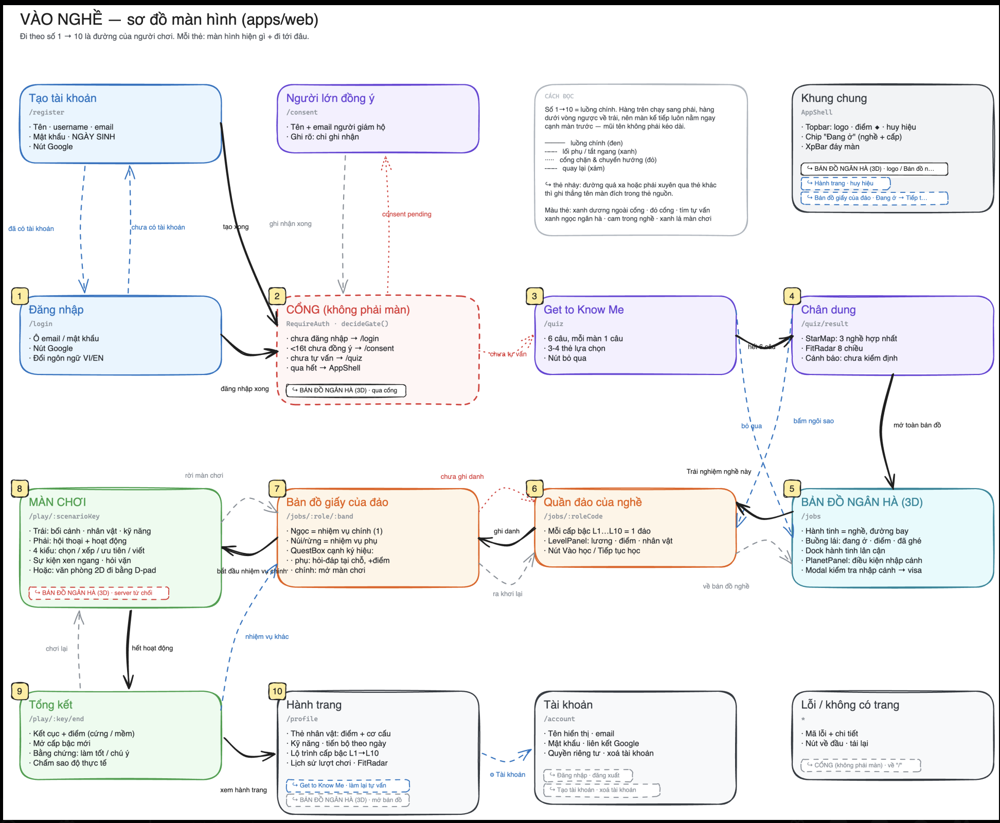

# 03 · Sản phẩm: JobQuest là gì và chơi thế nào

> Đây là mô tả sản phẩm **theo những gì đã chốt** (xem [02](02-quyet-dinh.md)). Chỗ nào còn tranh cãi thì có ghi chú ⚠️.
> Nguồn chính: báo cáo Ch.1–5 (18/9), deck 7/9, `occupation-data/specs/spec-scenario-KHOI1.md` v2.2 và code.

## 1. Một câu

**JobQuest cho người dùng làm thử công việc của một nghề qua các tình huống mô phỏng do AI dẫn dắt, rồi để họ tự cảm nhận mình có hợp nghề đó không.** Hệ thống không đưa ra kết luận kiểu "bạn hợp với ngành X".

*"Try the job before you pick the career."*

## 2. Vì sao (tóm tắt Chương 1–2)

- Người ta chọn nghề mà gần như **không biết công việc hằng ngày ra sao**. Thiếu thông tin về nghề là một nhóm khó khăn riêng khi chọn nghề (Gati và cộng sự, 1996). ⚠️ Cô nhận xét nguồn này đã quá cũ.
- Công cụ phổ biến (MBTI, RIASEC) chỉ hỏi người dùng *nghĩ gì về bản thân*. Riêng MBTI, 39–76% người làm lại bị xếp sang nhóm khác.
- Cho xem trước công việc một cách trung thực (**Realistic Job Preview**) giúp chọn đúng hơn (Phillips 1998; Earnest et al. 2011). Lâu nay cái khó là cách triển khai: muốn xem trước thì phải đến tận nơi làm việc, hoặc viết nội dung riêng cho từng nghề. Mô hình sinh nội dung giúp giảm chi phí đó.
- Học qua làm (Kolb) và học qua mô phỏng (Chernikova 2020) có bằng chứng tốt. Nhưng game hoá ít giúp *cảm giác năng lực*, và mô phỏng chỉ hiệu quả khi là **bổ trợ**. Vì vậy JobQuest không tuyên bố thay thế được đi làm thật.

## 3. Người dùng

| Nhóm | Vai trò |
|---|---|
| **Explorer** (người chơi) | Học sinh chọn ngành, sinh viên mới ra trường, người muốn chuyển nghề. Chơi nhiệm vụ, tích kỹ năng, đánh giá nghề |
| **Domain expert** | Viết seed và rubric, duyệt tình huống AI sinh ra. Là người đảm bảo nội dung đúng với nghề thật |
| **Content admin** | Quản lý vòng đời nội dung: đặt làm, theo dõi duyệt, xuất bản, duyệt lại |
| **System admin** | Cấu hình model AI, theo dõi chi phí và lỗi, quản lý dữ liệu cá nhân |

## 4. Vòng chơi chính

```
Đăng nhập ─► (Get-to-know-me, tuỳ chọn) ─► Chọn nghề trên bản đồ ngân hà
   ─► Chọn cấp bậc (hòn đảo L1…L10) ─► Nhận vai, team, bối cảnh công ty
   ─► Làm nhiệm vụ (scenario: 3–4 activity + follow-up do AI sinh)
   ─► AI chấm → điểm + nhận xét + kỹ năng thể hiện được
   ─► Tích điểm kỹ năng → mở cấp cao hơn, hoặc bay sang nghề kề
   ─► Xong cả nghề → đánh giá nghề theo 5 tiêu chí
   ↺  Sự kiện nghề nghiệp và cuộc sống ngẫu nhiên (roguelike) làm mỗi lượt chơi một khác
```

**Ví dụ một nhiệm vụ** (deck 7/9 và 18/9): Backend Engineer, cấp khởi đầu, đang trực on-call. Hệ thống thanh toán sập lúc 2 giờ sáng: bạn kiểm tra chỗ nào trước (lựa chọn, rẽ nhánh câu chuyện)? Sắp xếp các bước xử lý (ORDERING, chấm theo đáp án). Viết báo cáo sự cố cho team (FREETEXT, chấm theo rubric). Cuối cùng nhận điểm, nhận xét và kỹ năng thể hiện được (debug, giao tiếp).

## 5. Mô hình nội dung

```
Domain (VD: Software Engineering)                    ← "thiên hà"
 └─ Role / nghề (VD: SWE_BACKEND)                    ← "hành tinh"
     └─ Band L1…L10 (chỉ những band có thật ở VN)    ← "hòn đảo"
         └─ Task của band = 1 Scenario (10–15 phút)  ← "nhiệm vụ chính"
             └─ 3–4 Activity cố định (nối bằng forward_to), mỗi activity có context riêng
                 └─ Follow-up do AI sinh (có trần theo band)
```

| Khái niệm | Luật chính |
|---|---|
| **Band** | L1 intern · L2 fresher · L3 junior · L4 middle · L5 senior · L6 lead · L7 principal/manager · L8 senior manager · L9 head/director · L10 VP/C-level |
| **Archetype** | S_EXEC (L1+) · S_AMBIG (L2+) · S_INCIDENT (L3+) · S_CONFLICT, S_REVIEW (L4+) · S_DECISION (L6+). Cấm dùng archetype chưa mở ở band đó |
| **Loại activity** | FREETEXT (mặc định) · CHOICE (tối đa 1) · ORDERING · PRIORITIZING |
| **Rubric** (`observes`) | Mỗi activity quan sát một số kỹ năng, mỗi kỹ năng có 3 mốc **+2 / 0 / −1** |
| **Hint** | Người chơi chủ động mở. Dùng hint thì activity đó tối đa mốc 0 |
| **Quick action** | Có đếm ngược, hết giờ tính −1 |
| **Random event** | Gieo theo xác suất: DIVERT (rẽ hướng) hoặc EARLY_END (kết thúc sớm) |
| **Ending** | Mỗi scenario có 2–5 kết cục: GOOD / PARTIAL / BAD / SECRET |
| **Nhiệm vụ phụ** | Hỏi nhanh ngay trên bản đồ đảo, cộng điểm (có trong code, chưa có trong spec) |

Cách sinh scenario mới: xem `occupation-data/specs/HUONG-DAN-SINH-SCENARIO.md`.

## 6. Kỹ năng và bản đồ nghề

- Mỗi lượt chơi ghi nhận **bằng chứng kỹ năng** (activity, kỹ năng, mốc, trích câu trả lời, có dùng hint không, có hết giờ không) rồi quy ra điểm.
- Kỹ năng là **nhiên liệu** để lên cấp (BR-02) và sang nghề kề (BR-03). Cấp đầu của mọi nghề luôn mở (BR-01).
- Người chơi học **cả hard skill lẫn soft skill** (D-32).
- ⚠️ **Chưa chốt:** điểm tính chung hay tách theo domain (D-35)?
- Bản đồ hiện tại có **22 hành tinh / 7 nhóm nghề / 64 đường nối** (36 SIMILAR, 28 PROGRESSES_TO). 💡 Flow 20/9 đề xuất bỏ đường nối và tính toạ độ hành tinh từ skill.

## 7. Các lớp phụ

| Lớp | Trạng thái |
|---|---|
| **Get-to-know-me** (6 câu, đo 8 chiều fit, có thể thêm tự luận) | Có trong code. **Tuỳ chọn** (D-29). Bộ câu hỏi tự soạn, **chưa kiểm định** |
| **Đánh giá nghề 5 tiêu chí** (lương, áp lực, độ khó, cân bằng, yêu thích) | Đã chốt (D-27). **Chưa có trong code**, màn tổng kết mới có "chấm sao độ thực tế" |
| **Hành trang** (thẻ nhân vật, kỹ năng theo ngày, lộ trình L1→L10, lịch sử lượt chơi) | Có trong code |
| **Sự kiện roguelike** | Có 43 sự kiện trong game data (7 chung + 36 riêng cho 9 nghề) |

## 8. Đặc tả trong báo cáo Ch.1–5 (18/9)

**9 luật nghiệp vụ**

| BR | Nội dung |
|---|---|
| BR-01 | Cấp đầu của mọi nghề mở, không cần điều kiện |
| BR-02 | Lên cấp cần đủ điểm năng lực |
| BR-03 | Sang nghề kề cần năng lực trùng với yêu cầu đầu vào của nghề đó |
| BR-04 | Chỉ ai đã hoàn thành nghề mới được đánh giá nghề |
| BR-05 | Seed và rubric chưa được chuyên gia duyệt thì không xuất bản |
| BR-06 | Kết quả chấm chỉ để tham khảo, không gửi nhà tuyển dụng |
| BR-07 | Phải thể hiện cả mặt không hay của nghề |
| BR-08 | Số liệu từ người dùng chỉ công bố dạng tổng hợp |
| BR-09 | Model chấm khác họ với model sinh |

**43 yêu cầu:** 21 FR, 12 NFR, 10 DR (27 Must · 15 Should · 1 Could). Đáng chú ý: sinh tình huống < 5s và chấm < 8s ở p95 (NFR-01/02), thêm nghề mới không cần sửa code (NFR-10).

**13 use case:** UC-01 Khám phá catalogue · UC-02 Get-to-know-me · **UC-03 Làm nhiệm vụ** · UC-04 Lên cấp / sang nghề · UC-05 Đánh giá nghề · UC-06 Xem hồ sơ · UC-07 Viết seed và rubric · **UC-08 Duyệt tình huống sinh ra** · UC-09 Xem chỗ máy chấm lệch chuyên gia · UC-10 Vòng đời nội dung · UC-11 Theo dõi độ phủ · UC-12 Cấu hình model · UC-13 Giám sát vận hành.

**5 vấn đề nghiên cứu:** RP-1 sinh có ràng buộc · RP-2 độ tin cậy của máy chấm · RP-3 ngưỡng năng lực để sang nghề kề · RP-4 giữ chân người chơi mà không lấn át việc học · RP-5 phương pháp đánh giá offline.

Chương 5 còn lại và Chương 6–8 (cài đặt, kiểm thử, kết luận) **chưa viết**.

## 9. Từ điển thuật ngữ

| Trong app (VI) | Tài liệu (EN) | Trong code / spec |
|---|---|---|
| Người chơi | Explorer | `User`, `GameProfile` |
| Bản đồ ngân hà | Career graph / galaxy | `/jobs`, `galaxy-data.json` |
| Hành tinh | Occupation / role | `role_code` |
| Quần đảo · hòn đảo | Levels | `band` (L1–L10), `/jobs/:role/:band` |
| Nhiệm vụ chính (ngọc) | Task scenario | `scenario`, `scenario_title` |
| Nhiệm vụ phụ (núi/rừng) | Side quest | `sideQuests` |
| Nhịp / hoạt động | Activity (tên cũ: beat) | `activities[]` |
| Câu đào sâu | Follow-up | `limitFollowup`, `followup_goal` |
| Hạt giống | Seed | skeleton scenario |
| Nhiên liệu | Competence credit | XP / skill points |
| Tự vấn · Get to Know Me | Orientation (UC-02) | `/quiz`, `fit_quiz.json` |
| Chân dung | Quiz result | `/quiz/result` (StarMap, FitRadar) |
| Hành trang | Logbook / personal record | `/profile` |
| Cổng | Gate | `RequireAuth`, `decideGate()` |

## 10. Sơ đồ màn hình hiện tại (code, 20/9)



Bản sửa được: `docs/vao-nghe-flow.excalidraw`, `docs/vao-nghe-flow.mmd`.
