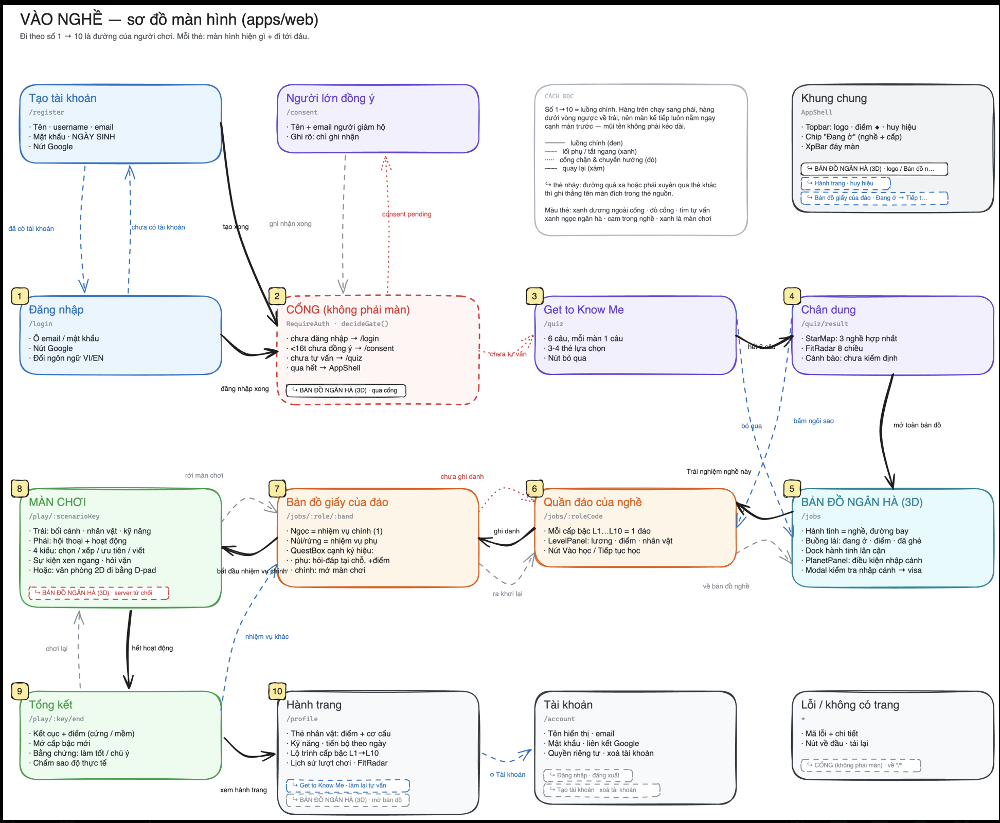

# 03 · Sản phẩm: JobQuest là gì và chơi thế nào

> Đây là mô tả sản phẩm **theo những gì đã chốt** (xem [02](02-quyet-dinh.md)). Chỗ nào còn tranh cãi thì có ghi chú ⚠️.
> Nguồn chính: báo cáo Ch.1–5 (bản 26/9, `reports/2026-09-26_ch1-5/`), deck 7/9, `occupation-data/specs/spec-scenario-KHOI1.md` v2.2 và code. Các quyết định chốt sau báo cáo (29/9) được ưu tiên hơn báo cáo.

## 1. Một câu

**JobQuest cho người dùng làm thử công việc của một nghề qua các tình huống mô phỏng do AI dẫn dắt, rồi để họ tự cảm nhận mình có hợp nghề đó không.** Hệ thống không đưa ra kết luận kiểu "bạn hợp với ngành X".

*"Try the job before you pick the career."*

## 2. Vì sao (tóm tắt Chương 1–2)

- Người ta chọn nghề mà gần như **không biết công việc hằng ngày ra sao**. Thiếu thông tin về nghề là một nhóm khó khăn riêng khi chọn nghề (Gati và cộng sự, 1996). ⚠️ Cô nhận xét nguồn này đã quá cũ. Báo cáo 26/9 §1.1 thêm Levin et al. (2023) xác nhận cấu trúc này ở 13 nước; cô 26/9 vẫn hỏi có khung thay thế không (T2609.21, T2609.22).
- Công cụ phổ biến (MBTI, RIASEC) chỉ hỏi người dùng *nghĩ gì về bản thân*. Riêng MBTI, nhãn loại hay đổi khi làm lại với người có điểm gần ranh giới, dù thang liên tục khá ổn định (báo cáo 26/9 §1.1). Giới hạn chính là **đo sở thích chứ không cho thông tin về công việc**.
- Cho xem trước công việc một cách trung thực (**Realistic Job Preview**) giúp chọn đúng hơn (Phillips 1998; Earnest et al. 2011). Lâu nay cái khó là cách triển khai: muốn xem trước thì phải đến tận nơi làm việc, hoặc viết nội dung riêng cho từng nghề. Mô hình sinh nội dung giúp giảm chi phí đó.
- Học qua làm (Kolb) và học qua mô phỏng (Chernikova 2020) có bằng chứng tốt. Nhưng game hoá ít giúp *cảm giác năng lực*, và mô phỏng chỉ hiệu quả khi là **bổ trợ**. Vì vậy JobQuest không tuyên bố thay thế được đi làm thật.
- Chọn hành động trong tình huống công việc là cách của **situational judgment test (SJT)**, một dạng "mô phỏng độ trung thực thấp" có liên hệ với hiệu suất làm việc (ρ = 0,34, McDaniel et al. 2001). Lựa chọn lấy từ critical incident của chuyên gia, và khoá chấm do một nhóm chuyên gia khác lập (báo cáo 26/9 §2.2).

## 3. Người dùng

Bốn vai trò cuối, theo cô 26/9 và Phúc chốt 29/9 (D-16):

| Nhóm | Vai trò |
|---|---|
| **Explorer** (người chơi) | Học sinh chọn ngành, sinh viên mới ra trường, người muốn chuyển nghề. Chơi nhiệm vụ, tích kỹ năng, đánh giá nghề |
| **Domain Expert (DE)** | **Dùng hệ thống.** Viết và sở hữu nội dung chuyên môn của scenario: fact, năng lực, lựa chọn và khoá hiệu quả, rubric. Duyệt scenario hệ thống sinh ra và các ca máy chấm lệch chuyên gia. Tiêu chuẩn: senior/lead ~5 năm trở lên, 3–4 người mỗi role từ ít nhất 2 loại công ty, không duyệt seed mình góp soạn (D-62) |
| **Content Admin (CA)** | **Không phải business admin.** Đưa nội dung của DE lên màn chơi (layout, trình bày), quản lý và duyệt nghề, xuất bản, vận hành vòng đời nội dung |
| **System Admin (SA)** | Chỉ lo hệ thống: vận hành, cấu hình model, tài khoản, system review |

⚠️ Báo cáo 26/9 §4.2.1 và §5.1.2 vẫn là mô hình cũ (D-15): DE đứng ngoài hệ thống, CA nhập seed thay DE và được gọi là business admin. Đang sửa ở T2609.1–T2609.3. Ở Giai đoạn 0 **chưa có chuyên gia ngành**; nhóm soạn seed tạm từ nguồn công khai (D-63).

## 4. Vòng chơi chính

```
Đăng nhập ─► (Get-to-know-me, tuỳ chọn) ─► Chọn nghề trên bản đồ ngân hà
   ─► Chọn cấp bậc (hòn đảo L1…L10) ─► Nhận vai, team, bối cảnh công ty
   ─► Làm nhiệm vụ (scenario: 3–4 activity + follow-up do AI sinh)
   ─► AI chấm → điểm + nhận xét + kỹ năng thể hiện được
   ─► Tích điểm kỹ năng → mở cấp cao hơn, hoặc bay sang nghề kề
   ─► Xong cả nghề → đánh giá nghề theo 5 tiêu chí
   ↺  Sự kiện nghề nghiệp và cuộc sống ngẫu nhiên (roguelike) làm mỗi lượt chơi một khác
```

**Ví dụ một nhiệm vụ** (deck 7/9 và 18/9): Backend Engineer, cấp khởi đầu, đang trực on-call. Hệ thống thanh toán sập lúc 2 giờ sáng: bạn kiểm tra chỗ nào trước (lựa chọn, rẽ nhánh câu chuyện)? Sắp xếp các bước xử lý (ORDERING, chấm theo đáp án). Viết báo cáo sự cố cho team (FREETEXT, chấm theo rubric). Cuối cùng nhận điểm, nhận xét và kỹ năng thể hiện được (debug, giao tiếp).

## 5. Mô hình nội dung

```
Domain (VD: Software Engineering)                    ← "thiên hà"
 └─ Role / nghề (VD: SWE_BACKEND)                    ← "hành tinh"
     └─ Band L1…L10 (chỉ những band có thật ở VN)    ← "hòn đảo"
         └─ Task của band = 1 Scenario (10–15 phút)  ← "nhiệm vụ chính"
             └─ 3–4 Activity cố định (nối bằng forward_to), mỗi activity có context riêng
                 └─ Follow-up do AI sinh (có trần theo band)
```

| Khái niệm | Luật chính |
|---|---|
| **Band** | L1 intern · L2 fresher · L3 junior · L4 middle · L5 senior · L6 lead · L7 principal/manager · L8 senior manager · L9 head/director · L10 VP/C-level |
| **Archetype** | S_EXEC (L1+) · S_AMBIG (L2+) · S_INCIDENT (L3+) · S_CONFLICT, S_REVIEW (L4+) · S_DECISION (L6+). Cấm dùng archetype chưa mở ở band đó |
| **Loại activity** | FREETEXT (mặc định) · CHOICE (tối đa 1) · ORDERING · PRIORITIZING |
| **Rubric** (`observes`) | Mỗi activity quan sát một số kỹ năng, mỗi kỹ năng có 3 mốc **+2 / 0 / −1** |
| **Hint** | Người chơi chủ động mở. Dùng hint thì activity đó tối đa mốc 0 |
| **Quick action** | Có đếm ngược, hết giờ tính −1 |
| **Random event** | Gieo theo xác suất: DIVERT (rẽ hướng) hoặc EARLY_END (kết thúc sớm) |
| **Ending** | Mỗi scenario có 2–5 kết cục: GOOD / PARTIAL / BAD / SECRET |
| **Nhiệm vụ phụ** | Hỏi nhanh ngay trên bản đồ đảo, cộng điểm (có trong code, chưa có trong spec) |

Cách sinh scenario mới: xem `occupation-data/specs/HUONG-DAN-SINH-SCENARIO.md`.

### Định dạng trả lời và cách chấm (theo báo cáo 26/9)

⚠️ Bảng trên theo spec v2.2 (4 loại activity, rubric +2/0/−1, hint trần 0). **Đã chốt 1/10 theo hướng của báo cáo**, spec và code chưa cập nhật:
- **9 định dạng** như bảng dưới; PRIORITIZING là biến thể của sắp thứ tự; "FREETEXT mặc định" chỉ là hướng dẫn soạn (D-80, D-85).
- **Một thang chung −1 / 0 / +1 / +2** cho mỗi năng lực, dùng cho cả lựa chọn lẫn rubric (D-87).
- **Hint giảm trọng số**; hết giờ là không trả lời, bỏ luật −1 (D-83, D-86).
- **Seed là khuôn các canon event**; AI phát triển câu chuyện theo câu trả lời nhưng bám luồng (D-67).

| Định dạng | Chấm thế nào | Thuộc RP-2? |
|---|---|---|
| Trắc nghiệm một đáp án | Profile hiệu quả SJT của lựa chọn, trên nhiều năng lực | Không |
| Chọn nhiều | Cộng profile các lựa chọn; tổ hợp chuyên gia đánh giá là có hại thì gắn cờ | Không |
| Sắp thứ tự | Khoảng cách tới thứ tự đồng thuận của chuyên gia, có điểm từng phần | Không |
| Ghép cặp · Đúng/sai | Đáp án khi là kiến thức thuần (đúng/sai dùng ít vì đoán trúng 50%) | Không |
| Lựa chọn có đếm giờ | Profile của lựa chọn; thời gian đo trên thiết bị, ghi làm evidence | Không |
| Tự luận · Email rút gọn | Rubric, chấm bằng panel judge nhiều họ model (D-49) | **Có** |
| Code rút gọn | Test chạy được khi viết hoặc sửa code; rubric khi giải thích hoặc review code | Chỉ phần giải thích, review |

- **Ba loại lựa chọn** (D-82): đúng · đánh đổi · sai (hiệu quả âm). Mỗi lựa chọn phải grounded, plausible, intentional, consistent, distinct; model được viết lại lời nhưng không đổi profile (D-81, DC-06).
- **Hint** có ở mọi định dạng, ghi vào evidence, giảm trọng số nhưng không chặn tiến độ (D-83).
- Mỗi câu trả lời trả về **kết quả, nhận xét và hướng cải thiện** như ba phần riêng (FR-07).

## 6. Kỹ năng và bản đồ nghề

- Mỗi lượt chơi ghi nhận **bằng chứng kỹ năng** (activity, kỹ năng, mốc, trích câu trả lời, có dùng hint không, có hết giờ không) rồi quy ra điểm.
- Kỹ năng là **nhiên liệu** để lên cấp (BR-02) và sang nghề kề (BR-03). Cấp đầu của mọi nghề luôn mở (BR-01).
- Người chơi học **cả hard skill lẫn soft skill** (D-32).
- ⚠️ **Chưa chốt:** điểm tính chung hay tách theo domain (D-35)?
- Bản đồ hiện tại có **22 hành tinh / 7 nhóm nghề / 64 đường nối** (36 SIMILAR, 28 PROGRESSES_TO). 💡 Flow 20/9 đề xuất bỏ đường nối và tính toạ độ hành tinh từ skill.

## 7. Các lớp phụ

| Lớp | Trạng thái |
|---|---|
| **Get-to-know-me** (6 câu, đo 8 chiều fit, có thể thêm tự luận) | Có trong code. **Tuỳ chọn** (D-29). Bộ câu hỏi tự soạn, **chưa kiểm định** |
| **Đánh giá nghề 5 tiêu chí** (lương, áp lực, độ khó, cân bằng, yêu thích) | Đã chốt (D-27). **Chưa có trong code**, màn tổng kết mới có "chấm sao độ thực tế" |
| **Hành trang** (thẻ nhân vật, kỹ năng theo ngày, lộ trình L1→L10, lịch sử lượt chơi) | Có trong code |
| **Sự kiện roguelike** | Có 43 sự kiện trong game data (7 chung + 36 riêng cho 9 nghề) |

## 8. Đặc tả trong báo cáo Ch.1–5 (26/9)

> Bản trình bày cô 26/9 (sửa lần cuối 25/9), source ở `reports/2026-09-26_ch1-5/report.md`. Đây là **bản đã nộp**, chưa áp góp ý 26/9: vai trò, BR-08, DC-04, user story, sơ đồ… đang được sửa theo T2609.1–T2609.31 ([tuần 40](tuan/2026-W40/tuan.md)).

### 8.1 Luật nghiệp vụ và ràng buộc thiết kế

**8 luật nghiệp vụ** (§4.1.3)

| BR | Nội dung |
|---|---|
| BR-01 | Cấp đầu của mọi nghề mở, không cần điều kiện |
| BR-02 | Lên cấp cần đủ điểm năng lực quy định cho cấp đó |
| BR-03 | Sang nghề kề cần năng lực đã chứng minh trùng với yêu cầu đầu vào của nghề đó, xác định từ taxonomy nghề |
| BR-04 | Chỉ ai đã hoàn thành nghề mới được đánh giá nghề |
| BR-05 | Seed và rubric chưa được chuyên gia duyệt thì không xuất bản |
| BR-06 | Kết quả chấm chỉ để tham khảo, không gửi nhà tuyển dụng, không quyết định cơ hội nào |
| BR-07 | Phải thể hiện cả mặt không hay của nghề |
| BR-08 | Số liệu từ kết quả người dùng chỉ công bố dạng tổng hợp (cô 26/9: nên chuyển sang NFR-06, T2609.7) |

**6 ràng buộc thiết kế** (§4.3.2), tách khỏi BR vì đến từ lựa chọn cài đặt chứ không phải từ nghiệp vụ

| DC | Nội dung |
|---|---|
| DC-01 | Model chấm khác họ với model sinh (BR-09 của bản 18/9) |
| DC-02 | Sinh và chấm dựa vào provider bên ngoài, qua một interface thay được |
| DC-03 | Xử lý dữ liệu cá nhân theo luật bảo vệ dữ liệu cá nhân của Việt Nam, gồm quy định cho trẻ vị thành niên |
| DC-04 | Chi phí model mỗi phiên bị chặn bởi một trần cấu hình (cô 26/9: đây là giải pháp, chuyển ra khỏi DC, T2609.9) |
| DC-05 | Web chạy trên trình duyệt, không cần cài |
| DC-06 | Model được viết lại lời một lựa chọn đã có khoá nhưng không được đổi profile hiệu quả của nó |

### 8.2 Yêu cầu: 45 yêu cầu (22 FR, 13 NFR, 10 DR) · 29 Must, 15 Should, 1 Could

**User story** (§4.3.1): 10 cho Explorer, 5 cho Content admin, 2 cho System admin; báo cáo ghi DE không dùng hệ thống nên không có story (sửa ở T2609.11).

| FR | Nội dung | Nhóm | Ưu tiên |
|---|---|---|---|
| FR-01 | Đăng ký, đăng nhập | Explorer | Must |
| FR-02 | Cấp đầu của mọi nghề đã xuất bản mở không cần điều kiện | Explorer | Must |
| FR-03 | Cho biết vai, team, bối cảnh trước task đầu của mỗi cấp | Explorer | Must |
| FR-04 | Sinh scenario từ seed đã xuất bản, giữ fact bắt buộc | Explorer | Must |
| FR-05 | Nhận câu trả lời có cấu trúc (6 định dạng lựa chọn) và chấm theo profile hiệu quả hoặc đáp án | Explorer | Must |
| FR-06 | Nhận tự luận (cả email, giải thích hoặc review code) và chấm theo rubric bằng panel judge | Explorer | Must |
| FR-07 | Trả kết quả, nhận xét riêng cho câu trả lời và hướng cải thiện thành ba phần riêng | Explorer | Must |
| FR-08 | Ghi các năng lực mỗi câu trả lời thể hiện | Explorer | Must |
| FR-09 | Cộng điểm năng lực khi xong cấp, mở cấp theo BR-02 | Explorer | Must |
| FR-10 | Mời sang nghề kề khi đủ điều kiện trùng năng lực (BR-03) | Explorer | Should |
| FR-11 | Orientation tuỳ chọn, gợi ý nghề để bắt đầu | Explorer | Should |
| FR-12 | Đánh giá nghề 5 tiêu chí sau khi xong, hiện số tổng hợp | Explorer | Should |
| FR-13 | Hồ sơ riêng: nghề đã thử, năng lực, phần thưởng | Explorer | Should |
| FR-14 | Sự kiện nghề nghiệp và cuộc sống ngẫu nhiên | Explorer | Could |
| FR-15 | Nhập và sửa seed soạn cùng chuyên gia, ghi chuyên gia đóng góp | Content admin | Must |
| FR-16 | Xuất gói duyệt, ghi quyết định duyệt, từ chối, sửa của chuyên gia | Content admin | Must |
| FR-17 | Báo các ca máy chấm lệch chuyên gia để xem lại | Content admin | Should |
| FR-18 | Vòng đời nghề: tạo, theo dõi, xuất bản, retire | Administrator | Must |
| FR-19 | Báo độ phủ catalogue và ngày kiểm định gần nhất | Administrator | Should |
| FR-20 | Cấu hình provider sinh và chấm, bắt buộc tách họ | Administrator | Must |
| FR-21 | Theo dõi lượt dùng, chi phí, lỗi | Administrator | Should |
| FR-22 | Ghi việc dùng hint và thời gian trả lời đo trên thiết bị làm evidence | Explorer | Should |

| NFR | Nội dung | Ưu tiên |
|---|---|---|
| NFR-01 | Sinh scenario < 5 s ở p95, quá 2 s thì hiện tiến trình | Must |
| NFR-02 | Chấm tự luận < 8 s ở p95 | Must |
| NFR-03 | Tiến độ không mất khi bị ngắt, chơi tiếp được | Must |
| NFR-04 | Provider lỗi thì không mất tiến độ đã ghi, báo người dùng trong 10 s | Should |
| NFR-05 | Dữ liệu cá nhân thu tối thiểu, mã hoá, xoá được theo yêu cầu | Must |
| NFR-06 | Số liệu tổng hợp có ngưỡng ẩn khi quần thể quá nhỏ | Must |
| NFR-07 | Công khai rằng nội dung do máy sinh và máy chấm | Must |
| NFR-08 | Giao diện và nội dung có tiếng Việt và tiếng Anh | Should |
| NFR-09 | ≥ 80% người đọc đại diện nói đúng mục tiêu task sau khi đọc scenario | Should |
| NFR-10 | Thêm nghề không cần sửa code | Must |
| NFR-11 | Chi phí model trung bình mỗi phiên nằm trong trần cấu hình | Must |
| NFR-12 | Đổi provider không phải sửa seed hay rubric | Should |
| NFR-13 | Chơi được trên trình duyệt điện thoại và mạng yếu | Must |

| DR | Nội dung | Ưu tiên |
|---|---|---|
| DR-01 | Dữ liệu nghề tham chiếu (O\*NET, ESCO, chuyên gia điều chỉnh cho Việt Nam) | Must |
| DR-02 | Taxonomy năng lực, tách soft và kỹ thuật | Must |
| DR-03 | Quan hệ nghề kề và độ trùng | Should |
| DR-04 | Seed: fact bắt buộc, năng lực mục tiêu, khung truyện, lựa chọn có khoá, rubric, nguồn chuyên gia | Must |
| DR-05 | Scenario đã sinh, truy về seed và phiên bản model | Must |
| DR-06 | Hồ sơ và tiến độ người dùng | Must |
| DR-07 | Bản ghi chấm: câu trả lời, điểm, năng lực, nhận xét, hướng cải thiện (sẽ thêm trường loại lượt chơi, D-46) | Must |
| DR-08 | Đánh giá nghề 5 tiêu chí, chỉ khi đã hoàn thành | Should |
| DR-09 | Bộ chuẩn đánh giá: benchmark tổng hợp (Giai đoạn A) và câu trả lời thật có chuyên gia chấm (Giai đoạn B) | Must |
| DR-10 | Telemetry: độ trễ, chi phí, lỗi, phiên bản model | Should |

### 8.3 Use case và sơ đồ (§5.1)

**13 use case**, 3 actor (Explorer, Content admin, System admin) và 2 hệ thống ngoài (model provider, nguồn dữ liệu nghề): UC-01 Khám phá catalogue · UC-02 Orientation · **UC-03 Làm task** · UC-04 Lên cấp / sang nghề · UC-05 Đánh giá nghề · UC-06 Xem hồ sơ · UC-07 Nhập seed soạn cùng chuyên gia · **UC-08 Ghi kết quả chuyên gia duyệt scenario** · UC-09 Xem ca máy chấm lệch chuyên gia · UC-10 Vòng đời nghề · UC-11 Theo dõi độ phủ · UC-12 Cấu hình model · UC-13 Giám sát vận hành. Có bảng mô tả UC-03, 04, 05, 07, 08 và ma trận truy vết FR/NFR/DR → UC.

Sơ đồ quy trình (§5.1.1): khám phá và vòng đời nội dung (CA làm mọi bước, chuyên gia duyệt ngoài hệ thống). Cô 26/9 yêu cầu vẽ lại: activity diagram có swimlane, state diagram vòng đời scenario, use case có boundary và include/extend (T2609.13–T2609.17).

### 8.4 Vấn đề nghiên cứu và đánh giá

- **2 RP** (§4.2.2, D-06): RP-1 sinh có seed chuyên gia, so với không seed; RP-2 độ khớp của máy chấm với chuyên gia bằng QWK, so với chuyên gia–chuyên gia. RP-3, 4, 5 cũ chuyển sang thiết kế, hướng phát triển, phương pháp.
- **Đánh giá hai giai đoạn** (D-47): A là benchmark tổng hợp làm hỏng từng tiêu chí; B là câu trả lời thật, 3 chuyên gia mỗi role pilot chấm mù.
- **Ngưỡng** (D-48): RP-1 I-CVI ≥ 0,78, S-CVI/Ave ≥ 0,90, McNemar p < 0,05, giữ ≥ 95% fact; RP-2 QWK ≥ 0,70, SMD ≤ 0,15, giảm ≤ 0,10 so với chuyên gia–chuyên gia; α ≥ 0,800.

### 8.5 Bối cảnh vận hành (§4.1.5)

- **Miễn phí** cho mọi người dùng; mở cấp theo năng lực, không theo tiền. Lý do: người cần thông tin nghề nhất (học sinh chọn ngành) là người khó trả tiền nhất.
- **Kinh phí:** tài trợ từ Bộ GD&ĐT và tổ chức edtech, cộng thời gian chuyên gia (in kind). Chi phí biến đổi chính là suy luận model mỗi phiên; chi phí cố định chính là soạn nội dung mỗi nghề, nên mở rộng theo từng lĩnh vực (D-65). Báo cáo vẫn ghi "không quảng cáo"; D-17 (29/9) đổi thành cho phép logo nhà tài trợ và ô quyên góp.
- **Đối tác và nhà tài trợ** chung một bộ biện pháp bảo vệ (D-64).
- **Lộ trình 5 giai đoạn** có cổng bằng chứng (D-60); hình thức và cơ cấu tổ chức (D-61).
- **Thách thức** (§4.2.3): độ trung thực khi sinh, tính hợp lệ của chấm, khan chuyên gia, cold start của số liệu tổng hợp, không đánh giá được tác động dài hạn, chi phí khi không có doanh thu, giới hạn của màn hình (Bảng 4.5 screen-vs-live, sửa ở T2609.19), bản địa hoá taxonomy.

**So với báo cáo 18/9:** BR-09 (model chấm khác họ) chuyển thành DC-01; thêm bảng DC-01…06; 21 → 22 FR và 12 → 13 NFR (**suy luận:** phần thêm là FR-22 hint và thời gian, NFR-13 mobile và mạng yếu, vì hub không lưu danh sách ID bản 18/9); FR-05, FR-06 viết lại cho 9 định dạng; 43 → 45 yêu cầu (27/15/1 → 29/15/1); 5 RP → 2 RP; Cohen's κ → QWK; thêm lộ trình, cơ cấu tổ chức, tiêu chuẩn chuyên gia; bỏ phần Tóm tắt tiếng Việt, chỉ giữ Abstract. Chương 5 còn lại và Chương 6–8 **chưa viết**.

## 9. Từ điển thuật ngữ

| Trong app (VI) | Tài liệu (EN) | Trong code / spec |
|---|---|---|
| Người chơi | Explorer | `User`, `GameProfile` |
| Bản đồ ngân hà | Career graph / galaxy | `/jobs`, `galaxy-data.json` |
| Hành tinh | Occupation / role | `role_code` |
| Quần đảo · hòn đảo | Levels | `band` (L1–L10), `/jobs/:role/:band` |
| Nhiệm vụ chính (ngọc) | Task scenario | `scenario`, `scenario_title` |
| Nhiệm vụ phụ (núi/rừng) | Side quest | `sideQuests` |
| Nhịp / hoạt động | Activity (tên cũ: beat) | `activities[]` |
| Câu đào sâu | Follow-up | `limitFollowup`, `followup_goal` |
| Hạt giống | Seed | skeleton scenario |
| Nhiên liệu | Competence credit | XP / skill points |
| Tự vấn · Get to Know Me | Orientation (UC-02) | `/quiz`, `fit_quiz.json` |
| Chân dung | Quiz result | `/quiz/result` (StarMap, FitRadar) |
| Hành trang | Logbook / personal record | `/profile` |
| Cổng | Gate | `RequireAuth`, `decideGate()` |
| Chuyên gia nghề | Domain Expert (DE) | — |
| Quản trị nội dung | Content Admin (CA), **không** phải business admin | — |
| Quản trị hệ thống | System Admin (SA) | — |
| Seed tạm | Provisional seed (Giai đoạn 0, chưa chuyên gia duyệt) | — |
| Profile hiệu quả, khoá chấm | Effectiveness profile / key (SJT) | — |
| Panel chấm | Judging panel (nhiều họ model) | — |
| Giai đoạn A / B | Stage A / B evaluation (benchmark tổng hợp / câu trả lời thật) | — |
| Giai đoạn 0–4 | Roadmap stages (đồ án → quốc gia) | — |
| Ràng buộc thiết kế | Design constraint (DC) | — |

## 10. Sơ đồ màn hình hiện tại (code, 20/9)



Bản sửa được: `docs/vao-nghe-flow.excalidraw`, `docs/vao-nghe-flow.mmd`.
