# JobQuest — Sơ đồ ERD chuẩn (Mermaid)

38 thực thể, 7 nhóm. Đã cập nhật theo `spec-scenario-KHOI.md` + `HUONG-DAN-SINH-SCENARIO.md`: content admin viết mô tả tự do (`admin_brief`) cho một task lấy từ dữ liệu nghề (`job_level_task`), AI dựa vào mô tả đó + bộ kỹ năng của cấp bậc (`job_level_competency`) + spec để sinh ra toàn bộ khung kịch bản (`scenario.skeleton_json`), rồi được kiểm định trước khi publish. Mô hình chấm điểm đổi từ điểm liên tục sang **mốc rời rạc +2/0/-1 kèm trích dẫn nguyên văn** (`evidence_emitted`), đúng cơ chế thật của spec.

## Quy ước ký hiệu (Mermaid `erDiagram` không hỗ trợ khung đúp cho weak entity, nên dùng 2 quy ước sau thay thế)

**1. Đường quan hệ (Mermaid hỗ trợ sẵn):**
- Nét liền (`--`) = **quan hệ định danh** (identifying relationship): thực thể con là **weak entity**, không có khoá nghiệp vụ độc lập, tồn tại phụ thuộc vào thực thể cha (xoá cha → xoá luôn con).
- Nét đứt (`..`) = **quan hệ không định danh** (non-identifying relationship): hai thực thể độc lập, chỉ tham chiếu FK thông thường.

**2. Danh sách tường minh (vì Mermaid không vẽ được khung đúp):**

| Strong entity (15) | Weak entity (23) |
|---|---|
| app_user, audit_log, domain, job, competency, reference_record, scenario, review, play_session, orientation_session, job_rating, reference_item, evaluation_run, model_config, ops_event | guardian_consent, job_level, job_level_task, job_level_competency, job_competency, job_adjacency, review_comment, scenario_generation, session_task, session_turn, evidence_emitted, session_debrief, scenario_feedback, competence_credit, user_competency, user_skill_point, unlock, orientation_answer, orientation_result, job_rating_score, job_rating_aggregate, evaluation_result, disagreement |

Một weak entity luôn nối tới thực thể cha định danh nó bằng nét liền; các tham chiếu FK khác (vai trò phụ, tuỳ chọn) dùng nét đứt.

## Sơ đồ

```mermaid
erDiagram
    %% ===================== NHÓM 1 — TÀI KHOẢN VÀ QUYỀN =====================
    app_user {
        bigint id PK
        varchar email UK
        varchar username UK
        varchar display_name
        varchar password_hash
        varchar google_id
        datetime date_of_birth
        varchar locale
        varchar role "explorer|content|review|sys"
        varchar status
        datetime created_at
    }
    guardian_consent {
        bigint id PK
        bigint user_id FK
        varchar guardian_name
        varchar guardian_email
        datetime consented_at
    }
    audit_log {
        bigint id PK
        bigint actor_id FK
        varchar action
        varchar entity
        bigint entity_id
        datetime at
    }

    %% ===================== NHÓM 2 — DANH MỤC NGHỀ VÀ KỸ NĂNG =====================
    domain {
        bigint id PK
        varchar code UK
        varchar name
        text description
    }
    job {
        bigint id PK
        bigint domain_id FK
        varchar code UK
        varchar name
        text summary
        text downsides "bắt buộc, BR-07"
        varchar status
        datetime published_at
        datetime retired_at
        datetime last_validated_at
        datetime revalidate_due
        bigint owner_id FK
    }
    job_level {
        bigint id PK
        bigint job_id FK
        varchar band "L1..L10"
        varchar name
        decimal soft_credit_required
        decimal domain_credit_required
        decimal salary_ref
    }
    job_level_task {
        bigint id PK
        bigint job_level_id FK
        text task_text "nguyên văn tasks[] trong dataset"
        int order_no
        varchar source_dataset "vd 78_roles_unmerged.json"
    }
    job_level_competency {
        bigint id PK
        bigint job_level_id FK
        bigint competency_id FK
        varchar dataset_level "familiar|proficient|expert"
        varchar evidence_level "A_VERIFIED|B_TITLE_SEEN|C_INFERRED"
    }
    competency {
        bigint id PK
        varchar code UK
        varchar name
        text definition
        text indicators
        varchar kind "soft|domain"
        bigint domain_id FK "NULL nếu soft"
        bigint source_record_id FK
    }
    job_competency {
        bigint id PK
        bigint job_id FK
        bigint competency_id FK
        decimal weight
        varchar required_level
    }
    reference_record {
        bigint id PK
        varchar source "ONET|ESCO"
        varchar source_id UK
        varchar version
        text payload
        datetime imported_at
    }
    job_adjacency {
        bigint id PK
        bigint from_job_id FK
        bigint to_job_id FK
        decimal domain_overlap "BR-03"
        decimal soft_overlap
        varchar status
        bigint reviewed_by FK
        datetime reviewed_at
    }

    %% ===================== NHÓM 3 — SOẠN THẢO VÀ KIỂM ĐỊNH NỘI DUNG =====================
    scenario {
        bigint id PK
        bigint job_level_task_id FK
        varchar key UK
        varchar scenario_title "= job_level_task.task_text"
        varchar archetype "S_EXEC|S_AMBIG|S_INCIDENT|S_CONFLICT|S_REVIEW|S_DECISION"
        text admin_brief "mô tả tự do content admin viết trước khi sinh"
        json skeleton_json "context · cast[] · activities[] · random_events[] · endings[]"
        varchar spec_version "vd scenario-2.2"
        varchar evidence_level "A_VERIFIED|B_TITLE_SEEN|C_INFERRED"
        int fallback_tier "1-3, xem A5"
        decimal estimated_minutes "10-15, công thức A7"
        int version "lần sinh thứ mấy"
        varchar status "draft|generated|validated|review|changes_requested|published|retired"
        boolean validation_passed "kết quả script kiểm A15/§7"
        bigint generated_by_model_config_id FK
        datetime generated_at
        bigint author_id FK
        bigint approved_by FK
        bigint published_by FK
        datetime effective_from
        datetime retired_at
    }
    review {
        bigint id PK
        bigint scenario_id FK
        bigint reviewer_id FK
        varchar verdict "approve|changes|reject"
        datetime created_at
    }
    review_comment {
        bigint id PK
        bigint review_id FK
        varchar anchor
        text body
        datetime created_at
    }
    scenario_generation {
        bigint id PK
        bigint scenario_id FK
        int version
        text admin_brief_snapshot
        bigint generated_by_model_config_id FK
        datetime generated_at
        decimal cost
        boolean validation_passed
    }

    %% ===================== NHÓM 4 — LƯỢT CHƠI VÀ CHẤM ĐIỂM =====================
    play_session {
        bigint id PK
        bigint user_id FK
        bigint job_level_id FK
        varchar status
        datetime started_at
        datetime finished_at
        text resume_state "NFR-03"
        varchar chosen_ending_id "trỏ vào endings[] trong skeleton_json"
        varchar ending_type "GOOD|BAD|PARTIAL|SECRET"
        int matched_plus2
        int matched_minus1
        varchar forced_by_event_id "khác NULL nếu EARLY_END"
    }
    session_task {
        bigint id PK
        bigint play_session_id FK
        bigint scenario_id FK
        varchar activity_id "vd a1, trỏ vào activities[] trong skeleton_json"
        int order_no
        varchar status
    }
    session_turn {
        bigint id PK
        bigint session_task_id FK
        int turn_no
        varchar turn_kind "FIXED|FOLLOWUP|CLOSING|EVENT"
        text player_input "NULL ở CLOSING/EVENT"
        text ai_narration
        datetime created_at
    }
    evidence_emitted {
        bigint id PK
        bigint session_turn_id FK
        bigint competency_id FK
        varchar anchor_hit "+2|0|-1"
        text quote "trích nguyên văn, NULL chỉ khi timeout"
        boolean hint_used "true thì anchor_hit không được +2"
        boolean timeout
    }
    session_debrief {
        bigint id PK
        bigint play_session_id FK, UK
        json did_well "[{behaviour, quote}]"
        json could_improve "tối đa 2 mục"
        text one_thing_next_time
    }
    scenario_feedback {
        bigint id PK
        bigint play_session_id FK, UK
        bigint scenario_id FK
        int realism "1-5"
        int difficulty "1-5"
        text comment
        datetime submitted_at
    }
    competence_credit {
        bigint id PK
        bigint user_id FK
        bigint job_level_id FK
        decimal soft_credit
        decimal domain_credit
        datetime awarded_at
    }
    user_competency {
        bigint id PK
        bigint user_id FK
        bigint competency_id FK
        decimal points
        int evidence_count
        datetime updated_at
    }
    user_skill_point {
        bigint id PK
        bigint user_id FK
        varchar kind "soft|domain"
        bigint domain_id FK "NULL nếu kind=soft"
        decimal points
        datetime updated_at
    }
    unlock {
        bigint id PK
        bigint user_id FK
        bigint job_id FK
        bigint job_level_id FK
        varchar reason "level|adjacency"
        datetime unlocked_at
    }

    %% ===================== NHÓM 5 — TỰ VẤN VÀ ĐÁNH GIÁ NGHỀ =====================
    orientation_session {
        bigint id PK
        bigint user_id FK
        varchar status
        datetime completed_at
    }
    orientation_answer {
        bigint id PK
        bigint session_id FK
        varchar question_code
        varchar choice_code
    }
    orientation_result {
        bigint id PK
        bigint session_id FK
        bigint job_id FK
        int rank
        decimal fit_score
    }
    job_rating {
        bigint id PK
        bigint user_id FK
        bigint job_id FK
        datetime created_at
    }
    job_rating_score {
        bigint id PK
        bigint job_rating_id FK
        int attribute "1..5"
        int score
    }
    job_rating_aggregate {
        bigint id PK
        bigint job_id FK
        int attribute
        decimal mean_score
        int response_count
        boolean is_suppressed "NFR-06"
    }

    %% ===================== NHÓM 6 — BỘ THAM CHIẾU VÀ ĐO ĐỘ CHÍNH XÁC =====================
    reference_item {
        bigint id PK
        bigint job_id FK
        bigint scenario_id FK
        varchar difficulty
        text gold_judgment
        bigint author_id FK
    }
    evaluation_run {
        bigint id PK
        datetime ran_at
        bigint model_config_id FK
        varchar reference_set_version
        boolean test_retest
    }
    evaluation_result {
        bigint id PK
        bigint run_id FK
        varchar difficulty
        decimal kappa
        int n_items
    }
    disagreement {
        bigint id PK
        bigint reference_item_id FK
        bigint evidence_emitted_id FK
        varchar auto_anchor "+2|0|-1"
        varchar gold_anchor "+2|0|-1"
        int delta
        varchar status
    }

    %% ===================== NHÓM 7 — CẤU HÌNH MÔ HÌNH VÀ VẬN HÀNH =====================
    model_config {
        bigint id PK
        varchar role "generation|assessment"
        varchar provider
        varchar model_name
        varchar version
        varchar api_key_ref
        boolean is_active
        datetime updated_at
        bigint updated_by FK
    }
    ops_event {
        bigint id PK
        datetime occurred_at
        varchar kind "gen|assess"
        bigint play_session_id FK
        bigint model_config_id FK
        int latency_ms
        int tokens
        decimal cost
        varchar status
        varchar error_code
    }

    %% ===================== QUAN HỆ — NHÓM 1 =====================
    app_user ||--o| guardian_consent : "có (nếu chưa đủ 16 tuổi)"
    app_user ||..o{ audit_log : "thực hiện"

    %% ===================== QUAN HỆ — NHÓM 2 =====================
    domain ||..o{ job : "thuộc lĩnh vực"
    job ||--o{ job_level : "có cấp bậc"
    job_level ||--o{ job_level_task : "có task (= sẽ thành scenario)"
    job_level ||--o{ job_level_competency : "khai skills_hard/soft cho AI sinh"
    competency ||--o{ job_level_competency : "được khai ở cấp bậc"
    job ||--o{ job_competency : "yêu cầu kỹ năng (hồ sơ nghề)"
    competency ||--o{ job_competency : "được yêu cầu bởi"
    domain |o..o{ competency : "giới hạn phạm vi (domain skill)"
    reference_record |o..o{ competency : "nguồn gốc"
    job ||--o{ job_adjacency : "từ nghề"
    job ||--o{ job_adjacency : "đến nghề"
    app_user |o..o{ job_adjacency : "kiểm định bởi"

    %% ===================== QUAN HỆ — NHÓM 3 =====================
    job_level_task ||..o{ scenario : "được sinh thành"
    model_config |o..o{ scenario : "sinh bằng model"
    app_user ||..o{ scenario : "viết brief / khởi tạo"
    app_user |o..o{ scenario : "duyệt bởi"
    app_user |o..o{ scenario : "xuất bản bởi"
    scenario ||..o{ review : "được duyệt trong"
    app_user ||..o{ review : "viết bởi"
    review ||--o{ review_comment : "có bình luận"
    scenario ||--o{ scenario_generation : "ghi lại mỗi lần sinh (DR-05)"
    model_config |o..o{ scenario_generation : "sinh bằng model"

    %% ===================== QUAN HỆ — NHÓM 4 =====================
    app_user ||..o{ play_session : "chơi"
    job_level ||..o{ play_session : "chơi tại cấp bậc"
    play_session ||--o{ session_task : "có hoạt động"
    scenario ||..o{ session_task : "dùng kịch bản"
    session_task ||--o{ session_turn : "có lượt hội thoại"
    session_turn ||--o{ evidence_emitted : "phát bằng chứng"
    competency ||--o{ evidence_emitted : "được quan sát"
    play_session ||--o| session_debrief : "có debrief"
    play_session ||--o| scenario_feedback : "có đánh giá kịch bản"
    scenario ||..o{ scenario_feedback : "được đánh giá"
    app_user ||--o{ competence_credit : "nhận điểm"
    job_level ||--o{ competence_credit : "trao tại cấp bậc"
    app_user ||--o{ user_competency : "tích luỹ"
    competency ||--o{ user_competency : "được tích luỹ"
    app_user ||--o{ user_skill_point : "có tổng điểm"
    domain ||--o{ user_skill_point : "theo lĩnh vực (điểm chuyên môn)"
    app_user ||--o{ unlock : "mở khoá"
    job ||--o{ unlock : "được mở khoá"
    job_level |o..o{ unlock : "mở khoá tại cấp bậc"

    %% ===================== QUAN HỆ — NHÓM 5 =====================
    app_user ||..o{ orientation_session : "thực hiện"
    orientation_session ||--o{ orientation_answer : "có câu trả lời"
    orientation_session ||--o{ orientation_result : "cho kết quả"
    job ||..o{ orientation_result : "được xếp hạng"
    app_user ||..o{ job_rating : "đánh giá"
    job ||..o{ job_rating : "được đánh giá"
    job_rating ||--o{ job_rating_score : "có điểm theo tiêu chí"
    job ||--o{ job_rating_aggregate : "tổng hợp đánh giá"

    %% ===================== QUAN HỆ — NHÓM 6 =====================
    job ||..o{ reference_item : "có bộ tham chiếu"
    scenario |o..o{ reference_item : "dựa trên kịch bản"
    app_user ||..o{ reference_item : "soạn bởi"
    model_config ||..o{ evaluation_run : "chạy đánh giá bằng model"
    evaluation_run ||--o{ evaluation_result : "có kết quả"
    reference_item ||--o{ disagreement : "phát hiện lệch"
    evidence_emitted ||--o{ disagreement : "gây lệch điểm"

    %% ===================== QUAN HỆ — NHÓM 7 =====================
    app_user |o..o{ model_config : "cập nhật lần cuối"
    play_session |o..o{ ops_event : "ghi log"
    model_config ||..o{ ops_event : "ghi log theo model"
```

## Giải thích usage của từng bảng

### Nhóm 1 — Tài khoản và quyền

- **app_user** — Tài khoản của mọi vai trò (explorer, content admin, reviewer, system admin). Là bảng gốc mà hầu hết các bảng khác tham chiếu tới để biết ai sở hữu, ai thao tác.
- **guardian_consent** — Xác nhận của phụ huynh khi người dùng chưa đủ 16 tuổi, phục vụ bảo vệ trẻ vị thành niên.
- **audit_log** — Ghi lại các hành động quan trọng (duyệt, xuất bản, xoá) để truy vết trách nhiệm.

### Nhóm 2 — Danh mục nghề và kỹ năng

- **domain** — Danh sách lĩnh vực nghề (CNTT, Cơ khí...), dùng để phân nhóm nghề và phân loại domain skill theo từng lĩnh vực.
- **job** — Danh mục nghề nghiệp, có vòng đời draft → published → retired; bắt buộc khai báo downsides (BR-07).
- **job_level** — Các cấp bậc L1..L10 trong một nghề, mỗi cấp có ngưỡng điểm domain/soft riêng để xét mở khoá (BR-02).
- **job_level_task** *(mới)* — Từng "task" trích nguyên văn từ dữ liệu nghề gốc (dataset 78 role) cho một cấp bậc cụ thể. Theo đúng luật A2/A3 của spec: **mỗi task = đúng một scenario**, `task_text` này sẽ được chép nguyên văn thành `scenario.scenario_title`. Ví dụ: `job_level` = SWE_BACKEND-L3 có 3 dòng task_text: "Phân tích yêu cầu và thiết kế DB schema", "Triển khai các luồng nghiệp vụ phức tạp", "Tối ưu hoá các API bị chậm" → sinh ra đúng 3 scenario.
- **job_level_competency** *(mới)* — Danh sách kỹ năng cứng/mềm (`skills_hard[]`/`skills_soft[]` trong spec) mà cấp bậc này thật sự đòi hỏi theo dữ liệu nghề, dùng làm **hàng rào** cho AI khi sinh scenario (AI cấm quan sát kỹ năng ngoài danh sách này). Khác với `job_competency` (kỹ năng hiển thị ở hồ sơ nghề, do content admin curate cho toàn bộ nghề) — bảng này là dữ liệu THÔ lấy từ dataset, có thể khác nhau giữa các cấp bậc của cùng một nghề.
- **competency** — Danh mục kỹ năng chuẩn, phân biệt kỹ năng mềm (kind=soft, dùng chung) và kỹ năng chuyên môn theo lĩnh vực (kind=domain).
- **job_competency** — Bảng liên kết N:N: nghề nào yêu cầu kỹ năng nào ở mức tổng quát (hiển thị hồ sơ nghề, tính độ liền kề), kèm trọng số và mức yêu cầu.
- **reference_record** — Dữ liệu nghề nền nhập từ nguồn ngoài (O*NET/ESCO), làm cơ sở tạo/đối chiếu competency.
- **job_adjacency** — Độ liền kề giữa hai nghề theo domain_overlap và soft_overlap, cho phép vào nghề lân cận không cần học lại từ đầu (BR-03).

### Nhóm 3 — Soạn thảo và kiểm định nội dung (đã thiết kế lại theo `spec-scenario-KHOI.md`)

Đây chính là luồng bạn hình dung: **content admin viết mô tả tự do → AI dựa vào mô tả đó + dữ liệu nghề + spec để sinh ra khung kịch bản đầy đủ, lưu được vào DB → kiểm định trước khi công khai.** Ba bảng cũ (`seed`, `rubric` tách rời, `scenario_instance`) đã bị gộp/bỏ vì không khớp với cách spec thật sự vận hành — xem giải thích trong mỗi mục.

**Ví dụ xuyên suốt**: nghề *SWE_BACKEND*, cấp bậc L3, task "Tối ưu hoá các API bị chậm".

- **scenario** — Bảng trung tâm của cả nhóm, thay thế hoàn toàn cụm `seed` + `rubric` + `scenario_instance` cũ. Quy trình tạo một dòng:
  1. Content admin chọn một `job_level_task` (task đã có sẵn từ dataset, ví dụ "Tối ưu hoá các API bị chậm").
  2. Content admin gõ `admin_brief` — mô tả tự do bằng lời, ví dụ: *"Cho một tình huống N+1 query trên endpoint lịch sử đơn hàng, khách hàng report chậm giờ cao điểm, có đồng nghiệp An đang bận việc khác."*
  3. Hệ thống gọi AI (`generated_by_model_config_id`), đưa vào: `admin_brief` + `job_level_task.task_text` (bắt buộc giữ nguyên văn) + `job_level_competency` (hàng rào skills_hard/soft) + toàn bộ **KHỐI A** của spec. AI trả về JSON đúng schema A14, lưu nguyên vào `skeleton_json` (gồm `context`, `cast[]`, `activities[]`, `random_events[]`, `endings[]`, `unknowns[]`...). Vì sao lưu nguyên khối JSON thay vì tách từng mảng thành bảng riêng: bản thân spec validate toàn bộ đối tượng cùng lúc (đồ thị `forward_to` phải liền mạch, `skills_in_play` phải khớp `observes[].skill`, ngân sách thời lượng tính trên cả activities...) — tách bảng sẽ làm mất tính nguyên tử này và vỡ mỗi khi spec đổi version.
  4. Vài trường được "kéo" ra khỏi JSON thành cột riêng để B4 (Kho kịch bản) lọc/tìm được: `archetype`, `evidence_level`, `fallback_tier`, `estimated_minutes`, `spec_version`.
  5. Hệ thống tự chạy bộ kiểm chương trình hoá (giống script ở mục 7 của `HUONG-DAN-SINH-SCENARIO.md`: đồ thị activity liền mạch, tổng `limitFollowup` không vượt trần band, có đúng 1 ending catch-all...) → ghi kết quả vào `validation_passed`.
  6. Nếu qua bước 5, chuyển `status` = "generated" → reviewer làm "9 câu kiểm bằng mắt" (A15) → duyệt (`review`) → publish.
- **review** — Không đổi nhiều so với bản cũ: một lượt kiểm định `scenario` trước khi publish. Ví dụ: `verdict` = "changes" vì phát hiện `context.skills_hard` không nguyên văn với dataset, sau khi content admin yêu cầu AI sinh lại (`scenario.version` tăng lên) thì `verdict` = "approve".
- **review_comment** — Bình luận cụ thể của reviewer, neo vào một phần trong `skeleton_json` (ví dụ `anchor` = "activities[1].hints[0]", `body` = "hint đang đưa thẳng đáp án N+1 query, vi phạm A9").
- **scenario_generation** *(mới)* — Nhật ký MỌI lần AI sinh cho một scenario, kể cả những lần bị bỏ vì không đạt (khác `scenario` chỉ giữ bản mới nhất/đang dùng). Đúng yêu cầu DR-05 (truy vết nguồn gốc bản sinh) và phục vụ trực tiếp màn "Nguồn gốc bản sinh" (F4): content admin sửa `admin_brief` rồi bấm sinh lại 3 lần trước khi ưng ý → 3 dòng `scenario_generation` (version 1, 2, 3), mỗi dòng lưu lại brief lúc đó, model dùng, chi phí, và có qua được validate hay không — dòng version mới nhất khớp với nội dung hiện tại của `scenario`.

### Nhóm 4 — Lượt chơi và chấm điểm (đã thiết kế lại theo mô hình mốc rời rạc +2/0/-1)

Nhóm này thay `assessment`/`assessment_competency` (điểm liên tục) bằng cơ chế thật của spec: mỗi lượt hội thoại phát ra bằng chứng dạng **mốc rời rạc kèm trích dẫn nguyên văn**, cộng dồn cả case rồi mới chọn kết cục.

**Ví dụ xuyên suốt** (tiếp nối nhóm 3): người chơi vào scenario "Tối ưu hoá các API bị chậm" (archetype S_INCIDENT).

- **play_session** — Một lượt chơi tại một cấp bậc. Sau khi kết thúc, lưu luôn kết cục đã chọn: `chosen_ending_id` = "e_good_1", `ending_type` = "GOOD", `matched_plus2` = 3, `matched_minus1` = 0 (đúng cơ chế chọn ending ở B5 của spec: đếm mốc rồi duyệt `endings[]` theo `priority`).
- **session_task** — Một "activity" cụ thể trong lượt chơi, `activity_id` = "a2" trỏ đúng vào `activities[]` bên trong `scenario.skeleton_json` của scenario đang chơi.
- **session_turn** *(mới)* — Từng LƯỢT hội thoại bên trong một session_task, vì một activity có thể có nhiều lượt (1 lượt mở đầu `FIXED` + tối đa vài lượt `FOLLOWUP` do AI tự đào sâu + 1 lượt `CLOSING`). Ví dụ: turn 0 = FIXED ("An: log đang báo lỗi gì vậy?"), turn 1 = FOLLOWUP (AI hỏi thêm dựa trên câu người chơi vừa gõ), turn 2 = CLOSING ("An: Ok, em check thêm nhé").
- **evidence_emitted** *(mới)* — Bằng chứng phát ra ở một session_turn cụ thể, đúng cấu trúc `evidence_emitted[]` của giao thức B3: `competency_id` = "Giải quyết vấn đề", `anchor_hit` = "+2", `quote` = "em nghĩ đây là N+1 query vì thấy 40 lần gọi DB cho 1 request", `hint_used` = false. Đây là bảng thay thế hoàn toàn `assessment`/`assessment_competency` cũ — điểm không còn là số liên tục mà là 1 trong 3 mốc, luôn kèm câu chữ thật của người chơi để kiểm tra lại được (đúng tinh thần B3: "quote là thứ duy nhất khiến điểm số kiểm tra lại được").
- **session_debrief** *(mới)* — Nhận xét cuối lượt chơi, đúng cấu trúc B6: `did_well` = `[{"behaviour":"Gọi đúng người biết log trước khi tự đoán","quote":"em nhắn An hỏi log server"}]`, `could_improve` tối đa 2 mục, `one_thing_next_time` = "Lần sau nêu luôn mốc thời gian nghi ngờ khi báo cáo". Gọi tên HÀNH VI chứ không gọi tên kỹ năng (tránh lộ rubric — B6 luật 1).
- **scenario_feedback** *(mới)* — Đánh giá CỦA NGƯỜI CHƠI về scenario (không phải năng lực), đúng B7: `realism` = 4, `difficulty` = 3, `comment` = "tình huống log hơi ít chi tiết". Tách hẳn khỏi `session_debrief` vì đây là dữ liệu cải thiện nội dung, không được lẫn vào bằng chứng năng lực.
- **competence_credit** — Không đổi cấu trúc, chỉ đổi cách tính: giờ được tổng hợp từ số mốc `+2`/`-1` trong toàn bộ `evidence_emitted` của play_session (quy đổi thành `soft_credit`/`domain_credit`) thay vì từ điểm decimal của `assessment` cũ.
- **user_competency** / **user_skill_point** / **unlock** — Không đổi, vẫn là kho điểm tổng hợp lâu dài của người dùng; chỉ đổi nguồn ghi vào là `competence_credit` (đã tính lại từ mốc rời rạc).

### Nhóm 5 — Tự vấn và đánh giá nghề

- **orientation_session** — Một lượt làm bài trắc nghiệm định hướng nghề nghiệp.
- **orientation_answer** — Từng câu trả lời trong bài trắc nghiệm.
- **orientation_result** — Danh sách nghề được gợi ý sau bài trắc nghiệm, xếp hạng theo độ phù hợp.
- **job_rating** — Đánh giá của người dùng cho một NGHỀ nói chung (khác `scenario_feedback` ở nhóm 4 — cái đó đánh giá một scenario cụ thể), thực hiện sau khi đã trải nghiệm xong.
- **job_rating_score** — Điểm đánh giá theo từng tiêu chí cụ thể (vd. mức lương, áp lực...).
- **job_rating_aggregate** — Số liệu tổng hợp đánh giá theo nghề; chỉ hiển thị khi đủ số lượng phản hồi, tránh lộ thông tin cá nhân (NFR-06).

### Nhóm 6 — Bộ tham chiếu và đo độ chính xác (đã cập nhật cho mốc rời rạc)

Nhóm này trả lời câu hỏi "AI chấm điểm có đáng tin không" (DR-09). Với mô hình mốc rời rạc, việc so khớp AI với người còn hợp lý hơn trước: **hệ số kappa vốn được thiết kế để đo độ khớp giữa các đánh giá rời rạc/phân loại**, nên nay khớp đúng bản chất dữ liệu hơn là khi còn dùng điểm liên tục.

- **reference_item** — Một "câu hỏi mẫu có đáp án chuẩn do con người chấm", dựa trên một `scenario` cụ thể (không còn `scenario_instance` vì skeleton giờ cố định, không sinh lại mỗi lượt chơi). Ví dụ: `gold_judgment` = "Ở activity a2, hành vi đúng là +2 cho kỹ năng Giải quyết vấn đề".
- **evaluation_run** — Một lần "cho AI đi thi" toàn bộ bộ reference_item để so xem AI chấm giống người bao nhiêu.
- **evaluation_result** — Kết quả đo được (kappa, số mẫu) theo từng mức độ khó.
- **disagreement** — Trường hợp AI chấm lệch so với đáp án chuẩn, giờ so sánh trực tiếp hai MỐC RỜI RẠC: `auto_anchor` = "0" (AI chấm) vs `gold_anchor` = "+2" (người chấm), trỏ tới đúng dòng `evidence_emitted` gây ra lệch đó (thay vì `assessment_id` cũ). Việc này giúp truy thẳng tới `quote` cụ thể đã gây hiểu lầm cho AI, dễ sửa `anchors` trong `skeleton_json` hơn.

### Nhóm 7 — Cấu hình mô hình và vận hành

- **model_config** — Cấu hình model AI cho từng vai trò (sinh nội dung / chấm điểm); đảm bảo hai vai trò dùng nhà cung cấp khác nhau (BR-09).
- **ops_event** — Log từng lượt gọi AI (sinh/chấm): độ trễ, token, chi phí, lỗi — nguồn dữ liệu cho màn giám sát vận hành (DR-10).

## Ghi chú đọc sơ đồ

- **Cardinality**: mọi quan hệ dùng ký hiệu crow's-foot chuẩn của Mermaid — `||` = đúng một (bắt buộc), `|o` = không hoặc một (tuỳ chọn), `o{` = không hoặc nhiều, `|{` = một hoặc nhiều.
- **Quan hệ N:N** (nghề↔kỹ năng, cấp bậc↔kỹ năng, nghề↔nghề) được giải quyết qua bảng liên kết (`job_competency`, `job_level_competency`, `job_adjacency`) — mỗi bảng này là weak entity, nối tới **cả hai** thực thể cha bằng nét liền vì khoá của nó phụ thuộc tổ hợp cả hai.
- **Vì sao `skeleton_json` là JSON thay vì tách bảng**: các luật của spec (đồ thị activity, ngân sách thời lượng, khớp skills_in_play/observes) ràng buộc CHÉO nhiều mảng lồng nhau cùng lúc và được kiểm bằng MỘT script đọc toàn bộ đối tượng — tách thành nhiều bảng quan hệ sẽ phải join lại đúng y hệt cấu trúc đó để validate, trong khi không có nhu cầu truy vấn rời từng activity ở tầng ứng dụng (runtime luôn nạp nguyên cả skeleton — B1). Ngược lại, những gì THẬT SỰ được ghi lại theo thời gian thực trong lúc chơi (turn, bằng chứng, kết cục, debrief) mới cần bảng quan hệ riêng, vì đó là dữ liệu phát sinh dần và cần truy vấn/tổng hợp (vd. cộng điểm, tính kappa).
- **Mô hình 2 điểm kỹ năng**: `job_level` tách `soft_credit_required` / `domain_credit_required` (BR-02: phải đạt cả hai ngưỡng); `competence_credit` tách `soft_credit`/`domain_credit`, nay được tính từ tổng hợp `evidence_emitted` của cả play_session; kho điểm gốc theo từng kỹ năng nằm ở `user_competency`, được gộp lại theo loại ở `user_skill_point` — điểm **domain** cộng dồn theo `domain_id` (BR-03), điểm **soft** cộng dồn toàn hệ thống (`domain_id` = NULL).
- **Điểm khác biệt lớn nhất so với bản trước**: không còn "sinh lại nội dung mỗi lượt chơi" (`scenario_instance` cũ) — skeleton của một scenario là CỐ ĐỊNH sau khi publish, chỉ có phần hội thoại/follow-up của AI (`session_turn.ai_narration`) là ứng biến sống theo từng người chơi, đúng ranh giới KHỐI A (cố định, offline/duyệt trước) và KHỐI B (ứng biến, runtime) của spec.
- Nguồn: `jobquest_report_ch1_5.pdf` (đối chiếu FR-08/09/10, DR-01→DR-10, BR-01→BR-09), `spec-scenario-KHOI.md`, `HUONG-DAN-SINH-SCENARIO.md`.
