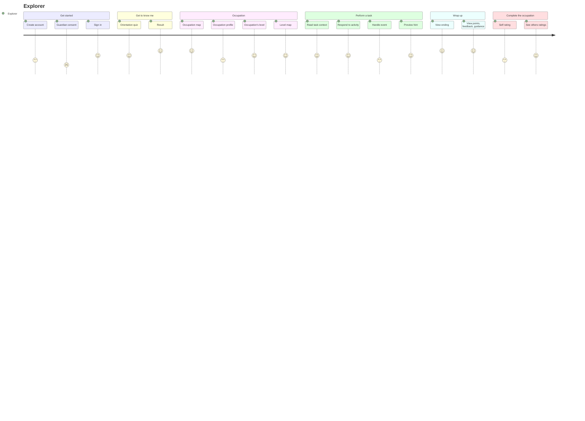
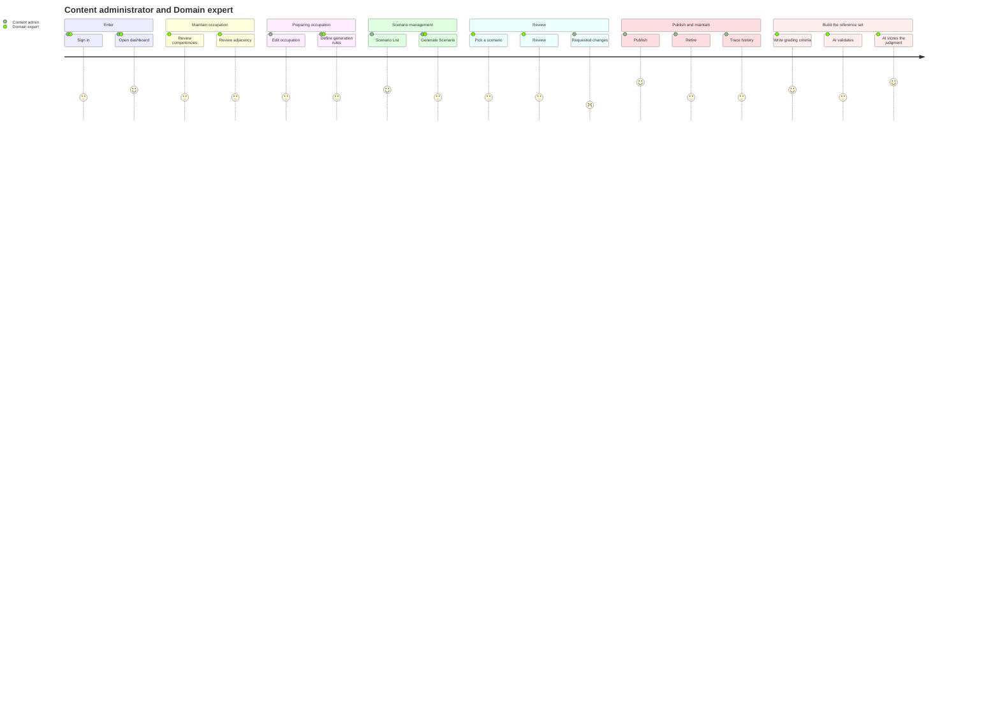
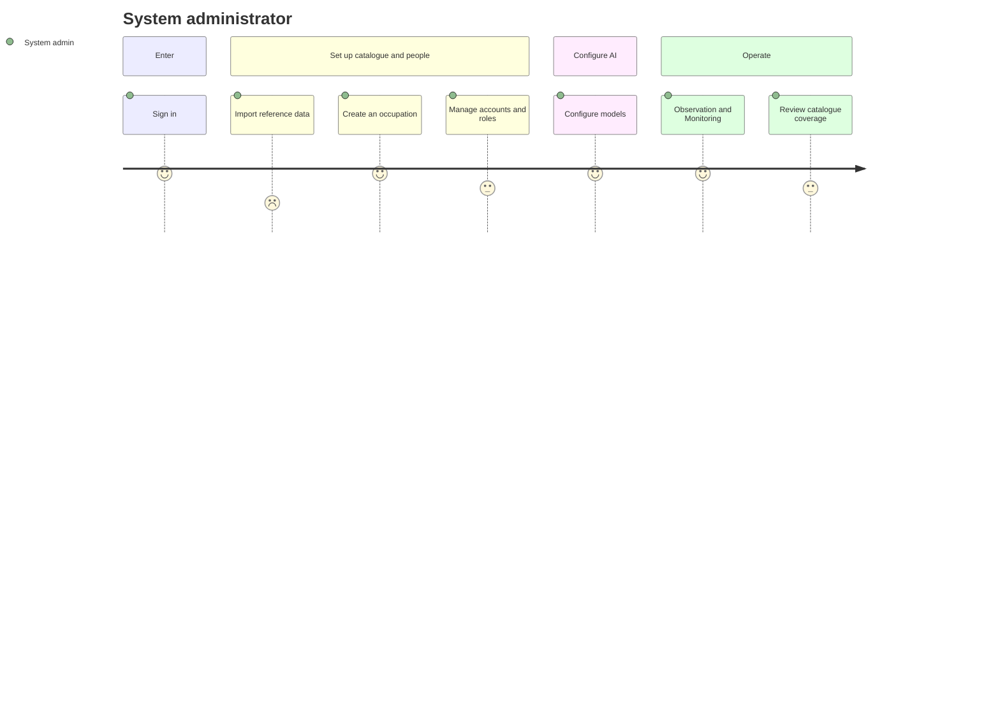

# JobQuest — User journeys (converted from the screen flow)

Converted from `vao-nghe-flow-full.excalidraw` (player screens 1–10 and 6b–9b, admin screens A–G), one journey per actor. Each task is one screen or one action on a screen; the screen code from the flow is given in square brackets.

**About the scores:** Mermaid user journeys require a satisfaction score from 1 (frustrating) to 5 (satisfying) for every task. The scores below are **design hypotheses** — where the team expects friction (waiting, fixing errors, filling forms) versus reward (results, unlocks) — not measured data. They should be replaced with real values after usability testing.

## Journey 1 — Explorer

## Journey 2 — Content administrator and Domain expert (scenario authoring)

## Journey 3 — System administrator

