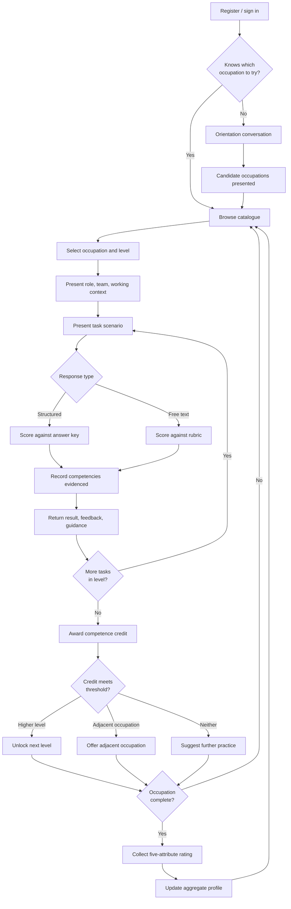
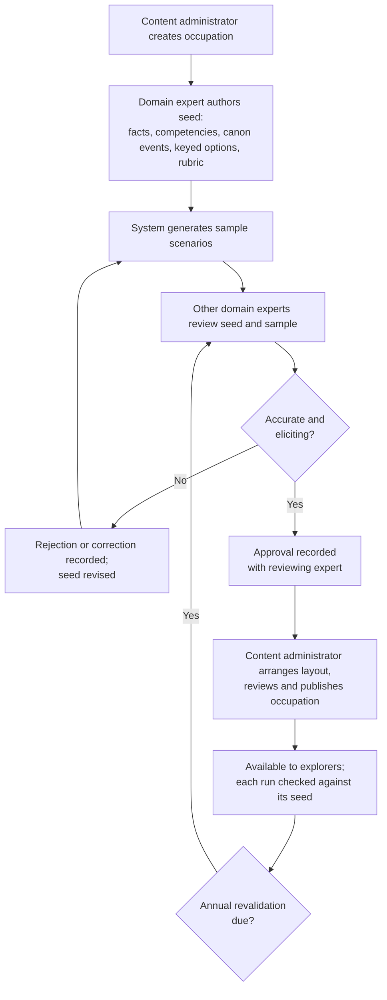
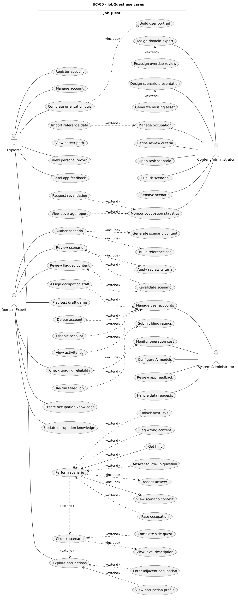

# Abstract {-}

Occupational choice is commonly made with limited direct knowledge of the work involved. Research on career decision-making identifies insufficient occupational information as a principal source of difficulty, and the realistic job preview literature establishes that balanced, candid previews improve person–job fit and reduce subsequent regret. Delivering such previews has historically required either workplace exposure or content authored occupation by occupation, neither of which scales. This project designs, implements, and evaluates a platform that uses generative language models to deliver experiential occupational exposure at greater breadth, and establishes whether competence demonstrated within such an experience can be measured with sufficient reliability to be useful.

The report establishes the evidence base for this approach, reviews existing research prototypes and deployed systems against criteria derived from properties the literature identifies as consequential for learning systems, and specifies a proposed platform in which occupations are presented as performable tasks, responses are assessed against expert-authored rubrics, and demonstrated competence determines subsequent exploration. The review finds that the constituent techniques have been demonstrated separately but not in combination, and that existing systems in this area report assessment agreement without chance correction or difficulty stratification. The proposed evaluation addresses this through an expert-reviewed reference set constructed within a single occupational field. The report covers Chapters 1 to 5.1: introduction, background, related work, the proposed system, and its analysis.

**Keywords:** career exploration, experiential learning, realistic job preview, large language models, automated assessment, stealth assessment, serious games.

# List of Abbreviations {-}

| Abbreviation | Expansion |
|---|---|
| BR | Business Rule |
| DC | Design Constraint |
| DR | Data Requirement |
| ECD | Evidence-Centered Design |
| ESCO | European Skills, Competences, Qualifications and Occupations |
| FR | Functional Requirement |
| HCMUT | Ho Chi Minh City University of Technology |
| I-CVI | Item-level Content Validity Index |
| LLM | Large Language Model |
| MBTI | Myers–Briggs Type Indicator |
| MOET | Ministry of Education and Training (Vietnam) |
| NFR | Non-functional Requirement |
| O\*NET | Occupational Information Network |
| RIASEC | Realistic, Investigative, Artistic, Social, Enterprising, Conventional |
| RJP | Realistic Job Preview |
| RP | Research Problem |
| S-CVI/Ave | Scale-level Content Validity Index, averaging method |
| SCCT | Social Cognitive Career Theory |
| SDT | Self-Determination Theory |
| UC | Use Case |
| UR | User Requirement |
| ĐACN | Đồ án chuyên ngành (Specialized Project) |

---

# Chapter 1 — Introduction

## 1.1 Motivations

Occupational choice is among the most consequential decisions an individual makes, and it is typically made with limited direct knowledge of the work itself. A prospective entrant selects a field on the basis of job titles, salary figures, and descriptions authored by parties with an interest in recruiting them. The texture of the work — its daily pressures, its trade-offs, the tasks that occupy most of its hours — generally becomes apparent only after entry, when the cost of reversing the decision is high.

Research on career decision-making identifies the mechanism behind this difficulty. In the taxonomy of Gati, Krausz and Osipow [1], whose structure was recently confirmed across thirteen countries [2], insufficient information about occupations constitutes a principal category of decision difficulty, distinct from indecisiveness or inadequate self-knowledge. The obstacle is informational rather than dispositional: individuals are not primarily unable to decide, but unable to decide on an adequate basis.

Conditions in Vietnam illustrate the problem in a particularly compressed form. Entry to higher education is mediated by national examination results and published admission benchmark scores, so the selection of a field of study is effectively completed at seventeen or eighteen, under time pressure, and is constrained by the applicant's score relative to institutional thresholds rather than by any assessment of occupational fit [3]. The decision is frequently not the applicant's own. A 2026 survey of approximately 9,200 students across ten Vietnamese universities reported that more than one fifth had selected their field on parental direction, that nearly one fifth had entered without a defined occupational goal, and that around a third were subsequently uncertain whether they would choose the same field again [4]. Labour-market data indicate the downstream cost. Analysing successive waves of the national Labour Force Survey, Tran et al. [5] found the proportion of graduates in fully matched employment declining over time, with vertical and combined mismatch carrying measurable wage penalties; related analyses associate the same pattern with underutilised human capital at national scale. Employer-reported skills shortages, particularly in science and technology fields, compound the effect.

The prevailing response, in Vietnam and elsewhere, is psychometric. Interest inventories derived from Holland's typology, personality instruments in the Myers-Briggs tradition, and their commercial derivatives dominate career guidance provision. These instruments are informative about preferences but structurally unable to address the difficulty Gati's taxonomy identifies: they elicit what an individual believes about themselves rather than supplying information about occupations, and they cannot establish whether that individual would perform or persist in a given role. Their measurement properties are also contested. Early retest studies found that a substantial share of respondents were assigned a different Myers-Briggs type after only a few weeks [6], whereas the publisher reports test–retest coefficients of 0.81 to 0.86 on the underlying continuous scales [7]; the instability concerns the dichotomised type labels on which guidance is usually based, for respondents whose scores lie near a boundary. The more fundamental limitation is not reliability but what is measured: a stable preference remains a preference, not information about the work.

An alternative is well established in organisational psychology but rarely applied to career exploration. The realistic job preview literature demonstrates that balanced previews, including a role's unattractive features, improve person–job fit and reduce subsequent turnover, with perceived honesty identified as the operative mechanism [8][9]. Such previews are, in effect, information about the work delivered before commitment. Their delivery, however, has historically depended on either direct workplace exposure or content authored case by case, neither of which scales to the breadth of occupations an undecided student might wish to consider. Recent advances in generative language models alter this constraint, and that change in feasibility motivates the present project.

## 1.2 Objectives

The overall objective is to enable a person facing an occupational decision to experience the work of an occupation, receive an assessment of how they performed it, and use that assessment to decide which occupations to explore further — before committing to one. This objective is realised by JobQuest, a deployable platform specified in Chapter 4. The present phase delivers a working system covering the information technology field; the subsequent capstone phase extends its occupational coverage and operational maturity.

The overall objective is pursued through four specific objectives:

1. To deliver occupational tasks that remain faithful to the occupations they represent, by constraining AI generation with expert-authored material, so that the experience a user receives conveys accurate information about the work.
2. To assess users' responses, including open-ended ones, through automated judgment whose agreement with domain experts is established, so that the result, feedback, and guidance a user receives can be relied upon for formative use.
3. To convert demonstrated competence into guidance on which occupations a user is prepared to explore next, so that exploration builds on what the user has shown they can do.
4. To make the platform freely and sustainably available, with occupational content governed by domain experts, so that access to occupational experience does not depend on a user's ability to pay.

The first two specific objectives correspond to the research problems stated in Section 4.2.2; the third and fourth are realised through the system's design and its business model (Section 4.1.5).

## 1.3 Scope

The system delivered in this phase is complete in function and bounded in coverage to the information technology field and its specialisations. The coverage boundary is methodological: constructing a reference set of gold-standard scenarios and expert judgments requires domain expertise that the project holds in this field, and without such a set the first two specific objectives cannot be verified. The design is domain-agnostic, so extending coverage to further fields requires expert authoring rather than redesign.

Within this coverage the work comprises the authoring of occupational scenario material by domain experts and their review of the scenarios generated from it; the presentation and publication of that material by content administrators; AI generation and adaptation of task scenarios from that material; automated assessment of structured and open-ended responses, returning a result, feedback, and guidance; a competence-based progression model linking levels and adjacent occupations; the presentation and engagement design described in Section 4.2.1; a supporting orientation conversation for users uncertain where to begin; administration of the occupation catalogue and of the AI models; and an offline evaluation of generation quality and assessment accuracy against the expert reference set.

## 1.4 Significance of the Project

### 1.4.1 Significance from the Practical Perspectives

The practical contribution is a freely accessible means of acquiring occupational information experientially before commitment, for students selecting a field of study, graduates entering the labour market, workers considering transition, and the institutions that guide them. Its value rests on three established findings: that balanced, honest previews improve fit and reduce later regret [8][9]; that the obstacle they address, insufficient occupational information, is a principal source of career decision difficulty [1][2]; and that performing authentic tasks is the strongest source of self-efficacy, which social cognitive career theory identifies as a determinant of choice and persistence [10][11]. Because the platform is designed to be offered without charge and operated in partnership with public education authorities (Section 4.1.5), its reach does not depend on users' ability to pay. This matters particularly in Vietnam, where the decision falls at an age and within a family setting that leave most applicants little opportunity to observe the work they are selecting, and where the existing guidance market consists almost entirely of self-report instruments.

### 1.4.2 Significance from the Scientific Perspectives

The scientific contribution lies in artificial intelligence applied to education, in two problems that current research identifies as open. The first is grounded generation of educational content: language models produce fluent instructional material readily, but fidelity to a specified domain requires explicit constraint, and the project contributes an expert-in-the-loop generation method evaluated against a domain reference set. The second is validated automated assessment: language models are increasingly used in educational technology to judge open-ended learner responses, yet reported agreement is systematically optimistic, and chance-corrected, difficulty-stratified validation is rarely reported. The project contributes such a validation in the setting of behavioural, or stealth, assessment, where the evidence of competence is the learner's performance of a task rather than an answer to a test item.

The application setting is itself a contribution to educational technology. Experiential career education has not previously combined these techniques, and the systems that approach it are research prototypes evaluated through small qualitative or within-subject studies. An evaluation reporting chance-corrected agreement, difficulty stratification, and test–retest consistency offers a more reproducible basis for the claims such systems make.

## 1.5 Report Structure

Chapter 2 establishes the background: the evidence that experiential exposure conveys occupational information more effectively than description, the basis for measuring competence from behaviour, the conditions under which game-based delivery supports rather than displaces learning, relevant career-development theory, the generative and assessment technologies involved, and the data resources and benchmarks available for grounding and evaluation. Chapter 3 reviews related work, examining research prototypes and deployed systems, deriving criteria for comparison, and identifying the gap the project addresses. Chapters 4 to 8 follow the prescribed structure for the specialized project, covering the proposed system, its analysis and design, implementation and testing, evaluation, and conclusions.

---

# Chapter 2 — Background Knowledge and Technologies

This chapter assembles the evidence on which the proposed design rests. Sections 2.1 and 2.2 concern learning and measurement: whether performing a task conveys understanding that description cannot, and whether competence can be inferred from performance. Section 2.3 examines game-based delivery, including evidence qualifying its effectiveness. Section 2.4 summarises career-development theory. Sections 2.5 and 2.6 address the generative and assessment technologies and the data resources available for grounding and evaluation, and Section 2.7 considers responsibility constraints arising from the intended user population.

## 2.1 Experiential learning and realistic job previews

Kolb's model of experiential learning [12] characterises learning as a cycle in which concrete experience is transformed through reflective observation into abstract conceptualisation and subsequent active experimentation. The model's implication for occupational information is direct: an occupational description supplies conceptual content without the experience from which, on this account, durable understanding is constructed. Whatever a description conveys, it does not engage the transformation process the model describes.

The realistic job preview literature provides the corresponding empirical tradition [13]. A realistic job preview presents a balanced account of a role, including features an applicant might find unattractive, in place of a promotional account. Four meta-analyses converge on its effects [8][9][14][15]. Phillips [8], synthesising forty studies, associated such previews with reduced inflation of expectations, increased self-selection, improved performance and lower voluntary turnover, and additionally found richer audiovisual previews more effective than written ones — a finding that bears directly on delivery format. Earnest, Allen and Landis [9], in a path analysis over fifty-two studies and approximately seventeen thousand participants, identified perceived honesty as the mediating mechanism, indicating that the effect depends on the preview's candour rather than merely on its informational content. No meta-analysis has since superseded it; the most recent umbrella review of the field identifies it as the current synthesis [16].

Whether simulated experience transfers to real performance is addressed by the simulation-based learning literature. Cook et al. [17] and McGaghie et al. [18] established substantial effects for technology-enhanced simulation within health professions education, where the paradigm originated. Of greater relevance here, Chernikova et al. [19], synthesising 145 studies in higher education, reported a large overall effect that generalised across academic domains rather than remaining confined to clinical training, and further found that scaffolding — worked examples for novices, reflective prompts for more advanced learners — moderated outcomes.

Taken together, these three literatures support a specific proposition: that an honest, performed representation of a role conveys occupational information more effectively than description, and that the effect is not restricted to the clinical domains in which simulation research began.

## 2.2 Assessment of competence from behaviour, and competency-based progression

If a learner performs tasks rather than answering questions about themselves, the assessment problem changes accordingly. Evidence-centered design, developed for assessment within game environments under the term stealth assessment [20], addresses this by decomposing the problem into three linked models: a competency model specifying what is claimed to be measured, an evidence model specifying which observable behaviours constitute evidence for those claims and with what weight, and a task model specifying situations that elicit the relevant behaviour.

| Model | Function | Requirement it imposes |
|---|---|---|
| Competency | Defines the constructs claimed to be measured | Constructs must be specified independently of any single task if inferences are to transfer |
| Evidence | Maps observed behaviour to inferences about the constructs | Each observable must be attributable to a named construct; unattributable observations yield uninterpretable scores |
| Task | Specifies situations that elicit relevant behaviour | The target construct must be necessary to task completion, not merely permitted by it |

: Evidence-centered design models and the requirements they impose.

The third requirement is the most demanding and the most frequently unmet. Shute et al. [21] obtained significant correlations between in-game estimates of problem-solving and external measures precisely because the tasks could not be completed without deploying the measured competency. Where a task admits a route that bypasses the target construct, the evidence model measures something other than what it claims. Task authoring in such systems is consequently a psychometric activity rather than a purely editorial one.

A related question is what an assessment result entitles a learner to do next. Competency-based progression [22] treats competence as a transferable and independently verifiable unit rather than as an attribute of a completed course or an occupied role. On this account, competence demonstrated in one context constitutes evidence bearing on readiness for adjacent contexts. Establishing which contexts are genuinely adjacent requires an external basis, and standard occupational taxonomies supply one by describing occupations in terms of constituent skills and work activities, discussed in Section 2.6.

Where a task asks the learner to choose among actions rather than to write, the relevant assessment tradition is the situational judgment test, which presents work situations with response options that differ in effectiveness and is commonly characterised as a low-fidelity simulation [23]. A meta-analysis of 102 validity coefficients from 10,640 people found situational judgment tests validly and generalisably related to job performance (ρ = .34) [24], and their items measure distinguishable constructs such as interpersonal skill, teamwork, and leadership rather than a single ability [25]. Two further findings bear on design. The established development process derives scenarios and response options from critical incidents supplied by subject-matter experts [26], and a separate group of experts rates each option's effectiveness to form the scoring key [27]. The wording of the response instruction also changes the construct measured: asking what a respondent would do relates more to personality, whereas asking which action is most effective relates more to cognitive ability [28]. Options scored in this way are keyed along a range from ineffective or harmful to highly effective, and each carries an expert-rated profile of effectiveness across competencies. An option may accordingly be correct, in the sense of the most effective response; a trade-off, effective for one competency at a cost to another; or wrong, ineffective or harmful and keyed with negative effectiveness.

## 2.3 Game-based delivery: evidence, moderators, and limits

Game-based delivery is frequently proposed for educational systems and frequently overstated. The evidence supports it conditionally, and the conditions are specific enough to constrain design.

Effects and moderators. Hamari, Koivisto and Sarsa [29] found gamification effects generally positive but dependent on context and user. Sailer and Homner [30], in the principal learning-specific synthesis, reported significant but modest effects — cognitive g = .49, motivational g = .36, behavioural g = .25 — and identified narrative and the combination of competition with collaboration as moderators, noting the effectiveness of narrative paired with a persistent developing avatar. Bai, Hew and Huang [31] and Clark, Tanner-Smith and Killingsworth [32] report comparable medium effects with design features moderating outcomes.

The competence qualification. A meta-analysis by Li, Hew and Du [33] disaggregates these effects by psychological need and yields a result that materially constrains claims made for such systems: gamification produced large gains in perceived autonomy (g = 0.638) and relatedness (g = 1.776) but only a marginal effect on competence (g = 0.277). Gamification, in other words, reliably improves how learners feel about an activity while doing comparatively little for what they can do. Zeng et al. [34] add that particular element combinations underperform, with one common configuration associating negatively with academic performance. Any system asserting skill development must therefore locate the mechanism of that development in something other than reward structures.

Evidence by genre. Genre-level findings differentiate more usefully than aggregate ones. Role-play methods show an overall effect of approximately 0.82 with the largest component on skill acquisition [35], the strongest genre-level support for role-based designs. Simulation games carry the most occupationally relevant evidence and the clearest caveat: Sitzmann [36], synthesising sixty-five studies, found simulation-taught trainees exceeded comparison groups on self-efficacy, declarative and procedural knowledge and retention, but only where the game actively conveyed material, permitted learner control, and supplemented other instruction — when it constituted the sole method, comparison groups performed better, and the analysis reported evidence of publication bias. Wouters et al. [37] similarly found serious games effective for learning and retention while not necessarily more motivating than conventional instruction, and most effective as a supplement across multiple sessions. Narrative and branching-story formats reinforce engagement and learning [38], consistent with the narrative moderator above. Procedurally varied and randomised formats support replayability, but the evidence here is double-edged: randomised-reward mechanisms are robustly associated with problem gambling and reduced wellbeing among purchasers [39], which distinguishes variation used for content variety from variable-ratio reward scheduling.

Motivational basis. These findings are commonly interpreted through self-determination theory [40], under which motivation depends on satisfaction of needs for competence, autonomy and relatedness. The mapping is reasonably direct: progression and mastery structures address competence, meaningful choice addresses autonomy, and social or comparative features address relatedness, the least studied of the three in game research.

The implication for design is that engagement mechanisms and learning mechanisms should not be conflated. Narrative, progression and choice are supported as engagement structures; skill acquisition, on this evidence, must derive from the authenticity of the tasks themselves.

## 2.4 Career-development theory

Four theoretical traditions inform career guidance provision and the design of systems supporting it. Holland's typology [41] models occupational choice as person–environment congruence and underlies the interest inventories in widespread use, including the public-domain instrument distributed with the O\*NET occupational database. Social cognitive career theory [10][42] identifies self-efficacy, built principally through mastery experience, as a determinant of interest formation and choice — a mechanism accessible to systems in which users perform tasks rather than report preferences, and inaccessible to instruments that only elicit self-description. Super's life-span theory [43] holds that vocational self-concept develops over time, so that occupational fit is properly understood as changing rather than fixed. Krumboltz's happenstance learning theory [44] extends this by treating unplanned events as a normal and potentially productive component of career development rather than as disruption.

Social cognitive career theory also specifies how self-efficacy forms, which determines what a system of this kind can and cannot affect. Following Bandura [45], self-efficacy derives from four sources: mastery experiences, vicarious experiences of others' performance, verbal and social persuasion, and affective and physiological states. Their contributions are unequal. A model-based meta-analysis identified mastery experience as the strongest source [11]; the finding has been extended to career exploration and decision-making [46] and confirmed longitudinally in a three-wave study of 1,512 university students, in which mastery experience exerted the greatest sustained influence on career decision self-efficacy [47]. Two qualifications follow for systems that deliver experience through simulated tasks. Such systems engage mastery experience directly and persuasion through feedback, but provide little vicarious experience and do not target affective states. And because self-efficacy is task-specific, a system can build it only for the tasks it actually presents: where interaction is text-based, it can address competencies expressed through written analysis, prioritisation, and decision-making, but not those expressed through speech or physical performance, such as oral fluency in an interview. Section 4.2.3 compares these competencies with their counterparts in live work situations.

The last two traditions jointly support a position that career guidance systems seldom represent: that a career decision is situated within a whole life, subject to circumstances — obligations, health, relationships, relocation, changing values — that alter what constitutes a suitable path. Where a system models occupational fit as a fixed verdict, this dimension is lost. The consideration carries particular weight in contexts where career decisions are made within strong family and social expectations, as the Vietnamese survey data indicate [4], and it provides the theoretical basis for treating work–life balance as an attribute of an occupation rather than as an externality.

The limitations of self-report instruments follow from the same body of theory. Beyond the contested stability of type classifications noted in Section 1.1 [6], self-report is subject to social desirability effects, and congruence measures derived from interest typologies correlate only modestly with subsequent satisfaction. These are not implementation defects but properties of the method: asking what a person believes they would enjoy produces evidence of a different kind from observing what they do.

Frameworks of career decision difficulty. The taxonomy of Gati, Krausz and Osipow [1], on which Section 1.1 relies, is one of several frameworks describing why career decisions stall, and it is among the oldest still in use, so its choice requires justification. Table 2.2 compares it with five others.

| Framework | Year | What it describes | Structure | Missing occupational information as a separate component |
|---|---|---|---|---|
| Taxonomy of career decision-making difficulties (CDDQ) [1] | 1996 | Difficulties arising before and during the decision | Ten categories in three clusters: lack of readiness, lack of information, inconsistent information | Yes: within the lack-of-information cluster, alongside information about the self, the process, and ways of obtaining information |
| Emotional and personality-related career decision-making difficulties (EPCD) [106] | 2008 | Emotional and personality-related difficulties | Three clusters: pessimistic views, anxiety, self-concept and identity | No |
| Career Indecision Profile [107] | 2013 | Sources of indecision, including personality | Four factors: neuroticism and negative affectivity, choice and commitment anxiety, lack of readiness, interpersonal conflicts | No separate component |
| Career Decision Self-Efficacy scale [108] | 1983 | Confidence in carrying out decision tasks | Five subscales: self-appraisal, occupational information, goal selection, planning, problem solving | Partly: confidence in gathering information, not the information that is lacking |
| Career Thoughts Inventory [109] | 1996 | Dysfunctional career thoughts | Three scales: decision-making confusion, commitment anxiety, external conflict | No |
| Career Decision Scale [110] | 1976 | Certainty and indecision | A certainty scale and an indecision scale | No separate component |

: Frameworks of career decision difficulty compared with the taxonomy of Gati, Krausz and Osipow.

The comparison shows a division of labour rather than a succession. The later frameworks do not replace the taxonomy; they describe other sources of difficulty — emotional and personality-related dispositions [106][107][109], or confidence in carrying out decision tasks [108] — and the first of them was developed with the taxonomy's own author to complement it [106]. Only the taxonomy isolates missing information about occupations as a separately measured category, distinct from readiness and from inconsistent information. That category is the difficulty a system supplying occupational information can address directly, whereas dispositions are unlikely to be changed by information alone. The taxonomy's age is offset by recent structural evidence: its structure was re-examined across thirteen countries in 2023 [2], a study that re-validates the taxonomy rather than proposing an alternative to it.

Applicability to Vietnam. The cross-national evidence concerns the taxonomy's structure. Levin et al. [2] compared factor models on thirty-nine samples (N = 19,562) in nine language versions, which the authors describe as covering thirteen countries, and found the original structure to fit best, including in the South Korean and Malaysian samples, the only Asian ones. Measurement invariance could be tested only within the English and the French versions; it held at the scalar level for the French version but not at the metric level for the English one, so scores are not established as comparable across countries. The lack-of-information cluster was the most reliable of the three and the lack-of-readiness cluster the weakest, which is also where earlier Taiwanese, Chinese, and Korean studies reported departures from the original structure [111][112][113], one of them placing external conflicts, which include the expectations of family, with readiness [111]. No validated Vietnamese version of the questionnaire was identified. The project therefore relies on the taxonomy only for the category that replicates most consistently, missing information, and does not use the questionnaire's scores; using it as an outcome measure with Vietnamese users would first require local validation, with particular attention to readiness and to family-related external conflicts.

## 2.5 Generative and assessment technologies

Content generation. Automatic generation of educational content predates large language models but was long confined to shallow factual items [48]. Language models extended this substantially: Sarsa et al. [49] generated programming exercises with solutions, tests and explanations, a domain directly relevant to information technology scenarios, while noting that quality oversight remained necessary; Doughty et al. [50] generated items calibrated to specified cognitive levels. Controlled comparison indicates the outputs can be psychometrically adequate — one study found model-authored assessment items statistically indistinguishable from human-authored items on difficulty, discrimination and reliability, with the effect most pronounced in computer science [51]. The consistent qualification across this literature concerns grounding: fluent generation is readily obtained, while factual fidelity to a specified domain requires explicit constraint, typically through retrieval or authored scaffolding [52].

Interactive narrative and its control. Systems in which a language model conducts an interactive scenario draw on work demonstrating that such models can maintain memory, synthesise reflections and plan behaviour over extended interaction [53], and can track game state while a human retains narrative authority [54][55]. The same literature documents the principal failure mode, namely degradation of consistency over long horizons, and the mitigations that address it. Plan-driven generation frameworks report improved continuity and reduced spatiotemporal inconsistency relative to unconstrained prompting [56], indicating that authored structure rather than model scale is the operative variable.

Automated assessment of open responses. The use of language models as evaluators has developed through three identifiable stages, each imposing a different requirement on systems that adopt it. Zheng et al. [57] established feasibility, reporting agreement with human preferences above eighty per cent — comparable to inter-human agreement — while documenting position, verbosity and self-preference biases in the same work. Liu et al. [58] addressed method, showing that structured chain-of-thought prompting against an explicit rubric improves alignment, while noting a residual preference for model-generated text. The third stage concerns validation and is the most consequential. A systematic evaluation of twenty-one evaluators across approximately 541,000 judgments [59] found that raw agreement systematically overstates chance-corrected performance, reporting an approximately forty-one point discrepancy between exact-match agreement and Cohen's kappa on one benchmark, and that high test–retest consistency can coexist with severe position bias. Dedicated benchmarks quantify the ceiling: on deliberately difficult response pairs with objective correctness labels, the strongest general-purpose evaluator without extended reasoning reached approximately sixty-four per cent accuracy, and models with extended reasoning seventy-five to eighty-one per cent [60].

Reliability of rubric scoring by language models. Whether such evaluators are themselves reliable for rubric-based scoring of learners' constructed responses has been studied directly, and the evidence supports a conditional answer. A synthesis of sixty-five studies of essay scoring found agreement between language models and human raters to be highly context-dependent, with reported quadratic weighted kappa spanning nearly the whole range and many values below the 0.70 conventionally required [101]. Agreement approaches that between human raters under identifiable conditions: a strong model, an explicit rubric, and calibration examples. With few-shot prompting, GPT-4 marked short answers in school subjects at a Cohen's kappa of 0.70, against 0.75 between human markers [102], and with calibration examples its ratings of short second-language essays approached those of dedicated scoring systems [103]. Without such support agreement is moderate: a small open model reached a mean quadratic weighted kappa of about 0.5 zero-shot on a standard essay corpus, against 0.79 for a fine-tuned scorer [104]. Consistency across repeated runs can be high, with intraclass correlations of 0.94 to 0.99 reported for GPT-4 [105], but consistency is not validity. Two implications follow. Judging models should be strong, anchored to an explicit rubric, and supplied with scored examples; and reliability cannot be inferred from the literature for a new task and domain, none of these studies concerning occupational tasks, but must be established against experts in each case.

Four requirements follow for any system adopting this technique. Agreement must be reported with chance correction rather than as exact match. The evaluator should be drawn from a different model family than the generator, since self-preference otherwise contaminates the loop. Option ordering and response length must be controlled, since both bias scores independently of quality. And because accuracy degrades unevenly with item difficulty, aggregate figures conceal failure on precisely the reasoning-intensive items such systems most need to assess, which requires stratified reporting.

Expert involvement in authoring. Maintaining accuracy in generated instructional content is a multi-party problem. Recent work converges on a layered pipeline: a curated source of truth, retrieval-grounded generation, expert review prior to publication, and a feedback loop from use. Evaluation of such pipelines indicates that automated checks reliably enforce verifiable properties while domain experts remain necessary for pedagogical adequacy and for the distinctions that make an item discriminating [61]. The division of labour this implies — automated first-pass generation under expert validation — is the current best-supported arrangement for content that must remain factually accurate about a real domain.

## 2.6 Data resources and benchmarks

Systems making claims about occupations and about assessment accuracy can be grounded in, and evaluated against, established resources rather than bespoke data collection.

Occupational and skills taxonomies. The O\*NET database maintained by the United States Department of Labor describes approximately nine hundred occupations linked to more than nineteen thousand task statements across some two thousand detailed work activities [62]. The European ESCO classification describes 3,039 occupations and 13,939 skills across twenty-eight languages, with an official correspondence to O\*NET [63]. Both express occupations as compositions of skills and activities, which supplies an external basis for claims about occupational adjacency and a source for authoring occupationally representative tasks.

Evaluation benchmarks. For automated assessment, MT-Bench and the associated arena methodology [57], JudgeBench [60] and RewardBench [64] provide difficulty-calibrated reference sets and, more importantly, an established reporting methodology. For generated instructional content, EQGBench [65] and EduBench [66] provide protocols for evaluating generation quality. Text-based interactive environments including TextWorld [67] and Jericho [68] serve as established settings for evaluating agents in branching narrative.

Measurement practice. Two constructs require separate instruments and should not be reported as a single accuracy figure. Generation quality concerns whether produced content preserves required domain facts and elicits the intended constructs. Expert review of such content has an established quantitative form in content validation: experts rate each item's relevance on a four-point scale, and the item-level content validity index (I-CVI) is the proportion of experts rating it relevant. Three experts is the accepted minimum for a content-validation effort [69][70], and an I-CVI of .78 or higher with three or more experts, together with a scale-level average (S-CVI/Ave) of at least .90, indicates good content validity [70]. Assessment accuracy concerns agreement between automated and expert judgment of the same response. Chance-corrected agreement is required because raw agreement overstates performance, and because rubric scores are ordinal, quadratic weighted kappa is the appropriate statistic, penalising large disagreements more heavily than small ones. For automated scoring, Williamson, Xi and Breyer [71] set acceptance at a quadratic weighted kappa of at least 0.70 between automated and human scores, a standardised mean score difference of at most 0.15, and a degradation of no more than 0.10 from human–human to automated–human agreement. Agreement among the human raters themselves is assessed with Krippendorff's alpha, for which .800 indicates reliable ratings and .667 is the lower bound for tentative conclusions [72]. Agreement is reported stratified by item difficulty and alongside test–retest consistency. Two further techniques allow evaluation before human responses are available. Perturbation checklists alter a response along a single targeted criterion while holding the others constant, which supplies ground truth by construction and exposes whether an evaluator is sensitive to that criterion [73]; and a panel of judging models drawn from different model families has been found to outperform a single large judge, with less intra-model bias and at lower cost [74], a result obtained for binary and pairwise judgments whose extension to ordinal rubric scoring remains to be tested. The distinction matters because the three failure modes — biased judgment, unstable judgment, and judgment that fails selectively on difficult items — are separately diagnosable only when reported separately. As to expected magnitude, the closest methodological precedent, a multi-agent architecture performing unobtrusive assessment in a serious game, reports correlations between behavioural estimates and external outcomes in the range of 0.28 to 0.33, with near-zero correlation against prior attainment [75]. The latter figure is as informative as the former, since it evidences discriminant validity. Moderate correlations are the realistic expectation for open-ended behavioural assessment.

## 2.7 Responsibility considerations

Three considerations arise from the intended user population and the nature of the data involved, each corresponding to a requirement of the project's specification.

Data protection for young users. A system addressed partly to secondary and tertiary students processes behavioural and performance data concerning individuals who may be minors, engaging Vietnam's Law on Personal Data Protection [99] and its implementing decree [100], both in force from 1 January 2026, and comparable frameworks for users elsewhere. Under that law, processing data collected in Vietnam on a platform located abroad is a cross-border transfer of personal data, which bears on any system that sends users' responses to a model provider outside the country. Aggregated statistics derived from individual performance carry a residual privacy surface, since aggregate presentations can under some conditions permit inference about individuals.

Fairness in automated assessment. An automated judgment of a user's demonstrated competence may influence that user's estimation of their own capability. The evaluator biases documented in Section 2.5 are therefore not solely accuracy concerns but fairness concerns, and the corresponding controls — chance-corrected validation, cross-family evaluation, rubric anchoring — function as fairness safeguards. Presenting assessment formatively, and not as a determination affecting access to opportunity, keeps the consequences proportionate to the reliability the method can currently support.

Accuracy of occupational representation. The realistic job preview evidence carries an ethical as well as a pedagogical implication: a system's value depends on representing occupations candidly, including their disadvantages, and is undermined if representation is shaped by commercial interest. Expert validation of authored material, discussed in Section 2.5, is the principal safeguard against a system conveying an inaccurate picture of a real profession with apparent authority.

## 2.8 Summary

The background supports a coherent position. Performed, honest representation of occupational work conveys information that description does not, and this effect generalises across domains (2.1). Competence can be inferred from behaviour provided the assessment is constructed so that target constructs are necessary to task completion, and such competence is meaningfully transferable across related occupations (2.2). Game-based delivery sustains engagement, but its contribution to competence is marginal, so skill development must rest on task authenticity rather than reward structures, and randomisation must serve variety rather than reward scheduling (2.3). Career theory supports treating occupational fit as changing and as situated within a whole life, while explaining why self-report alone is a weak basis for guidance (2.4). Generative and assessment technologies make scenario production and open-response evaluation feasible, subject to explicit grounding, validated judgment, and expert oversight (2.5), and established taxonomies and benchmarks permit both grounding and evaluation without bespoke data collection (2.6). The user population imposes data protection, fairness and accuracy obligations that are design constraints rather than subsequent considerations (2.7).

Two qualifications in this evidence bear directly on what any such system may claim. The first is the marginal effect of gamification on competence [33]; the appropriate response is to locate skill development in authentic task performance and validated assessment rather than in reward mechanisms. The second is Sitzmann's finding that simulation exceeds comparison instruction only as a supplement, and underperforms as a sole method [36]; a system of this kind is therefore properly positioned as informing occupational choice and building initial self-efficacy, not as a substitute for employment or formal instruction. Both qualifications are treated in what follows as constraints on claims rather than as objections to be set aside.

---

# Chapter 3 — Related Work

Chapter 2 established what the evidence indicates should be effective. This chapter examines what has been built. Section 3.1 reviews research prototypes; Section 3.2 reviews deployed systems, internationally and in Vietnam; Section 3.3 derives comparison criteria from the attributes the background identifies as consequential for learning systems, applies them, and states the resulting gap. Throughout, attention is given both to the limitations of existing work and to the design solutions worth adopting from it.

## 3.1 Related work from research literature

A growing body of research applies games and generative models to career development. It establishes the direction as active and credible, and three limitations recur across it.

Reflection as the terminal outcome. The most developed prototypes assist users in thinking about a career rather than performing one. CareerSim [76] is a language-model-driven career development game combining generated content with alumni data and career construction theory, advancing an avatar through life stages to produce a personalised report; a preliminary study with twelve participants reported improved understanding and reflection. Its interaction concerns a career trajectory rather than the tasks constituting an occupation, and the authors note limited contextual depth and difficulty with distant scenarios. Future You [77], in which participants conversed with a model-generated future self, reduced anxiety and increased future self-continuity across 344 participants, and Letters from Future Self [78] found comparable benefits for career exploration and resilience with thirty-six participants. Both demonstrate measurable psychological benefit from structured imagination of a future self. Neither provides the basis on which a user might discover, through performance, that the imagined self would find the work unsuitable — the informational deficit identified in Section 2.1. The design element worth adopting is the prospective framing itself, which these studies show is motivationally effective and which can be applied at the entry point of an experiential system rather than as its substance.

Trajectory abstraction without task fidelity. A second group models career development under uncertainty while abstracting from the work. CareerPooler [79] represents career development through a physical metaphor in which generated events perturb a trajectory, and reports significant gains in engagement, information gain, satisfaction and career clarity relative to a conversational baseline across twenty-four participants. It constitutes the strongest available evidence that generated, interactive career exploration outperforms conversational advice, and its treatment of unplanned events accords with the theoretical position in Section 2.4. Because the representation is metaphorical, however, the user does not perform occupational tasks, and outcomes are consequently reported in terms of clarity rather than demonstrated capability. Its event-generation pipeline, which balances favourable and unfavourable outcomes to avoid a uniformly positive trajectory, is directly adaptable to any system incorporating stochastic career events. Comparable abstraction characterises generative career imagination for children [80] and career simulation for self-regulation in secondary students [81].

Guidance without measurement. A third group improves the guidance interaction while leaving assessment unaddressed. A career counselling agent grounded in self-determination theory [82] reduced decision-making difficulty and improved engagement, confirming the applicability of the motivational framework in Section 2.3; its outcomes are measured through self-report instruments rather than through anything the user demonstrably did. Among the systems reviewed here, none infers competence from behaviour within a task, and none validates automated judgment against an expert-constructed standard. The techniques required are established outside the career domain — memory-consistent interactive narrative [53][56], rubric-based automated evaluation with its attendant validation requirements [57][59][60], and unobtrusive behavioural assessment [75] — but have not been combined within it.

Evaluation practice in this literature is a further limitation. Sample sizes range from twelve to thirty-six, with one exception at 344, and designs are predominantly qualitative or within-subject. Such designs are appropriate for establishing feasibility and eliciting user response, but they do not support claims about assessment accuracy, which requires comparison against an external standard.

## 3.2 Related work from deployed systems

### 3.2.1 International systems

Authored task simulation. Forage [83] is the established platform in experiential career exposure: employer-authored simulations in which users attempt representative tasks and compare their work against a model answer, distributed without charge and funded through employer talent acquisition. It substantiates the underlying premise that users will voluntarily attempt occupational tasks, and its task decomposition — discrete, self-contained work products with supporting context — is a directly adaptable model for scenario structure. Its constraints follow from its authoring model. Content expands only as employers commission it; repetition yields identical material, limiting exploration to a single pass; and assessment terminates in a fixed model answer, which demonstrates what a competent response looks like without evaluating the response the user produced. The catalogue also reflects its funding, concentrating in fields that sponsor recruitment. Human-mediated alternatives such as Virtual Internships and Extern provide genuine workplace exposure at correspondingly limited scale, while career video and mentoring platforms provide exposure without performance.

Generated task simulation and workplace assessment. A more recent group generates content rather than commissioning it. EntryLevel [84] produces AI-generated job simulations parameterised by field, skill and difficulty with an accompanying automated tutor, establishing commercially that occupational task content can be generated; it delivers these as discrete projects without progression or a connecting structure between occupations. Anthropos [85] conducts extended workplace scenarios in which a user interacts with several model-driven colleagues and produces work artefacts, explicitly generating behavioural evidence rather than self-report ratings. It is the closest deployed analogue to behavioural assessment as described in Section 2.2, and its multi-role scenario construction is adaptable. Its orientation is nonetheless towards personnel selection: the evidence generated serves an employer's hiring decision rather than a user's exploration, which determines both what is measured and who receives it. A third group — including conversation and interview practice systems with adaptive personas and scored feedback [86] — rehearses the selection process rather than the work, and its scoring dimensions, being conversational, do not generalise to occupational task performance.

Generative narrative systems. The systems that have most successfully solved the generation problems described in Section 2.5 are not career systems. AI Dungeon [87] and character.ai [88] established substantial demand for model-driven interactive narrative, particularly among the demographic most relevant to career exploration, and equally demonstrate the consistency degradation that unconstrained generation produces at scale. Hidden Door [89] is the more instructive case: it generates narrative within bounded authored components rather than through open generation, with the reported consequence that its narratives remain coherent across sessions. This is independent commercial corroboration of the finding in Section 2.5 that authored structure, not model capability, governs consistency, and its architecture is the most directly adaptable element identified in this review. What these systems lack is any representational commitment to a real domain, any model of competence, and any assessment.

Assessment and orientation instruments. O\*NET and its associated public interfaces, together with commercial and institutional counterparts, constitute the most widely used category. They administer an inventory, return ranked occupational suggestions, and terminate. Their occupational databases are a genuine asset — and, as noted in Section 2.6, a usable one — but the guidance model rests on the self-report foundation whose limitations Section 2.4 describes.

### 3.2.2 Vietnamese systems

The domestic market is materially homogeneous, which is itself the relevant finding.

Assessment-based provision. JobWay [90], reported in Vietnamese government press as the first digitised career orientation application in the country, comprises interest and personality assessment, descriptions of approximately three hundred occupations drawn from international sources, and linked institutional information. Notably, its occupational descriptions include the common difficulties of each occupation — an implicit application of the realistic job preview principle, delivered as text. JobTest.vn [91] is the most instrumentally developed, offering multiple validated inventories alongside an aptitude instrument adapted and standardised for Vietnamese use and an occupational database of substantial scale; its sophistication is concentrated in the measurement of self-report. Hướng nghiệp Sông An [92] combines counsellor training with a library of licensed instruments, representing the most methodologically careful domestic provision and remaining entirely assessment- and counsellor-based. Hướng Nghiệp LwL [93] advertises experiential activity alongside assessment and occupational information for a younger audience, though its substance remains assessment, content and mentoring.

Generative systems in the domestic market. Recent entrants apply generative models to career guidance, uniformly in conversational form. AI Hay [94] provides a model-driven agent predicting admission likelihood and recommending institutions and fields, together with an automated career-personality instrument; a parallel development across Vietnamese universities has produced admissions advisory agents at institutional scale. These establish market acceptance of AI-assisted career guidance domestically. None provides performed experience of occupational work, and none assesses demonstrated capability. Among the systems surveyed, no Vietnamese system offers generated, performed occupational simulation — a claim that should be re-verified close to submission, given the rate of change in this market.

## 3.3 Comparison, gap analysis, and positioning

### 3.3.1 Derivation of comparison criteria

Comparing systems against the features of a proposed system produces a circular result. The criteria below are instead derived from attributes that Chapter 2 identifies as determining whether a system of this general class — one intended to help a person learn about and choose an occupation — achieves its purpose. Each is stated as a general property, applicable to any system in the category, and each traces to an evidential basis rather than to a design preference.

The first concerns the nature of what the user does. Experiential learning and simulation transfer research (2.1) indicate that engagement with representative tasks of actual practice conveys understanding that description does not; task authenticity is therefore a primary attribute. The second concerns what is conveyed. The realistic job preview literature (2.1) and the decision-difficulty taxonomy (1.1) establish that balanced information, including unattractive aspects, is what improves fit — hence completeness and candour of occupational representation. The third concerns responsiveness: adaptive instruction and the generative literature (2.5) indicate that content which responds to the individual outperforms fixed content, giving adaptivity to the learner. The fourth concerns whether the system knows what the user can do: evidence-centered design (2.2) establishes both the possibility of inferring competence from behaviour and the conditions under which such inference is valid, giving validity of competence measurement. The fifth follows from it — assessment is educationally inert without actionable response, giving quality of feedback and guidance. The sixth derives from the gamification and self-determination literatures (2.3): sustained engagement determines whether any learning occurs at all. The seventh concerns navigation: career theory and competency-based progression (2.2, 2.4) indicate that occupational choice involves comparing and moving among related options, giving support for pathway navigation. The eighth concerns durability: the authoring literature (2.5) shows that content about real occupations degrades unless it can be extended and maintained, giving scalability and currency of content. A ninth attribute, the existence of empirical validation, is treated in the discussion rather than tabulated, since it concerns the evidence for a system rather than a property of it.

### 3.3.2 Comparative assessment

Ratings use three levels, defined as follows. Full (●) indicates the attribute is a core designed property of the system. Partial (◐) indicates it is present but limited in scope, incidental, or a by-product of another objective. Absent (○) indicates it is not provided. Ratings reflect the systems as surveyed and would require revision as products change.

\begin{landscape}
\begin{scriptsize}
\setlength{\tabcolsep}{3pt}
\renewcommand{\arraystretch}{1.3}
\begin{longtable}{@{}p{3.1cm} *{7}{p{2.55cm}}@{}}
\caption{Comparison of system classes against the derived criteria.}\\
\toprule
\textbf{Attribute} & \textbf{Authored simulation (Forage)} & \textbf{Generated simulation (EntryLevel, Anthropos)} & \textbf{Interview practice (careersim.ai etc.)} & \textbf{Generative narrative games (Hidden Door etc.)} & \textbf{Assessment \& orientation (O\textasteriskcentered NET, VN market)} & \textbf{Research prototypes (CareerSim, CareerPooler)} & \textbf{Proposed system} \\
\midrule
\endhead
C1 \newline Task authenticity & {\small$\bullet$}\  employer-authored real work products & {\small$\bullet$}\  generated role tasks & {\small$\ominus$}\  interview talk, not work & {\small$\circ$}\  fictional worlds & {\small$\circ$}\  inventory only & {\small$\ominus$}\  trajectory, not tasks & {\small$\bullet$}\  tasks drawn from occupational taxonomies \\
C2 \newline Candour of occupational representation & {\small$\bullet$}\  includes unglamorous tasks & {\small$\ominus$}\  varies by generation & {\small$\circ$}\  not its purpose & {\small$\circ$}\  no real occupations & {\small$\ominus$}\  text lists difficulties & {\small$\ominus$}\  events skew narrative & {\small$\bullet$}\  candour is a design requirement \\
C3 \newline Adaptivity to the learner & {\small$\circ$}\  fixed content, identical on repeat & {\small$\bullet$}\  parameterised generation & {\small$\bullet$}\  adaptive personas & {\small$\bullet$}\  fully generative & {\small$\ominus$}\  branching by score & {\small$\bullet$}\  generated per user & {\small$\bullet$}\  seeded generation per user \\
C4 \newline Validity of competence measurement & {\small$\circ$}\  model answer, no judgment & {\small$\ominus$}\  behavioural evidence, unvalidated & {\small$\ominus$}\  scored, conversational only & {\small$\circ$}\  none & {\small$\circ$}\  self-report only & {\small$\circ$}\  self-report outcomes & {\small$\ominus$}\  designed; validity to be established \\
C5 \newline Quality of feedback and guidance & {\small$\ominus$}\  exemplar, not response-specific & {\small$\ominus$}\  automated tutor & {\small$\bullet$}\  per-dimension coaching & {\small$\circ$}\  none & {\small$\ominus$}\  generic occupation reports & {\small$\ominus$}\  reflective prompts & {\small$\bullet$}\  result, feedback and guidance separated \\
C6 \newline Sustained engagement & {\small$\circ$}\  one-pass certificate & {\small$\circ$}\  discrete projects & {\small$\circ$}\  practice utility & {\small$\bullet$}\  high replayability & {\small$\circ$}\  single sitting & {\small$\ominus$}\  short study exposure & {\small$\ominus$}\  designed; retention untested \\
C7 \newline Support for pathway navigation & {\small$\circ$}\  isolated simulations & {\small$\circ$}\  unconnected projects & {\small$\circ$}\  single-role focus & {\small$\ominus$}\  world, not career, traversal & {\small$\bullet$}\  ranked occupational lists & {\small$\ominus$}\  linear life stages & {\small$\bullet$}\  competence-linked adjacency \\
C8 \newline Scalability and currency of content & {\small$\circ$}\  commissioned per employer & {\small$\bullet$}\  generated on demand & {\small$\bullet$}\  generated on demand & {\small$\bullet$}\  generated on demand & {\small$\ominus$}\  periodic database updates & {\small$\ominus$}\  prototype scale & {\small$\bullet$}\  generation with expert validation \\
\bottomrule
\end{longtable}
\end{scriptsize}

\noindent\scriptsize{$\bullet$~Full — a core designed property \quad $\ominus$~Partial — limited, incidental, or a by-product \quad $\circ$~Absent. Annotations state the basis for each rating. Ratings for the proposed system denote design intent; those marked $\ominus$ are targeted but not yet empirically established.}
\end{landscape}

### 3.3.3 Gap and positioning

The assessment indicates no systematic deficiency in any single system so much as a consistent failure to combine attributes that have been demonstrated separately. Authored simulation platforms achieve task authenticity and candour but cannot adapt or scale, and do not assess. Generated simulation systems achieve authenticity, adaptivity and scale, and where they assess behaviour they do so for selection rather than exploration, without pathway structure. Generative narrative systems achieve adaptivity and sustained engagement at high quality while making no representational commitment to real occupations. Assessment and orientation instruments — including the entire Vietnamese market surveyed — achieve pathway navigation and scale while omitting performance altogether. Research prototypes achieve adaptivity and engagement but stop short of task performance and competence measurement, and their evaluations do not support accuracy claims.

The consequent gap is not a missing feature but an unrealised combination: performed, candid occupational tasks that adapt to the individual, from which competence is measured with validated automated judgment, connected by a structure that relates occupations through the competencies they share, and maintained through expert authoring. Each constituent has been demonstrated — task authenticity by Forage, generation and behavioural evidence by EntryLevel and Anthropos, coherent generative narrative by Hidden Door, pathway structure by occupational taxonomies, engagement by the research prototypes — and their integration has not.

The present project addresses this combination. Its design adopts specific solutions identified above: bounded authored components as the means of maintaining generative consistency, discrete self-contained task structure for scenario construction, multi-role scenario composition for eliciting interpersonal competencies, balanced event generation for representing career uncertainty, and prospective framing at the entry point. Its contribution beyond assembly lies in the assessment and evaluation layer, where the requirements established in Section 2.5 — chance-corrected agreement, cross-family evaluation, difficulty stratification — are applied to a class of system in which such validation has not previously been reported. The claims the project may make are correspondingly bounded by Section 2.8: engagement and clarity effects are supported by existing evidence, whereas competence gain is a hypothesis to be tested against the reference set rather than a property the design confers.

---

---

# Chapter 4 — The Proposed System

## 4.1 Business Context

### 4.1.1 Application domain

The application domain is career guidance and exploration, situated at the intersection of educational technology and occupational information provision. Participants in this domain are individuals facing an occupational decision, institutions supporting them, and the bodies that publish occupational information. The domain's characteristic activity is the transfer of occupational information to a person who must act on it, and Chapter 1 established that this transfer is currently incomplete: guidance provision is dominated by instruments that elicit self-description rather than convey what work involves.

The proposed system, JobQuest, addresses this by allowing a user to perform representative tasks of an occupation, receive an assessment of the competencies those tasks elicited, and use that assessment to determine which further occupations to explore. It is a platform for informed exploration rather than a placement, recruitment, or credentialing service, and this boundary determines several of the business rules below.

### 4.1.2 Business processes

Three processes constitute the operation of the platform. They are modelled formally in Section 5.1.1.

The exploration process is the primary user-facing process. A registered user optionally completes an orientation conversation, which is provided for users who do not know which occupation to begin with and is not a prerequisite. The user selects an occupation and a level within it, is presented with the role, team, and working context before any task begins, and then works through the tasks comprising that level. Each task is a scenario drawn from the occupation and is answered in one of nine formats — multiple choice, multiple selection, ordering, matching, true/false, timed choice, free text, simplified email, or simplified code — with hints available throughout. Tasks ask what the user does in the situation, a behavioural-tendency instruction [28], because how a user tends to act is itself information about fit; scoring uses expert effectiveness keys in either case. Each response option is of one of three types: correct, the most effective response; trade-off, effective for one competency at a cost to another; or wrong, ineffective or harmful. Options and rubric criteria are scored on a single ordinal scale per competency, from −1 (ineffective or harmful) through 0 and +1 to +2 (most effective), so that evidence from choices and from written responses accumulates in the same competence record and agreement with experts can be computed on an ordinal scale. Using a hint is recorded and lowers the weight of that response as evidence of independent competence without blocking progress; a timed task that expires is recorded as unanswered, with its response time, and carries no separate penalty. The system evaluates each response, records the competencies it evidences, and returns a result, feedback specific to the response, and guidance for improvement. Completing a level awards competence credit; accumulated credit unlocks higher levels of the same occupation or, where competencies overlap sufficiently, entry to an adjacent occupation above its entry level. On completing an occupation, the user may rate it on five attributes, which contribute to that occupation's aggregate profile.

The content lifecycle process governs how occupations enter the catalogue, and it involves two roles with distinct responsibilities. Domain experts own the occupational content and author it in the system: for each scenario they enter the required facts, the competencies it must elicit, the critical incidents from which response options are drawn, the effectiveness of each option, and the rubric against which free responses are judged, which together form the scenario's seed. A seed is a template rather than a script: it fixes the canon events of a scenario — the situations every run must pass through, at set points — together with the keyed options and rubric attached to them, and leaves the narrative between those events to be developed by the model in response to the user's answers. Validation accordingly has two layers. In the first, the system generates a sample of scenarios from the seed, and experts other than the seed's authors review the seed and the sample in the system, judging their accuracy and returning approvals, rejections, or corrections, each recorded with the identity of the reviewing expert. In the second, every scenario generated at run time is checked automatically against its seed — that it passes through every canon event, preserves the required facts, and leaves each option's keyed profile unchanged (NFR-15) — and one that fails is regenerated or replaced by an instance from the approved sample. The content administrator does not author occupational content. The administrator manages the occupation as an entry in the catalogue, arranges how approved content is laid out and presented in gameplay, reviews the occupation as a whole before release, publishes it, and operates its lifecycle thereafter. Published content is revalidated annually by the experts, since occupational practice changes. In the present phase, in which no industry experts are yet engaged, the project team performs the expert role on provisional seeds (Section 4.2.1).

The evaluation process is internal and supports the research objectives. It proceeds in two stages (Section 4.2.2): a synthetic benchmark constructed by the project team, and a reference set of real responses and generated scenarios rated independently by domain experts, against which generation quality and assessment accuracy are measured offline as specified in Section 2.6.

### 4.1.3 Business rules

Business rules are stated here as policies and constraints of the domain that hold independently of any particular implementation. Constraints arising from implementation choices — which models are used, how cost is bounded, where data is processed — are recorded separately as design constraints in Section 4.3.3.

| ID | Rule | Origin |
|---|---|---|
| BR-01 | The entry level of every occupation is accessible without prerequisite. | Exploration is the purpose; gating discovery defeats it |
| BR-02 | Access to a higher level requires the competence credit specified for that level. | Competency-based progression (Section 2.2) |
| BR-03 | Demonstrated competencies that overlap an adjacent occupation's requirements, as determined from the occupational taxonomy, count towards that occupation's levels, so that a user may enter it above its entry level. | Sections 2.2, 2.6; a user exploring related work need not restart |
| BR-04 | An occupation may be rated only by a user who has completed it. | Rating validity depends on exposure |
| BR-05 | No scenario seed or rubric is published without domain-expert validation of the seed and of a sample of the scenarios generated from it. | Section 2.5; accuracy of occupational representation |
| BR-06 | Assessment results are formative. They are not transmitted to employers and do not determine access to any external opportunity. | Section 2.7; proportionality to assessment reliability |
| BR-07 | Occupational representation must include the unfavourable aspects of the work. | Realistic job preview evidence (Section 2.1) |
| BR-11 | Replaying a scenario cannot raise a competency beyond the credit that scenario can award. | Keeps unlocks tied to demonstrated competence (BR-02) |
| BR-13 | An occupation's content becomes available to explorers only when the content administrator publishes it, which requires approved seeds (BR-05). | Scenario lifecycle (Section 5.1.1) |
| BR-14 | Revising a seed withdraws the scenarios generated from it until the revised seed is approved. | Scenario lifecycle; accuracy of occupational representation |
| BR-15 | Published content is revalidated by domain experts every year. | Occupational practice changes |
| BR-16 | A retired occupation remains in the records of users who attempted it but can no longer be started. | Scenario lifecycle; continuity of users' records |

: Business rules governing the proposed system.

BR-01 and BR-03 are complementary. BR-01 keeps discovery free: the entry level of any occupation can be tried without prerequisite. BR-03 concerns what earlier work is worth: competence already demonstrated in one occupation is credited towards an adjacent one, so that the user does not begin it again from the entry level.

### 4.1.4 Organisational policies and legal-ethical considerations

The platform processes personal data, including performance data, of users who may be minors, and is therefore subject to Vietnam's Law on Personal Data Protection and its implementing decree [99][100] and to comparable frameworks for users in other jurisdictions. Three policies follow. Data minimisation limits collection to what the exploration and assessment functions require. Aggregate-only publication governs any statistic derived from user performance, with suppression thresholds applied so that small populations cannot be de-anonymised; as a privacy measure rather than a rule of the domain, it is specified as a non-functional requirement (NFR-06). Formative-use limitation (BR-06) prevents assessment output from acquiring consequences the method's reliability does not support.

Two provisions of the law shape the design directly. A child's rights as a data subject are exercised by the child's legal representative; the platform therefore obtains guardian consent for users under sixteen, as a conservative practice. Sending a user's response to a model provider located abroad is a cross-border transfer of personal data, for which the law requires a transfer impact assessment to be filed with the competent authority within sixty days of the first transfer; responses are therefore stripped of identifying details before they leave the platform, since de-identified data is not personal data under the law, and the assessment is to be prepared before any deployment to real users. How these provisions apply to a university-hosted project, and whether behavioural logs fall within the decree's sensitive categories, are to be confirmed with the university's legal office.

Two further policies concern the system's use of generative models. Provenance disclosure requires that users be informed that scenarios are machine-generated from expert-authored material and that assessments are machine-produced. Expert accountability assigns responsibility for the occupational accuracy of published content to the authoring and reviewing domain experts, as recorded in the system, rather than to the generating model. Under the intended partnership described in Section 4.1.5, data governance would additionally follow the requirements of the Ministry of Education and Training for systems serving students. Detailed processing policies, including third-party model providers, are specified in Section 5.3.10.

### 4.1.5 Business model and organisation

JobQuest is designed as a public-benefit platform rather than a commercial product, and its business model follows from that position and from the evidence on which the system rests.

Value and beneficiaries. The platform offers learners experiential occupational information before commitment, and offers education authorities and institutions a scalable complement to limited counselling capacity. All content is available to all users without charge; access to levels and occupations is governed by demonstrated competence (BR-01 to BR-03) rather than by payment. The choice is deliberate: the users who most need occupational information — secondary students choosing a field under examination and family pressure — are those least able to pay for it, and the platform's effect depends on reaching them.

Partners and funders. The Ministry of Education and Training and educational-technology organisations may each act both as partners and as funders. As a partner, the Ministry — preceded by city-level education departments — supplies distribution through schools, legitimacy with schools and families, and a governance framework for minors' data, while edtech organisations supply pilot hosting, distribution, and technical cooperation. As funders, both may provide programme funding, grants, or in-kind support such as cloud credits. Industry partners and professional associations supply and coordinate domain experts, and the host university provides academic oversight. One set of safeguards applies to every partner and funder, whatever its role: none authors, validates, or ranks occupational content; none receives identifiable user data, only aggregate statistics (NFR-06); none may introduce charges, promotional content, or monetisation of users; and every partnership and source of funding is disclosed on the platform.

Funding and sustainability. Without user revenue, operation is funded through public and philanthropic support: grant funding sought from the Ministry and from educational-technology organisations; sponsorship from companies, which may contribute experts as well as funds; voluntary donations through a donation box on the platform; and in-kind contribution of expert consultation. The first expert panel, in Stage 1, contributes voluntarily; from Stage 2 an honorarium for experts is budgeted within grant funding. The cost structure determines how that funding must be managed. The dominant variable cost is language-model inference, incurred per session, which is why per-session cost is a monitored requirement (NFR-11). The system manages it by enforcing a configured ceiling on the model cost of each session, a cost-management mechanism specified with the design in Chapter 5. The dominant fixed cost is expert authoring, incurred per occupation, which is why coverage expands field by field rather than all at once. Model access is provider-portable (NFR-12, DC-02), so that inference can move to lower-cost or institutionally hosted models as funding conditions change. Two further levers reduce cost. A panel of smaller judging models from different families is less expensive than a single large judge [74], and because a seed fixes a scenario's canon events, keyed options, and rubric in advance (BR-05), run-time generation is confined to the narrative between those events, which bounds the length and therefore the cost of each generation.

Sponsorship and content integrity. A model in which employers paid to shape how occupations are portrayed would reward favourable portrayal, in direct conflict with the realistic job preview evidence (Section 2.1) and with BR-07. Sponsorship is therefore admitted only as acknowledgement. Sponsoring companies are named, with their logos, under a plain "Supported by" heading; the acknowledgement carries no slogans, product claims, or links to product pages, and it never appears within scenarios, assessments, or rankings. Sponsors do not author, approve, or rank content, and every sponsorship is disclosed. Whether such an acknowledgement falls within the advertising regulations is subject to legal review, to be settled with the university's legal or partnership office before any logo is displayed.

Perception of a free service. A service offered without charge can be taken to be of low quality. The platform answers this with signals of credibility rather than with a price. Sponsor acknowledgements and the donation box are present from the outset. A badge marks scenarios validated by domain experts; it is shown only on scenarios that experts have actually approved, and therefore from Stage 1. Evaluation results are published once Stage A or Stage B has produced them, with the stage stated, since Stage A does not establish agreement with experts. Endorsement by the Ministry or by partner institutions is deferred to Stage 3. No paid tier is introduced.

Starting point and growth roadmap. A public authority does not adopt an unproven platform, so the project begins where it stands and advances only as evidence accumulates. The policy direction supports the end goal: the national scheme on career guidance and student streaming in general education, approved by Decision 522/QĐ-TTg, covered the period 2018–2025 [95]; its results were reviewed in November 2025, with a decree on career guidance and educational streaming in preparation [96]; and Ho Chi Minh City has set a 2030 target of at least 35% of students in basic sciences, engineering, and technology [97]. Table 4.2 sets out the stages. Each has a gate — the evidence required before the next begins — and meeting the thresholds of the two research problems is the evidence that justifies approaching funders and authorities.

| Stage | Indicative period | Activities | Resources and funding | Gate to next stage |
|---|---|---|---|---|
| 0. University project | Present phase, to the end of 2026 | Core system for the IT field; provisional seeds prepared by the team from authoritative public sources under advisor guidance; Stage A evaluation | Project team; advisor; host university; model costs self-funded or covered by cloud credits | Working system; Stage A targets met |
| 1. Capstone and first pilot | Capstone phase, 2027 | Complete product; first expert panel for three pilot roles (back-end engineering, DevOps and cloud engineering, and business analysis); pilot with volunteer IT students; Stage B evaluation | University research or innovation support; cloud credits; competitions; donations | RP-1 and RP-2 thresholds met for the pilot roles |
| 2. Incubation and multi-site pilot | 2027–2028 | Operating organisation established; expert panels extended through industry partners; pilots with partner schools and university career centres in Ho Chi Minh City | Edtech grants; company sponsorship; donations; in-kind expert consultation | Multi-site evidence of use and decision clarity; expert coverage of the IT roles |
| 3. Public-sector partnership | 2028–2029 | Evidence presented to the city Department of Education and Training, then to the Ministry; alignment with the successor to Scheme 522; a second occupational field begins | Public programme funding; edtech grants; company sponsorship; donations | A formal cooperation agreement |
| 4. National public resource | 2030 onward | Deployment through the public education system; further fields; annual expert revalidation | Public and philanthropic funding; company sponsorship; donations | Sustained operation |

: Staged roadmap from university project to national public resource.

The project remains university-hosted during Stages 0 and 1, which gives it institutional standing without a separate legal entity. The operating organisation formed in Stage 2 is to take a non-commercial form consistent with free access, such as a social enterprise or a university-affiliated centre, to be settled with legal advice at that stage.

Organisational structure. The organisation is staged. During the present phase and the capstone phase, the three-member project team holds every operating role, one member holding several where necessary; domain experts join from the capstone phase; and the project advisor provides academic oversight. For sustained operation after the capstone phase, the proposed structure places a steering committee — with representatives of the Ministry, the host university, funding organisations, and the project lead — above five operating units, advised by an expert board of senior domain and assessment specialists. Table 4.3 sets out the units, their positions, and their responsibilities. The indicative core is about eleven full-time positions, with domain leads part-time and contributing experts engaged per occupation, a size chosen to remain sustainable on grant funding. The numbers of positions are indicative and the structure is not rigid: in the early stages one person may hold more than one position.

| Unit | Positions (indicative number) | Responsibilities | Corresponding user group or constraint |
|---|---|---|---|
| Product and Engineering | Engineering lead (1); full-stack engineers (2); AI engineer (1); DevOps and system administrator (1) | Platform development and operation; AI model integration, configuration, and cost control; infrastructure and security | System administrator; DC-01, DC-02, DC-05; NFR-11 |
| Content and Occupational Expertise | Content lead (1); assessment and rubric specialist (1); domain leads, one per occupational domain (part-time); domain experts (part-time, three to four per role) | Occupation catalogue; authoring of seeds, rubrics, and keyed options by domain experts, and their review of generated scenarios; presentation, review, and publication of occupations; annual revalidation | Domain expert; content administrator; BR-05, BR-07 |
| Research and Evaluation | Research lead (1); evaluation analyst (1) | Construction of the expert reference set; offline evaluation; subsequent user studies | Evaluation process; RP-1, RP-2 |
| Partnerships and Outreach | Partnerships manager (1); school and institution outreach coordinator (1) | Liaison with the Ministry, schools, and universities; grant applications and reporting; recruitment of domain experts | — |
| Data Protection and Compliance | Data protection officer (1, part-time initially) | Consent and minors' data; data-subject requests; regulatory compliance | DC-03; policies in Section 4.1.4 |

: Proposed organisational structure for sustained operation.

Occupational domains are the unit of content governance: each has a domain lead accountable for its accuracy. Within the information technology field covered in the present phase, the proposed domains are software engineering; data and artificial intelligence; network and systems infrastructure; information security; and IT product and business analysis. Each further field is added as a new domain with its own lead, which is how coverage expands without restructuring the organisation.

## 4.2 System Description

### 4.2.1 System overview

JobQuest is a web-based platform that presents occupations as sequences of performable tasks, assesses the competencies a user demonstrates while performing them, and uses those assessments to structure further exploration. Its purpose is to supply occupational information experientially, at a breadth that authored content cannot reach, to people who must choose or change an occupation.

The experience is delivered through three presentation and progression conventions selected against the evidence in Section 2.3 rather than by preference. Progression follows a role-playing convention, in which levels and access to further occupations are earned through demonstrated competence rather than time spent, which the role-play evidence supports as the genre most associated with skill acquisition. Scenarios are presented in a branching narrative form comparable to a visual novel, the narrative moderator being among the strongest identified in the gamification meta-analyses. Career and life events are introduced probabilistically across sessions, a convention drawn from roguelike design, so that the circumstances bearing on occupational fit vary between runs; consistent with the harm evidence in Section 2.3, this randomisation governs narrative variety only and is not coupled to any reward schedule or monetisation. These conventions carry engagement; consistent with Section 2.8 they are not relied upon for competence development, which rests on task authenticity and assessment.

The system serves four user groups: the explorer, the domain expert, the content administrator, and the system administrator.

The explorer is the primary user: a student choosing a field of study, a graduate entering the labour market, or a worker considering transition. The explorer performs tasks, receives assessment and guidance, accumulates competence credit, and navigates among occupations. All other groups exist to make this possible.

The content administrator manages the occupation catalogue and is responsible for how expert-authored content reaches explorers: arranging its layout and presentation in gameplay; creating, reviewing, and publishing occupations; and operating the content lifecycle, including monitoring coverage and currency across occupations and arranging revalidation. The content administrator does not author or alter occupational content, which belongs to the domain experts.

The system administrator operates the platform: configuring and monitoring the generation and assessment models, managing capacity and cost, administering accounts and access, and overseeing data protection controls.

Domain experts are senior or lead practitioners in an occupation, typically with around five or more years in the role and experience supervising junior staff, who therefore know what entry-level work demands and where newcomers typically fail. They use the system directly: they author and own the occupational content of scenarios — the required facts, target competencies, response options and their effectiveness keys, and rubrics — and they review the scenarios the system generates and the cases in which automated judgment departs from their own. Each role is served by three to four experts, three being the accepted minimum for content validation [69], drawn from at least two types of organisation — such as product, outsourcing, startup, and in-house enterprise IT — because the same job title involves different work in different organisations; no expert reviews scenarios generated from a seed they helped prepare. Their involvement is heaviest when an occupation's seeds are first prepared and lighter thereafter, through annual revalidation, and is arranged part-time through partner organisations; the first panel is recruited through the advisor's and the university's alumni networks and contributes voluntarily. Across the approximately twenty-two IT roles in scope, the full network is some sixty-six to eighty-eight experts, reached progressively (Section 4.1.5). In the present phase the project team prepares provisional seeds from authoritative public sources under the advisor's guidance, and these are not presented as expert-validated. This group is the guarantor of the system's central claim, that its representations correspond to real work.

### 4.2.2 Research problems

In this report, a research problem is a question that meets three conditions: the answer is not established in the existing literature; the answer constitutes knowledge that generalises beyond this particular system; and the project's evaluation produces evidence that answers it. A question resolved by a design decision fails the second condition, and a question about how evidence is gathered concerns method rather than a problem. Two questions meet all three conditions, both in artificial intelligence applied to education, and they correspond to the first two specific objectives in Section 1.2.

RP-1, grounded generation of occupational scenarios. The literature establishes that language models generate fluent instructional content but that fidelity to a specified domain requires explicit constraint (Section 2.5); it does not establish how accurate expert-seeded generation is for task-based occupational content, nor whether generated tasks preserve the competency they target (Section 2.2). The question is therefore: when generation is constrained by an expert-authored seed specifying required facts and target competencies, what proportion of generated scenarios do domain experts judge to be occupationally accurate and to require the target competency, and how does this compare with generation from the same instructions without the seed? The comparison is what makes the answer knowledge rather than description, since without it an accuracy figure cannot be attributed to the seeding.

RP-2, validity of language-model stealth assessment. Reported agreement between automated judges and human raters is systematically optimistic, and chance-corrected, difficulty-stratified validation is rarely reported (Section 2.5); nor has such assessment been validated where the evidence of competence is the performance of a task rather than an answer to a test item (Section 2.2). The question is therefore: to what extent does rubric-based automated judgment of task responses agree with domain-expert judgment of the same responses, measured by quadratic weighted kappa, relative to the agreement between experts themselves, and how does that agreement vary with item difficulty and across repeated runs? Expert–expert agreement provides the ceiling against which the automated judge is interpreted.

Both problems are evaluated in two stages, because the experts on whom they depend are engaged progressively (Section 4.2.1). In Stage A, during the present phase, the project team constructs a synthetic benchmark: for each free-text task, a strong reference response and variants that each degrade one rubric criterion to a known level, together with probes for length, format, and ordering bias, following the perturbation-checklist method [73]. A panel of judging models from different families, none of which produced the synthetic responses, scores them independently and repeatedly [74], and the advisor confirms the designed levels on a random sample of about a fifth of the variants. Stage A establishes whether the judge is sensitive to each criterion, robust to known biases, and consistent across runs; it cannot establish agreement with experts on real responses, and is not presented as doing so. In Stage B, on the completed product, volunteer participants complete tasks with informed consent, and their responses, together with generated scenarios, are rated independently and blind by three experts per pilot role. RP-1 is then answered by content validity indices, with I-CVI of at least .78 and S-CVI/Ave of at least .90 [70], by a paired comparison of seeded and unseeded generation using McNemar's test on acceptability, and by a fact-preservation target of 95% of seed-required facts. RP-2 is answered against the three acceptance criteria of Williamson, Xi and Breyer [71], with agreement among experts measured by Krippendorff's alpha [72].

Three further questions arise in the project and are addressed, but they are not research problems under these conditions.

| Question | Condition not met | Where it is addressed |
|---|---|---|
| How should demonstrated competence determine access to adjacent occupations? | Resolved by a design decision based on occupational taxonomies; the project does not generate new knowledge about it | Design (Chapter 5) |
| Does the engagement design sustain exploration without displacing learning? | Answerable only through longitudinal user study, which the offline evaluation does not provide | Subsequent work |
| How should the expert reference set be constructed? | Concerns how evidence is gathered — a matter of method rather than a problem | Evaluation (Chapter 7) |

: Questions addressed in the project but not treated as research problems.

### 4.2.3 Challenges and difficulties

Generation fidelity is the principal technical difficulty. Occupational content is factual, and a scenario that is plausible but inaccurate is worse than no scenario, since it conveys a confident false impression of a real profession. Long-horizon consistency compounds this within multi-task levels.

Assessment validity is the principal methodological difficulty. Section 2.5 indicates that agreement figures for automated judgment are frequently overstated and that performance degrades unevenly with difficulty; obtaining defensible figures requires a reference set that is stratified and expert-authored, which is expensive to produce.

Expert availability constrains breadth. Each role requires three to four senior practitioners for authoring and review, whose time must be arranged through partner organisations; in Stage 1, an estimated seven hours per expert covers scenario ratings, response ratings, and option keying for a pilot role. The three pilot roles are back-end engineering, DevOps and cloud engineering, and business analysis, the last chosen so that assessment is also examined on work whose output is requirements and communication with stakeholders rather than code. Because experts are engaged progressively, the present phase relies on provisional seeds prepared from public sources, and occupational accuracy can be claimed only once the Stage 1 panel has reviewed them. This is the reason for restricting the first phase to a single field, and for treating expert authoring as a first-class activity of the system rather than an administrative convenience.

Cold start affects the aggregate occupational profiles, which require a population of completions before they are informative. Until that population exists, profiles are absent or unreliable, and the interface must represent this honestly rather than display an unfounded figure.

Evaluation without deployment limits what the project can establish. Offline benchmarking substantiates generation quality and assessment accuracy but cannot establish engagement retention or effects on career decisions, which require longitudinal study. The claims are bounded accordingly, consistent with Section 2.8.

Operating without user revenue makes cost a design constraint rather than a commercial concern. Inference cost per session must remain within what grant funding can sustain, which constrains model choice, response length, and caching strategy.

Interaction modality limits what the platform can represent, and the limit differs by competency. Hamstra et al. [98] argue that the realism of a simulation should be understood not as physical resemblance but as functional task alignment — the correspondence between what a task demands and what the real situation demands — noting that physical fidelity has been found largely independent of educational effectiveness. On this view the relevant question is not whether a screen-based task looks like a workplace but whether it demands what the work demands. Table 4.5 compares the competencies a JobQuest task can involve with their counterparts in a live work situation, rating alignment on four levels: high, moderate, partial, and low.

| Competency | In a JobQuest task | In a live work situation | Alignment |
|---|---|---|---|
| Technical analysis and problem-solving, such as diagnosing a failing service | Performed through the same text and code interfaces used in practice | Largely screen-based in IT roles | High |
| Written communication, such as incident reports, documentation, and messages to colleagues | Produced and assessed as text | Produced as text | High |
| Prioritisation and decision-making under constraints | Decisions made with consequences represented in the scenario | The same decisions, with real consequences for users and colleagues | Moderate: decision structure aligned, stakes attenuated |
| Adaptability to changing requirements | Changes introduced as scenario events | Changes arrive unpredictably and compound | Moderate |
| Collaboration and handling of stakeholders | Text interaction with AI-driven colleagues and clients | Real people with their own goals, relationships, and history | Partial: structure aligned, social dynamics simplified |
| Working under time pressure and regulating stress | Time limits can be simulated, with low personal stakes | Sustained pressure with genuine stakes | Low |
| Oral communication and presentation | Represented only through what is written; delivery, tone, and listening are not exercised | Central in many roles | Low |
| Interviews | The content of answers can be rehearsed in text; live delivery under observation is not exercised | The gateway to most roles | Low |
| Physical and manual skill | Procedures can be described and sequenced; manual execution is not exercised | Central in some occupations | Low |

: Alignment of competencies between screen-based tasks and live work situations.

Two consequences follow. Alignment is highest for the competencies at the core of information technology work, which is itself largely screen-mediated — a further reason for the first phase's coverage. Conversely, competencies that depend on live interpersonal dynamics, genuine stakes, speech, or physical performance are attenuated: oral communication, interviewing, and physical skill are represented only through their written or procedural content, and alignment for them is low. Both the assessment and the self-efficacy the platform builds (Section 2.4) are therefore evidence about the well-aligned competencies only, and results must not be presented as indicating readiness for the others. Voice interaction could extend coverage to oral communication; genuine stakes and physical skill lie outside what any screen-based simulation can provide.

Localisation presents a further difficulty: occupational taxonomies are authored in English for other labour markets, and their occupational structures do not map cleanly onto Vietnamese practice, requiring expert adaptation rather than translation.

## 4.3 User's Requirements

Requirements are expressed first as user requirements per group, each with a priority (Must, Should, Could). These are then analysed into functional, non-functional, and data requirements. Each of these carries two verification methods: a business verification, by which a stakeholder — an explorer, a domain expert, a content administrator, or a system administrator — confirms that the requirement meets its purpose, through acceptance tests, walkthroughs, or expert review; and a technical verification, by which the development team confirms that the implementation behaves correctly, through automated, integration, boundary, load, or fault-injection tests.

### 4.3.1 User requirements

User requirements — explorer:

| ID | User requirement | Priority |
|---|---|---|
| UR-E01 | As an explorer, I want to create an account, recover it if I forget my password, and return to my own progress on every visit, so that my exploration is kept safe. | Must |
| UR-E02 | As an explorer, I want to browse the occupations available, read what each involves at every level, including its unfavourable aspects, and try the entry level of any of them without prerequisite, so that I can survey possibilities before committing to one. | Must |
| UR-E03 | As an explorer who does not know where to begin, I want optional suggestions of occupations to start with, and a description of myself that explains them, so that a blank choice does not stop me. | Should |
| UR-E04 | As an explorer, I want to be told my role, team, and working context before each scenario begins, so that my decisions are situated rather than abstract. | Must |
| UR-E05 | As an explorer, I want to perform tasks that practitioners would recognise and whose objective I can understand, so that what I learn reflects the occupation. | Must |
| UR-E06 | As an explorer, I want to respond in the forms the work itself takes — choosing a course of action, ordering steps, prioritising tasks, or writing an answer such as an email or a code review — so that I experience how the work is done, not only what it is about. | Must |
| UR-E07 | As an explorer, I want hints when I am stuck, at a small cost to my best possible score, so that I can continue while still learning. | Should |
| UR-E08 | As an explorer, I want my response judged as an expert in the occupation would judge it, probed further when my answer is unclear, and returned as a result, an explanation, and guidance, so that I can trust the judgment and know how to improve. | Must |
| UR-E09 | As an explorer, I want follow-up questions and feedback to arrive without long waits, and to see progress while I wait, so that the experience keeps its momentum. | Must |
| UR-E10 | As an explorer, I want to play on my phone, over a weak connection, and with assistive technology if I need it, without installing anything, so that I can explore wherever I am. | Must |
| UR-E11 | As an explorer, I want to resume where I stopped after an interruption or a system failure, and to be told promptly if something has failed, so that I never lose work I have done. | Must |
| UR-E12 | As an explorer, I want to know which content and judgments are produced by AI, so that I can weigh them accordingly. | Must |
| UR-E13 | As an explorer, I want to choose scenarios within a level, have the competencies I demonstrate recorded, and open higher levels as they grow, without replaying the same scenario being enough to inflate them, so that my progress reflects what I can do rather than time spent. | Must |
| UR-E14 | As an explorer, I want to start an adjacent occupation at a level my competencies support, so that I need not restart from the entry level when exploring related work. | Should |
| UR-E15 | As an explorer, I want to see the career path across the levels of an occupation — the role held at each level — so that I understand where the occupation could lead me. | Should |
| UR-E16 | As an explorer, I want to rate an occupation after completing it and see how others rated it, without anyone's individual rating being exposed, so that I can compare my impression with a broader one. | Should |
| UR-E17 | As an explorer, I want a private record of what I have attempted and demonstrated, so that my exploration accumulates into something I can reflect on. | Should |
| UR-E18 | As an explorer, I want my individual responses and results never to be shown to others or passed to employers, and my data to be deleted when I ask, so that trying an occupation carries no risk to me. | Must |
| UR-E19 | As an explorer, I want to use the platform in Vietnamese or English, so that language is not a barrier to exploring. | Should |
| UR-E20 | As an explorer, I want short side quests I can answer on the spot for bonus points, so that I can engage with an occupation in small steps. | Could |
| UR-E21 | As an explorer, I want to send feedback about the whole app, so that problems and ideas reach the team. | Should |

: User requirements of explorers.

User requirements — domain expert:

| ID | User requirement | Priority |
|---|---|---|
| UR-D01 | As a domain expert, I want to write a scenario's context with AI assistance and set the allowed question types, the score of each option, the grading rubric, hints, random events, and side quests directly in the system, with my authorship recorded, so that the content I own is traceable to me and needs no developer to enter. | Must |
| UR-D02 | As a domain expert, I want every published scenario to keep the required facts and option scores exactly as I set them, so that the system never misrepresents the work in my name. | Must |
| UR-D03 | As a domain expert, I want to review scenarios written by another expert of my occupation against shared criteria and approve them, request changes, or reject them, so that only content experts judge accurate, and AI output kept within the limits they set, reaches explorers. | Must |
| UR-D04 | As a domain expert, I want to see where the automated judge disagrees with expert judgments, so that I can refine the rubric. | Should |
| UR-D05 | As a domain expert, I want to revalidate published content when practice changes, so that what explorers see stays current. | Should |
| UR-D06 | As a domain expert, I want to create and keep up to date the knowledge of an occupation once the content administrator has created it — levels, salary, generation rules, competencies, and adjacency — so that progression and adjacency reflect how the work is organised in Vietnam. | Should |
| UR-D07 | As a domain expert, I want to rate explorers' responses and generated scenarios blind, independently of other experts, so that the automated judge and the generator can be measured against expert judgment. | Should |
| UR-D08 | As the author of a scenario, I want to play the draft game before it is published, without my play being counted as explorer data, so that I can confirm it presents my content correctly. | Must |
| UR-D09 | As the author of a scenario, I want to add sample answers with expert scores while preparing it, so that the automated judge can be checked against my judgment. | Should |

: User requirements of domain experts.

User requirements — content administrator:

| ID | User requirement | Priority |
|---|---|---|
| UR-C01 | As a content administrator, I want to add a new occupation and track it through authoring, review, publication, and retirement without asking developers, so that catalogue growth is managed. | Must |
| UR-C02 | As a content administrator, I want to arrange how approved content is presented in gameplay — question types, characters, and scenes — without altering its substance, so that explorers receive it in a coherent form. | Must |
| UR-C03 | As a content administrator, I want to publish a scenario only after it has been approved and play-tested by its author, so that nothing unvalidated is released. | Must |
| UR-C04 | As a content administrator, I want to see coverage and play statistics for my occupations, so that I can identify outdated or weak content and arrange its revalidation. | Should |
| UR-C05 | As a content administrator, I want to replace an outdated scenario by removing the old one first and then opening a new one, so that explorers never meet superseded content. | Should |
| UR-C06 | As a content administrator, I want to open a scenario for each task and assign a domain expert other than its author to review it, so that every scenario is reviewed independently. | Must |
| UR-C07 | As a content administrator, I want to import occupational reference data from O\*NET and ESCO, so that occupations start from an established source. | Should |
| UR-C08 | As a content administrator, I want to define the criteria domain experts use to review scenarios, so that every review follows the same standard. | Must |

: User requirements of content administrators.

User requirements — system administrator:

| ID | User requirement | Priority |
|---|---|---|
| UR-S01 | As a system administrator, I want to configure which models generate and which assess, keep the two separate, and change provider without touching any authored content, so that assessment stays independent and the platform is not locked to one vendor. | Must |
| UR-S02 | As a system administrator, I want to monitor usage, cost, and failures, re-run failed AI jobs, and keep the cost of each session within budget, so that the service remains operable on grant funding. | Must |
| UR-S03 | As a system administrator, I want to manage every account, explorers included — grant staff their roles and occupations, view activity logs, and disable or delete accounts — so that each person can do exactly their part and misuse can be stopped. | Must |
| UR-S04 | As a system administrator, I want to handle data-subject requests and oversee data-protection controls, so that the platform meets its legal obligations to users, including minors. | Must |
| UR-S05 | As a system administrator, I want to review feedback sent about the app, so that recurring problems are found and fixed. | Should |

: User requirements of system administrators.

### 4.3.2 Functional requirements

| ID | Functional requirement | Group | Business verification | Technical verification |
|---|---|---|---|---|
| FR-01 | Register, sign in, and recover the account | Explorer | Acceptance test: a user registers, signs in, resets a forgotten password, and reaches their own progress | Authentication tests; unauthenticated requests for progress are refused; reset links expire after one use |
| FR-02 | Edit, sign out of, and delete the account | Explorer | Walkthrough of each account action | Account deletion removes personal data as defined in NFR-05 |
| FR-03 | Run an optional, retakable RIASEC orientation quiz suggesting occupations [41] | Explorer | Pilot users complete the quiz and find the suggested occupations meaningful | Quiz yields a RIASEC profile; the five suggested occupations (project-defined) come from matching it with each occupation's O\*NET interest code, without AI; skipping leads to the Galaxy Map; retaking replaces the earlier result |
| FR-04 | Write the explorer's portrait from the RIASEC profile with AI, including the social index | Explorer | Pilot users judge the description relevant and not misleading | The AI writes only the description text; the social index is the profile's Social score; the portrait is labelled as self-reported and not validated |
| FR-05 | Browse occupations on the Galaxy Map and show each profile with its downsides and level descriptions | Explorer | Explorers find an occupation on the map and can state its main downsides and what each level involves | Every published occupation appears on the map with all profile fields and a description for every level; ratings follow FR-19 suppression |
| FR-06 | Open the entry level of every published occupation to every explorer | Explorer | Acceptance test: a new explorer opens the entry level of any published occupation | Entry level reachable with zero credit and without any adjacency check |
| FR-07 | Let explorers start an adjacent occupation at a higher level when overlap conditions are met | Explorer | Domain experts judge the offered starting levels as plausible for seeded profiles | Overlap only unlocks higher starting levels and never blocks an entry level; no offer is made where adjacency data is missing |
| FR-08 | Enrol in levels, choose scenarios, award credit, and unlock the next level | Explorer | Acceptance test: an explorer enrols, chooses scenarios, and progresses through levels as expected | Threshold boundary tests unlock at and only at the specified credit; below the threshold, tasks for the missing competencies are suggested |
| FR-09 | Show the role, team, and context before each scenario | Explorer | Explorer walkthrough: the context is shown and understood before each scenario | End-to-end test: the context screen precedes every scenario; an unavailable scenario returns the explorer to the map |
| FR-10 | Support choice, ordering, prioritising, and free-text answers | Explorer | Explorers complete each response form without help | Known-input tests return the expected scores for each closed form |
| FR-11 | Score free-text answers with anchor points backed by quotations | Explorer | Domain experts judge a sample of scored responses as fair and well-evidenced | Every quotation is found verbatim in the response; scores outside the rubric anchors are rejected; agreement with experts is checked under NFR-14 |
| FR-12 | Answer follow-up questions generated by AI on free-text answers | Explorer | Explorers judge the follow-up questions relevant to what they wrote | Follow-ups stay within the expert's follow-up goal and the activity's limit; each follow-up passes the output check before display, otherwise the expert's default follow-up is shown; each follow-up answer is assessed |
| FR-13 | Offer hints when the explorer is stuck | Explorer | Explorers continue after a hint and still find the task meaningful | Using a hint removes the +2 option for that activity; hint use is recorded and shown in the summary; hints do not reveal grading criteria |
| FR-14 | Return result, feedback, and guidance separately | Explorer | Usability test: explorers identify the result, the feedback, and the guidance separately | All three present and distinguishable for every assessed scenario; AI-written feedback is built from the rubric anchors and passes the output check (on topic, no grading criteria, correct language), otherwise the expert's default feedback is shown; explorers can flag wrong content to the domain expert |
| FR-15 | Record evidenced expertise and soft-skill competencies, capped per skill per scenario | Explorer | Domain experts spot-check sampled sessions: recorded competencies match the observed behaviour | Records correspond to rubric criteria and are split into expertise and soft skills; random-event answers add bonus soft-skill evidence only; replay test confirms accumulation never exceeds the cap |
| FR-16 | Offer optional side quests for bonus points | Explorer | Explorers find side quests short and optional | Side quests are authored by the domain expert (FR-22); side-quest points are recorded separately from main-quest competence credit |
| FR-17 | Show the career path of each occupation level | Explorer | Explorers can describe the role held at each level of an occupation | Career path lists every level of the occupation with its role and description, as written by the domain expert |
| FR-18 | Show a private record of attempts, expertise and soft-skill points, and awards | Explorer | Explorers confirm their record is accurate and complete | Record reconstructs from session history for a seeded account; both point types shown in the top bar, summary, and profile; not accessible to other users |
| FR-19 | Collect occupation ratings and feedback | Explorer | Acceptance test: the rating and feedback form appears only after full completion; aggregated results are shown or withheld as expected | Form accepted only once every level is completed; aggregated result updates after each new submission; suppressed below the response-count threshold |
| FR-20 | Send app feedback and review it | Explorer, System administrator | An explorer sends feedback and a system administrator finds it in the review list | Every submission is stored with time and app version; the system administrator can mark it as handled |
| FR-21 | Create and update occupation knowledge: levels, salary, generation rules, competencies, adjacency | Domain expert | Experts approve the adaptation for Vietnamese practice | Knowledge can be created only for an occupation the content administrator has created; every rubric criterion resolves to a competency; routes without enough data are hidden, not guessed |
| FR-22 | Author scenario context, question types, option scores, rubric, hints, random events, and side quests | Domain expert | Walkthrough: an author prepares a scenario for an assigned task end to end, including its hints, random events, and side quests | Edits persist with authorship recorded; access limited to domain experts assigned to that occupation; every free-text activity has a follow-up goal, a default follow-up, and default feedback; random events are dropped into sessions at random within the configured probability, target the scenario's reviewed skills, and never lower the main score |
| FR-23 | Generate scenario content with AI from the author's context, keeping its generation history | Domain expert | Domain-expert review of sampled generations against the required facts and the occupation's rules | Automated validator passes on every stored generation; a scenario that fails the checks cannot be submitted; each run's context, model, cost, and check result are viewable |
| FR-24 | Add reference answers with expert scores | Domain expert | Experts confirm the stored criteria reflect what they intended | Item is stored only when validation passes; failing items return the reasons |
| FR-25 | Review another expert's scenario against the review criteria | Domain expert | Walkthrough: an expert approves, rejects, and requests changes on sample scenarios using the criteria | Reviewer is never the author; every criterion is answered before a decision; unapproved scenarios are never served to explorers; a rejected scenario cannot be reopened |
| FR-26 | Play-test the draft game before publication | Domain expert | Walkthrough: the author is invited, play-tests a draft game, and reports findings | Author is notified when the draft game is built; play-test sessions are excluded from every explorer aggregate; display findings return the scenario to presentation, content findings return it to the author and to review |
| FR-27 | Revalidate a published scenario on request | Domain expert | Experts revalidate a sample of published scenarios on request | A domain expert or content administrator can send a published scenario back to the review queue; the scenario stays published and playable meanwhile; the result is recorded; outdated scenarios are flagged for replacement |
| FR-28 | Report disagreements between AI and expert grading | Domain expert | Experts confirm the disagreement list helps them refine grading criteria | Disagreement list matches recomputation over the reference set |
| FR-29 | Rate responses and scenarios blind | Domain expert | Experts confirm they cannot see AI scores or other experts' ratings while rating | Blind-rating records exist per expert; inter-expert agreement is computable |
| FR-30 | Create and manage own occupations | Content administrator | Walkthrough: a content administrator takes their occupation from draft to published to retired | State transitions follow the defined lifecycle; publication requires completed review; actions on other occupations are refused; a domain that still holds occupations cannot be deleted |
| FR-31 | Import O\*NET and ESCO reference data | Content administrator | A content administrator imports a sample and adjusts it | Imported records resolve against source identifiers; unresolved records are listed; domain experts are notified to derive competencies once the import completes |
| FR-32 | Define the scenario review criteria | Content administrator | Domain experts confirm the criteria are clear enough to apply | Reviews cannot start until criteria exist for the occupation; each review records an answer per criterion |
| FR-33 | Open one active scenario per task | Content administrator | Walkthrough: a content administrator opens a scenario and the author is notified | A second active scenario for the same task is refused; retired and rejected scenarios do not count |
| FR-34 | Assign a domain expert as reviewer, with a deadline, and reassign overdue reviews | Content administrator | Walkthrough: a content administrator assigns a domain expert to review a scenario and reassigns an overdue review | Assigning the author is refused; the domain expert is notified; the deadline appears in the review queue; the reviewer is reminded before the deadline; once it passes, the content administrator is notified and can reassign the review |
| FR-35 | Design the scenario presentation with AI | Content administrator | Walkthrough: a content administrator gamifies an approved scenario | Question types outside the allowed set are refused; content text is read-only in this step |
| FR-36 | Maintain a bias-checked asset library; AI generates missing assets | Content administrator | Reviewers judge sampled assets, including AI-generated ones, free of stereotyping | Every asset carries its source and bias-check result; an AI-generated asset enters the library only after its bias check passes |
| FR-37 | Publish a scenario after review and play-test | Content administrator | Walkthrough: a content administrator publishes a ready scenario with an effective date and release note | Publish is disabled unless the status is ready |
| FR-38 | Retire or delete a published scenario | Content administrator | Walkthrough: a content administrator replaces an outdated scenario | Played scenarios are retired and keep their history; unplayed scenarios are deleted permanently |
| FR-39 | Monitor own occupations: statistics and coverage | Content administrator | A content administrator spots a weak or outdated scenario from the dashboard | Figures match stored records; ratings follow the suppression threshold; coverage matches stored metadata |
| FR-40 | Assign and reassign one content administrator and domain experts to each occupation | System administrator | Walkthrough: a system administrator assigns staff to an occupation and moves it to another content administrator | Every occupation carries exactly one content administrator and at least one domain expert once assigned; reassigning an occupation moves its pending work to the new content administrator |
| FR-41 | Manage all user accounts, roles, and role-based access | System administrator | Walkthrough: a system administrator views the activity log of an explorer and a staff member, then disables and deletes an account | Staff sign in on the shared login screen and see only the work for their assigned occupations; wrong-role access to admin screens is refused; disabled accounts cannot sign in; deleted accounts follow NFR-05; staff-authored records are kept |
| FR-42 | Configure separate generation and assessment models | System administrator | A system administrator changes a provider through the configuration screen | Configuration rejects an identical provider for both roles |
| FR-43 | Monitor usage, cost, and errors, and re-run failed AI jobs | System administrator | A system administrator uses the monitoring screen to spot cost or error spikes | Metrics consistent with generated load; alerts raised when a cost threshold is crossed; failed generation and grading runs listed with cause and can be re-run |
| FR-44 | Handle data requests and data-protection settings | System administrator | Data-protection walkthrough of a deletion request | Requests are completed and logged; settings take effect on the next computation; a transfer impact assessment is documented and kept current for each AI provider |

: Functional requirements with business and technical verification.

### 4.3.3 Non-functional requirements

| ID | Non-functional requirement | Category | Business verification | Technical verification |
|---|---|---|---|---|
| NFR-01 | Follow-up generation within 5 s (95th percentile); progress shown after 2 s | Performance | Usability session: explorers find the wait for follow-up questions acceptable and see progress feedback | Latency distribution measured over at least 200 sampled follow-ups |
| NFR-02 | Free-text assessment within 8 s (95th percentile) | Performance | Usability session: explorers find the wait for feedback acceptable | Latency distribution measured over at least 200 sampled assessments |
| NFR-03 | Progress survives interruption | Reliability | Acceptance test: an explorer closes the browser mid-scenario, returns, and continues | Forced-interruption tests resume at the recorded position |
| NFR-04 | No progress lost on provider failure; user notified within 10 s | Reliability | Explorers receive a clear message and find their progress intact | Fault injection against the provider interface; zero progress-record loss across injected failures |
| NFR-05 | Minimal, encrypted, deletable personal data; only de-identified answers sent to AI providers | Security and privacy | Data-protection review against applicable regulation; walkthrough of a deletion request | Data inventory review; encryption check; deletion request removes records; AI requests contain no name, e-mail, or account ID; providers are configured with no training on submitted data and no retention |
| NFR-06 | Suppress aggregates below a minimum population | Security and privacy | Privacy review confirms small-population figures are withheld and the reason is stated | Aggregates below threshold are withheld |
| NFR-07 | Disclose AI generation and AI assessment | Transparency | Pilot users can state that scenarios and assessments are machine-produced | Disclosure present at the point of use in every relevant screen |
| NFR-08 | Vietnamese and English support | Usability | Native speakers review both locales for completeness and accuracy | Both locales render complete content with no missing text |
| NFR-09 | At least 80% of readers state the task objective correctly | Usability | Comprehension check with a minimum of 20 representative readers | Validator confirms every scenario states an explicit objective in its context |
| NFR-10 | New occupations need no code change | Maintainability | A content administrator publishes a new occupation through the authoring interface alone | No code change or redeployment is recorded for the new occupation |
| NFR-11 | Session cost stays within the configured ceiling | Cost | System administrator reviews cost against the agreed budget | Cost telemetry aggregated per session and compared against the configured ceiling |
| NFR-12 | Model provider replaceable without content changes | Portability | Domain experts confirm scenario quality is unchanged after a provider switch | Provider substitution test with unchanged content; regression suite passes |
| NFR-13 | Works in a mobile browser on a slow connection | Compatibility | Explorers complete a scenario on their own phone | Test on reference devices and a throttled network profile agreed for testing |
| NFR-14 | AI grading validated against expert judgment | Fairness | Domain experts accept the agreement report for their occupation | Cohen's kappa per difficulty stratum recomputed whenever the assessment model changes |
| NFR-15 | Published scenarios match approved content; AI content during play stays within expert-set limits | Accuracy | Reviewers confirm sampled published scenarios and sampled follow-ups and feedback stay within the approved content | Automated comparison between approved and published content shows no difference; every follow-up and feedback shown passed the output check or is an expert default |
| NFR-16 | Scenario status changes logged; published content immutable | Auditability | A content administrator traces who approved and published a scenario | Lifecycle log complete for every scenario; write attempts on published content are refused |
| NFR-17 | Passwords hashed, all traffic encrypted, idle sessions expire, AI prompts protected against injection | Security and privacy | Security review of sign-in, session handling, and AI prompts | Stored passwords are salted hashes; plain-HTTP requests are redirected or refused; sessions end after the configured idle time; explorer answers reach the AI as separated data whose instructions are ignored; an injection test set in the regression suite never changes a score |
| NFR-18 | Explorer service available within the agreed operating target | Availability | A system administrator reviews monthly availability against the agreed target | Uptime monitoring records availability; planned maintenance is announced in advance |
| NFR-19 | Explorer screens meet WCAG 2.1 level AA | Accessibility | Users with assistive technology complete a scenario | Automated and manual accessibility audit against WCAG 2.1 AA |

: Non-functional requirements with business and technical verification.

Design constraints are recorded separately from business rules, since they arise from implementation choices rather than from the domain. Each derives from at least one non-functional requirement: the requirement states what must be achieved, and the constraint fixes or prohibits a design choice so that it can be.

| ID | Design constraint | Derived from | Rationale |
|---|---|---|---|
| DC-01 | The assessor and generator shall use different model families. | NFR-14 | Reduces correlated failure modes and self-preference bias, thereby improving the independence of automated evaluation (Section 2.5) |
| DC-02 | The system shall support replacing the underlying model provider without requiring changes to the core application logic. | NFR-12, NFR-04 | Dependence on third-party model providers; portability as funding conditions change |
| DC-03 | Personal data is processed and stored in compliance with Vietnam's Law on Personal Data Protection and its implementing decree, including the provisions for minors and for cross-border transfer. | NFR-05, NFR-06 | Legal obligation (Sections 2.7, 4.1.4) |
| DC-05 | The platform is delivered as a web application usable through standard browsers without installation. | NFR-13 | Universal access (Section 4.1.5) |

: Design constraints.

### 4.3.4 Data requirements

| ID | Data requirement | Source | Business verification | Technical verification |
|---|---|---|---|---|
| DR-01 | Occupational reference data (occupations, tasks, skills) | O\*NET and ESCO, imported by the content administrator and adapted for Vietnamese practice by domain experts | Domain experts review the adaptation for Vietnamese practice | Imported records resolve against source identifiers |
| DR-02 | Competency taxonomy with observable indicators | Derived from DR-01 under expert adaptation | Domain experts review definitions and indicators | Every rubric criterion resolves to a taxonomy entry |
| DR-03 | Occupational adjacency with overlap measures | Computed from DR-01/DR-02 | Domain experts review computed adjacency for plausibility | Overlap values are reproducible from DR-01/DR-02 |
| DR-04 | Scenario content: context, activities, option scores, rubric, hints, random events, side quests | Author domain expert with AI assistance | Reviewer sign-off recorded before presentation | Context schema validation; automatic checks pass before submission |
| DR-05 | Generated scenarios with provenance | System | A content administrator traces any served scenario back to its context and model | Every served scenario carries resolvable provenance |
| DR-06 | User progress: enrolled levels, competence credit capped per scenario, side-quest points, play history, awards | System | Explorers confirm their progress and awards are shown correctly | Progress reconstructs from stored records; replaying a scenario never adds credit beyond the cap |
| DR-07 | Assessment records, including hint use and explorer flags | System, with flags from explorers | Domain experts audit a sample of assessment records and review flagged content | Records complete for every assessed response; every flag reaches a domain expert of that occupation |
| DR-08 | Five-attribute occupation ratings (project-defined) | Explorers | Acceptance test of the rating flow after full completion | Ratings exist only for fully completed occupations |
| DR-09 | Expert reference set stratified by difficulty | Domain experts | Inter-expert agreement recorded for the reference set | Set covers the defined difficulty strata; every item passed validation |
| DR-10 | Operational telemetry | System | A system administrator answers cost and error questions from the telemetry | Telemetry present and queryable |
| DR-11 | Play-test session flag | System | Staff confirm dashboards are unchanged after play-testing | Play-test sessions are absent from explorer-facing aggregates |
| DR-12 | Quiz answers, RIASEC profile with social index, and AI portrait | Explorers and AI model | Pilot users judge the description relevant and not misleading | Profile recalculates from stored answers; retaking the quiz replaces the profile and portrait |
| DR-13 | Scenario lifecycle record, including review decisions, comments, and revalidation results | System, from staff actions | A content administrator reconstructs a scenario's history | Every transition in SM-01 is logged; every review and revalidation result is stored with actor and time; at most one active scenario per task |
| DR-14 | Presentation data and asset library | Content administrator with AI | Reviewers check sampled assets for stereotyping | Every presented asset resolves to a library entry with a bias-check result |
| DR-15 | Occupation catalogue, including level descriptions and future roles | Content administrator and domain experts | A content administrator reviews the catalogue for completeness | Every published occupation has all required fields and a description for every level |
| DR-16 | User accounts, roles, assignments, and activity log | System administrator; activity log from the system | A system administrator confirms each occupation's staff and reviews an account's activity | Exactly one content administrator and at least one domain expert per occupation; every account action is logged |
| DR-17 | Platform settings | System administrator | A system administrator reviews settings against policy | Every change is versioned with actor and time |
| DR-18 | App feedback records | Explorers | A system administrator reviews recent feedback | Each record holds text, time, app version, and handling status |
| DR-19 | Scenario review criteria | Content administrator | Domain experts confirm the criteria match how they review | Criteria are versioned; each review links to the version it used |

: Data requirements with source, business verification, and technical verification.

Personal data within DR-06, DR-07, DR-08, DR-11, DR-12, DR-16, and DR-18 is subject to the policies in Section 4.1.4. DR-09 contains no personal data and is retained as a research asset.

## 4.4 Summary

This chapter specified the proposed system against the domain established in Chapters 1 to 3. The business context identified three operating processes — exploration, content lifecycle, and evaluation — and twelve business rules, several of which derive from the evidence reviewed in Chapter 2 rather than from product preference: accessible entry levels, competence-gated progression, taxonomy-derived adjacency, mandatory expert validation, and formative-only assessment. It set out a public-benefit business model in which all content is free to users, operation is funded through grants, acknowledged sponsorship, donations, and an intended partnership with the Ministry of Education and Training, and sponsors are excluded from content so that the candour of occupational representation is protected, together with a five-stage roadmap in which each stage is gated by evidence, and a staged organisation of five operating units under a steering committee, with content governed by occupational domain. The system description identified four user groups — explorers, domain experts, content administrators, and system administrators — two research problems in AI applied to education — grounded generation and the validity of stealth assessment, each stated with the comparison that makes its answer knowledge — and the principal difficulties, the most consequential being generation fidelity, assessment validity, expert availability, cost sustainability without revenue, and the uneven alignment between screen-based tasks and live work. The requirements analysis produced forty-three prioritised user requirements, from which forty-four functional, nineteen non-functional, and nineteen data requirements were derived, each paired with a business and a technical verification method, together with four design constraints, each derived from a non-functional requirement and recorded separately from the business rules. Chapter 5 models the processes and interactions these requirements imply.

---

# Chapter 5 — Analysis and Design

## 5.1 Analysis

### 5.1.1 Business process modelling

The three processes identified in Section 4.1.2 are modelled below. Diagram sources are given in a text notation for reproduction in the project's modelling tool.

Exploration process. The process begins with authentication and ends either in occupation completion and rating or in the user selecting a different occupation. The decision points are the optional orientation, the response type within a task, and the unlock evaluation on level completion.

*Exploration process.*

Content lifecycle process. This process governs occupational accuracy and is the operational expression of BR-05. Domain experts author and review content in the system; the content administrator presents, publishes, and maintains it.

*Content lifecycle process.*

Evaluation process. This process is internal to the project and supports RP-1 and RP-2. Experts construct reference items stratified by difficulty; generation output and assessor output are compared against them; agreement is computed with chance correction and reported per stratum, together with test–retest consistency.

### 5.1.2 Use case modelling

Four actors correspond to the user groups in Section 4.2.1. Two external systems also participate, though they are not drawn in the diagram: the model provider, which performs generation and assessment, and the occupational data source, which supplies reference data. Use cases in the diagram are named rather than numbered, and the descriptions and the traceability matrix below refer to them by name. A use case joined to another by an include relation is always performed as part of it; one joined by an extend relation is performed only under the condition stated in the flow of the use case it extends.

Tabular descriptions of the key use cases follow. Author scenario and Review scenario are the use cases on which RP-1 depends, and Perform scenario, through Assess answer, is the one on which RP-2 depends.

Perform scenario

| Field | Content |
|---|---|
| Actor | Explorer (primary); model provider (supporting) |
| Goal | Attempt a task representative of the occupation and receive an assessment of it |
| Precondition | The explorer is signed in, is enrolled in the level, and has chosen a published scenario in it (Choose scenario) |
| Trigger | The explorer starts the chosen scenario |
| Main flow | 1. System shows the role, team, and working context of the scenario (View scenario context). 2. System presents the next activity in its question type: choice, ordering, prioritising, or free text. 3. Explorer submits an answer. 4. System assesses the answer (Assess answer): a closed answer against the option scores set by the domain expert, a free-text answer against the rubric anchors, each score backed by quotations found verbatim in the answer. 5. System records the expertise and soft-skill competencies evidenced, capped per skill per scenario. 6. System returns the result, the feedback, and the guidance separately. 7. Steps 2 to 6 repeat for each activity; the scenario ends with a summary of expertise and soft-skill points and of hint use. |
| Alternative flow | 3a. Explorer is stuck and asks for a hint (Get hint): the hint is shown, the +2 option is removed for that activity, and hint use is recorded. 4a. A free-text answer needs probing: system asks a follow-up question within the expert's follow-up goal and the activity's limit (Answer follow-up question), and assesses the follow-up answer as well. 5a. A random event is dropped into the session within the configured probability: its answer adds bonus soft-skill evidence only and never lowers the main score. 6a. Explorer judges the content wrong (Flag wrong content): the flag is recorded and reaches a domain expert of the occupation. 7a. Credit reaches the threshold of the next level (Unlock next level). 7b. Explorer has completed every level of the occupation (Rate occupation). 7c. Explorer leaves mid-scenario: progress is kept and resumes at the recorded position (NFR-03). |
| Exception flow | 1a. Scenario is unavailable: explorer is returned to the Galaxy Map. 4b. An AI-written follow-up or feedback fails the output check: the expert's default follow-up or default feedback is shown instead. 4c. Model provider fails: the answer and progress are kept, the explorer is told within 10 s, and assessment completes when the provider recovers (NFR-04). |
| Postcondition | An assessment record exists, with hint use and any flag (DR-07), and progress is updated within the per-scenario cap (DR-06) |
| Business rules | BR-06 assessment is formative; BR-07 representation includes unfavourable aspects; BR-11 replay cannot exceed the cap; design constraint DC-01 requires the assessor to differ from the generator |
| Requirements | FR-09, FR-10, FR-11, FR-12, FR-13, FR-14, FR-15; NFR-01, NFR-02, NFR-03, NFR-04, NFR-07, NFR-14, NFR-15, NFR-17 |

: Use case Perform scenario.

Unlock next level

| Field | Content |
|---|---|
| Actor | Explorer (primary); occupational data source (supporting) |
| Goal | Convert demonstrated competence into access to further exploration |
| Precondition | The explorer has completed a scenario in an enrolled level and competence credit has been awarded |
| Trigger | A scenario ends with credit awarded (extends Perform scenario) |
| Main flow | 1. System computes accumulated competence credit against the next level's threshold. 2. If it is met, the next level is unlocked and the explorer is told. 3. System recomputes the overlap between demonstrated competencies and the levels of adjacent occupations. 4. Where overlap conditions are met, the adjacent occupation is offered at the higher starting level the competencies support (Enter adjacent occupation). 5. Explorer enrols in the next level, chooses another scenario, or returns to the Galaxy Map. |
| Alternative flow | 2a. Threshold not met: system indicates the competencies outstanding and suggests tasks that elicit them. |
| Exception flow | 3a. Adjacency data is missing: no adjacent offer is made rather than one guessed; the entry level of every occupation stays open (BR-01). |
| Postcondition | Accessible levels and offered starting levels reflect demonstrated competence |
| Business rules | BR-01, BR-02, BR-03, BR-11 |
| Requirements | FR-06, FR-07, FR-08; DR-02, DR-03, DR-06 |

: Use case Unlock next level.

Author scenario

| Field | Content |
|---|---|
| Actor | Domain expert (primary); model provider (supporting) |
| Goal | Record expert knowledge as the scenario content from which tasks are presented and answers judged |
| Precondition | The content administrator has opened a scenario for the task (FR-33); the expert is assigned to the occupation; its knowledge exists (FR-21) |
| Trigger | The expert is notified that a scenario has been opened for the task |
| Main flow | 1. The expert writes the scenario context: role, team, situation, and objective. 2. System generates the scenario content with AI from the context (Generate scenario content), keeping the run's context, model, cost, and check result. 3. The expert edits the content and sets the allowed question types, the score of each option, the rubric, each criterion resolving to a competency, the hints, the random events, and the side quests. 4. For each free-text activity, the expert sets a follow-up goal, a default follow-up, and default feedback. 5. The expert adds reference answers with expert scores (Build reference set). 6. System runs the automatic checks and records the authorship. 7. The expert submits the scenario for review. |
| Alternative flow | 2a. The expert regenerates the content or writes it without AI; every run is kept in the generation history. |
| Exception flow | 5a. A reference answer fails validation: it is not stored and the reasons are returned. 6a. A check fails: the scenario cannot be submitted, and the failing items are identified. |
| Postcondition | A checked scenario with author provenance and generation history awaits review |
| Business rules | BR-05 |
| Requirements | FR-22, FR-23, FR-24; NFR-10, NFR-16; DR-04, DR-05, DR-09 |

: Use case Author scenario.

Review scenario

| Field | Content |
|---|---|
| Actor | Domain expert (primary) |
| Goal | Ensure only scenarios that experts judge occupationally accurate and competency-eliciting reach explorers |
| Precondition | The scenario has been submitted; review criteria exist for the occupation (FR-32); the content administrator has assigned this expert, who is not the author, with a deadline (FR-34) |
| Trigger | The expert is notified of the assignment, or a published scenario is sent back for revalidation |
| Main flow | 1. System shows the scenario with its context, activities, option scores, rubric, and generation history, next to the review criteria. 2. The expert answers every criterion (Apply review criteria). 3. The expert approves the scenario, requests changes, or rejects it, with comments. 4. System records the decision with the reviewer, the time, and the criteria version used; an approved scenario passes to the content administrator for presentation. |
| Alternative flow | 1a. The scenario is under revalidation (Revalidate scenario): it stays published and playable meanwhile, the result is recorded, and an outdated scenario is flagged for replacement. 3a. Changes requested: the scenario returns to its author and re-enters review once revised. 3b. Rejected: the scenario is closed and cannot be reopened; the content administrator may open a new scenario for the task. |
| Exception flow | 2a. A criterion is left unanswered: no decision can be submitted. 1b. The deadline passes: the content administrator is notified and may reassign the review (Reassign overdue review). |
| Postcondition | Every scenario reaching presentation carries a recorded approval against the review criteria |
| Business rules | BR-05, BR-07 |
| Requirements | FR-25, FR-27, FR-34; NFR-15, NFR-16; DR-13, DR-19 |

: Use case Review scenario.

Rate occupation

| Field | Content |
|---|---|
| Actor | Explorer |
| Goal | Record an impression of the occupation and contribute to its aggregate profile |
| Precondition | The explorer has completed every level of the occupation (BR-04) |
| Trigger | Completion of the occupation's last level (extends Perform scenario) |
| Main flow | 1. System presents the five rating attributes and a feedback field. 2. Explorer submits ratings and feedback. 3. System records them and recomputes the aggregate profile. 4. System presents the aggregate alongside the explorer's own ratings, and on the occupation profile. |
| Alternative flow | 2a. Explorer declines to rate: completion is recorded without a rating. |
| Exception flow | 3a. Population below the suppression threshold: the aggregate is withheld and the condition is stated rather than displaying an unfounded figure. |
| Postcondition | Rating recorded; aggregate updated or suppressed |
| Business rules | BR-04 |
| Requirements | FR-19; NFR-06; DR-08 |

: Use case Rate occupation.

The remaining use cases in the diagram are specified in the same form in Appendix 1.

The traceability matrix below traces every requirement to the use case realising it, so that no requirement is left unrealised and no use case introduces behaviour the requirements do not specify. Use cases are listed by actor, in the order explorer, domain expert, content administrator, and system administrator, each followed by the use cases it includes or is extended by.

| Use case | Functional | Non-functional | Data |
|---|---|---|---|
| Register account | FR-01 | NFR-05, NFR-17 | DR-16 |
| Manage account | FR-02 | NFR-05 | DR-16 |
| Complete orientation quiz | FR-03 | NFR-08 | DR-01, DR-12 |
| Build user portrait | FR-04 | NFR-05, NFR-07 | DR-12 |
| View career path | FR-17 | — | DR-15 |
| View personal record | FR-18 | NFR-05 | DR-06, DR-07 |
| Send app feedback | FR-20 | — | DR-18 |
| Explore occupations | FR-05, FR-06 | NFR-08, NFR-13, NFR-18, NFR-19 | DR-01, DR-15 |
| View occupation profile | FR-05 | NFR-06 | DR-08, DR-15 |
| Enter adjacent occupation | FR-07 | — | DR-02, DR-03, DR-06 |
| Choose scenario | FR-08 | — | DR-06 |
| View level description | FR-05 | — | DR-15 |
| Complete side quest | FR-16 | — | DR-04, DR-06 |
| Perform scenario | FR-10, FR-15 | NFR-03, NFR-04, NFR-07, NFR-11, NFR-13, NFR-19 | DR-04, DR-05, DR-06 |
| View scenario context | FR-09 | NFR-09 | DR-04 |
| Assess answer | FR-11, FR-14, FR-15 | NFR-02, NFR-05, NFR-07, NFR-14, NFR-15, NFR-17 | DR-07 |
| Get hint | FR-13 | — | DR-07 |
| Answer follow-up question | FR-12 | NFR-01, NFR-15, NFR-17 | DR-07 |
| Flag wrong content | FR-14 | — | DR-07 |
| Unlock next level | FR-08 | — | DR-06 |
| Rate occupation | FR-19 | NFR-06 | DR-08 |
| Author scenario | FR-22 | NFR-10, NFR-16 | DR-04 |
| Generate scenario content | FR-23 | NFR-11, NFR-12 | DR-05, DR-10 |
| Build reference set | FR-24 | — | DR-09 |
| Review scenario | FR-25 | NFR-15, NFR-16 | DR-13 |
| Apply review criteria | FR-25 | — | DR-19 |
| Revalidate scenario | FR-27 | NFR-16 | DR-13 |
| Review flagged content | FR-14 | — | DR-07 |
| Play-test draft game | FR-26 | — | DR-11 |
| Check grading reliability | FR-28 | NFR-14 | DR-07, DR-09 |
| Submit blind ratings | FR-29 | — | DR-09 |
| Create occupation knowledge | FR-21 | NFR-10 | DR-01, DR-02, DR-03, DR-15 |
| Update occupation knowledge | FR-21 | — | DR-02, DR-03, DR-15 |
| Manage occupation | FR-30 | NFR-10, NFR-16 | DR-13, DR-15 |
| Import reference data | FR-31 | — | DR-01 |
| Assign domain expert | FR-34 | — | DR-13, DR-16 |
| Reassign overdue review | FR-34 | — | DR-13 |
| Design scenario presentation | FR-35 | NFR-15 | DR-14 |
| Generate missing asset | FR-36 | — | DR-14 |
| Define review criteria | FR-32 | — | DR-19 |
| Open task scenario | FR-33 | — | DR-13 |
| Publish scenario | FR-37 | NFR-15, NFR-16 | DR-13 |
| Remove scenario | FR-38 | NFR-16 | DR-13 |
| Monitor occupation statistics | FR-39 | NFR-06 | DR-06, DR-08, DR-11 |
| Request revalidation | FR-27 | — | DR-13 |
| View coverage report | FR-39 | — | DR-04, DR-15 |
| Manage user accounts | FR-41 | NFR-17 | DR-16 |
| Assign occupation staff | FR-40 | — | DR-16 |
| Disable account | FR-41 | — | DR-16 |
| Delete account | FR-41 | NFR-05 | DR-16 |
| View activity log | FR-41 | — | DR-16 |
| Configure AI models | FR-42 | NFR-12 | DR-17 |
| Monitor operation cost | FR-43 | NFR-11, NFR-18 | DR-10 |
| Re-run failed job | FR-43 | NFR-04 | DR-10 |
| Review app feedback | FR-20 | — | DR-18 |
| Handle data requests | FR-44 | NFR-05 | DR-17 |

: Traceability from requirements to use cases.

---

## References

[1] I. Gati, M. Krausz, and S. H. Osipow, "A taxonomy of difficulties in career decision making," *Journal of Counseling Psychology*, vol. 43, no. 4, pp. 510-526, 1996.

[2] N. Levin, S. Udayar, Y. Lipshits-Braziler, I. Gati, and J. Rossier, "The structure of the Career Decision-Making Difficulties Questionnaire across 13 countries," *Journal of Career Assessment*, vol. 31, no. 1, pp. 129-148, 2023, doi: 10.1177/10690727221099226.

[3] T. M. Trinh, T. T. K. Le, K. M. A. Le, C. Nguyen, and T. N. Tran, "Shaping choices: Factors influencing Vietnamese high school students' transition to higher education," 2024. [Verify venue/pages before citation.]

[4] "Nearly 20% of university students lack career direction, survey shows," *VietnamNet*, May 23, 2026. [Grey literature; survey of ~9,200 students across 10 Vietnamese universities, reported at the "Building Happy Universities in Vietnam" seminar.]

[5] T. Q. Tran, N. B. T. Vu, D. Van Le, and L. H. Vu, "Vertical and horizontal job-education mismatches and wages: A quantitative analysis of university graduates in Vietnam," *International Journal of Educational Development*, vol. 117, art. 103323, 2025, doi: 10.1016/j.ijedudev.2025.103323.

[6] D. J. Pittenger, "Cautionary comments regarding the Myers-Briggs Type Indicator," *Consulting Psychology Journal: Practice and Research*, vol. 57, no. 3, pp. 210-221, 2005.

[7] The Myers & Briggs Foundation, "MBTI reliability and validity," myersbriggs.org, 2023. [Grey literature; publisher-affiliated source reporting MBTI Manual data.]

[8] J. M. Phillips, "Effects of realistic job previews on multiple organizational outcomes: A meta-analysis," *Academy of Management Journal*, vol. 41, no. 6, pp. 673-690, 1998, doi: 10.2307/256964.

[9] D. R. Earnest, D. G. Allen, and R. S. Landis, "Mechanisms linking realistic job previews with turnover: A meta-analytic path analysis," *Personnel Psychology*, vol. 64, no. 4, pp. 865-897, 2011, doi: 10.1111/j.1744-6570.2011.01230.x.

[10] R. W. Lent, S. D. Brown, and G. Hackett, "Toward a unifying social cognitive theory of career and academic interest, choice, and performance," *Journal of Vocational Behavior*, vol. 45, no. 1, pp. 79-122, 1994.

[11] A. Byars-Winston, J. Diestelmann, J. N. Savoy, and W. T. Hoyt, "Unique effects and moderators of effects of sources on self-efficacy: A model-based meta-analysis," *Journal of Counseling Psychology*, vol. 64, no. 6, pp. 645-658, 2017, doi: 10.1037/cou0000219.

[12] D. A. Kolb, *Experiential Learning: Experience as the Source of Learning and Development*, 2nd ed. Upper Saddle River, NJ, USA: Pearson Education, 2015 (orig. 1984).

[13] J. P. Wanous, *Organizational Entry: Recruitment, Selection, Orientation, and Socialization of Newcomers*, 2nd ed. Reading, MA, USA: Addison-Wesley, 1992.

[14] S. L. Premack and J. P. Wanous, "A meta-analysis of realistic job preview experiments," *Journal of Applied Psychology*, vol. 70, no. 4, pp. 706-719, 1985.

[15] G. M. McEvoy and W. F. Cascio, "Strategies for reducing employee turnover: A meta-analysis," *Journal of Applied Psychology*, vol. 70, no. 2, pp. 342-353, 1985.

[16] M. Graef, "Realistic job previews," Quality Improvement Center for Workforce Development, University of Nebraska–Lincoln, Feb. 2020. [Grey literature; umbrella review.]

[17] D. A. Cook et al., "Technology-enhanced simulation for health professions education: A systematic review and meta-analysis," *JAMA*, vol. 306, no. 9, pp. 978-988, 2011, doi: 10.1001/jama.2011.1234.

[18] W. C. McGaghie, S. B. Issenberg, E. R. Cohen, J. H. Barsuk, and D. B. Wayne, "Does simulation-based medical education with deliberate practice yield better results than traditional clinical education? A meta-analytic comparative review of the evidence," *Academic Medicine*, vol. 86, no. 6, pp. 706-711, 2011.

[19] O. Chernikova, N. Heitzmann, M. Stadler, D. Holzberger, T. Seidel, and F. Fischer, "Simulation-based learning in higher education: A meta-analysis," *Review of Educational Research*, vol. 90, no. 4, pp. 499-541, 2020, doi: 10.3102/0034654320933544.

[20] V. J. Shute, "Stealth assessment in computer-based games to support learning," in *Computer Games and Instruction*, S. Tobias and J. D. Fletcher, Eds. Charlotte, NC, USA: Information Age Publishing, 2011, pp. 503-524.

[21] V. J. Shute, L. Wang, S. Greiff, W. Zhao, and G. Moore, "Measuring problem solving skills via stealth assessment in an engaging video game," *Computers in Human Behavior*, vol. 63, pp. 106-117, 2016, doi: 10.1016/j.chb.2016.05.047.

[22] F. Delamare Le Deist and J. Winterton, "What is competence?" *Human Resource Development International*, vol. 8, no. 1, pp. 27-46, 2005, doi: 10.1080/1367886042000338227.

[23] S. J. Motowidlo, M. D. Dunnette, and G. W. Carter, "An alternative selection procedure: The low-fidelity simulation," *Journal of Applied Psychology*, vol. 75, no. 6, pp. 640-647, 1990.

[24] M. A. McDaniel, F. P. Morgeson, E. B. Finnegan, M. A. Campion, and E. P. Braverman, "Use of situational judgment tests to predict job performance: A clarification of the literature," *Journal of Applied Psychology*, vol. 86, no. 4, pp. 730-740, 2001, doi: 10.1037/0021-9010.86.4.730.

[25] M. S. Christian, B. D. Edwards, and J. C. Bradley, "Situational judgment tests: Constructs assessed and a meta-analysis of their criterion-related validities," *Personnel Psychology*, vol. 63, no. 1, pp. 83-117, 2010.

[26] J. C. Flanagan, "The critical incident technique," *Psychological Bulletin*, vol. 51, no. 4, pp. 327-358, 1954.

[27] D. L. Whetzel, T. S. Sullivan, and R. A. McCloy, "Situational judgment tests: An overview of development practices and psychometric characteristics," *Personnel Assessment and Decisions*, vol. 6, no. 1, 2020.

[28] M. A. McDaniel, N. S. Hartman, D. L. Whetzel, and W. L. Grubb, "Situational judgment tests, response instructions, and validity: A meta-analysis," *Personnel Psychology*, vol. 60, no. 1, pp. 63-91, 2007, doi: 10.1111/j.1744-6570.2007.00065.x.

[29] J. Hamari, J. Koivisto, and H. Sarsa, "Does gamification work? — A literature review of empirical studies on gamification," in *Proc. 47th Hawaii Int. Conf. System Sciences (HICSS)*, 2014, pp. 3025-3034, doi: 10.1109/HICSS.2014.377.

[30] M. Sailer and L. Homner, "The gamification of learning: A meta-analysis," *Educational Psychology Review*, vol. 32, no. 1, pp. 77-112, 2020, doi: 10.1007/s10648-019-09498-w.

[31] S. Bai, K. F. Hew, and B. Huang, "Does gamification improve student learning outcome? Evidence from a meta-analysis and synthesis of qualitative data in educational contexts," *Educational Research Review*, vol. 30, art. 100322, 2020, doi: 10.1016/j.edurev.2020.100322.

[32] D. B. Clark, E. E. Tanner-Smith, and S. S. Killingsworth, "Digital games, design, and learning: A systematic review and meta-analysis," *Review of Educational Research*, vol. 86, no. 1, pp. 79-122, 2016.

[33] L. Li, K. F. Hew, and J. Du, "Gamification enhances student intrinsic motivation, perceptions of autonomy and relatedness, but minimal impact on competency: A meta-analysis and systematic review," *Educational Technology Research and Development*, vol. 72, no. 2, pp. 765-796, 2024, doi: 10.1007/s11423-023-10337-7.

[34] Y. Zeng et al., "The effects of gamification on academic performance: A meta-analysis of 2008-2023," *British Journal of Educational Technology*, 2024.

[35] "Effectiveness of the role-play method: A meta-analysis," *International Journal of Instruction*, vol. 18, no. 1, 2025.

[36] T. Sitzmann, "A meta-analytic examination of the instructional effectiveness of computer-based simulation games," *Personnel Psychology*, vol. 64, no. 2, pp. 489-528, 2011, doi: 10.1111/j.1744-6570.2011.01190.x.

[37] P. Wouters, C. van Nimwegen, H. van Oostendorp, and E. D. van der Spek, "A meta-analysis of the cognitive and motivational effects of serious games," *Journal of Educational Psychology*, vol. 105, no. 2, pp. 249-265, 2013.

[38] R. Breien and F. Fossøy, "Narrative categorization in digital game-based learning: Engagement, motivation & learning," *British Journal of Educational Technology*, vol. 52, no. 1, pp. 91-111, 2021, doi: 10.1111/bjet.13004.

[39] "Randomized reward mechanisms (loot boxes) and their association with problem gambling and wellbeing: A pre-registered study," *Addictive Behaviors* / PMC10731324, 2023. [Verify authors/venue before citation.]

[40] R. M. Ryan, C. S. Rigby, and A. Przybylski, "The motivational pull of video games: A self-determination theory approach," *Motivation and Emotion*, vol. 30, no. 4, pp. 344-360, 2006, doi: 10.1007/s11031-006-9051-8.

[41] J. L. Holland, *Making Vocational Choices: A Theory of Vocational Personalities and Work Environments*, 3rd ed. Odessa, FL, USA: Psychological Assessment Resources, 1997.

[42] H.-B. Sheu et al., "Testing the choice model of social cognitive career theory across Holland themes: A meta-analytic path analysis," *Journal of Vocational Behavior*, vol. 76, no. 2, pp. 252-264, 2010.

[43] D. E. Super, "A life-span, life-space approach to career development," *Journal of Vocational Behavior*, vol. 16, no. 3, pp. 282-298, 1980.

[44] J. D. Krumboltz, "The happenstance learning theory," *Journal of Career Assessment*, vol. 17, no. 2, pp. 135-154, 2009.

[45] A. Bandura, *Self-Efficacy: The Exercise of Control*. New York, NY, USA: W. H. Freeman, 1997.

[46] R. W. Lent, G. W. Ireland, L. T. Penn, T. R. Morris, and R. Sappington, "Sources of self-efficacy and outcome expectations for career exploration and decision-making: A test of the social cognitive model of career self-management," *Journal of Vocational Behavior*, vol. 99, pp. 107-117, 2017, doi: 10.1016/j.jvb.2017.01.002.

[47] B. Chang, X. Zhong, and Z. He, "Sources of self-efficacy in career contexts: A longitudinal perspective," *Current Psychology*, vol. 44, pp. 7393-7403, 2025, doi: 10.1007/s12144-025-07699-x.

[48] G. Kurdi, J. Leo, B. Parsia, U. Sattler, and S. Al-Emari, "A systematic review of automatic question generation for educational purposes," *International Journal of Artificial Intelligence in Education*, vol. 30, no. 1, pp. 121-204, 2020, doi: 10.1007/s40593-019-00186-y.

[49] S. Sarsa, P. Denny, A. Hellas, and J. Leinonen, "Automatic generation of programming exercises and code explanations using large language models," in *Proc. 2022 ACM Conf. Int. Computing Education Research (ICER)*, vol. 1, 2022, pp. 27-43, doi: 10.1145/3501385.3543957.

[50] J. Doughty et al., "Automated educational question generation at different Bloom's skill levels using large language models," in *Artificial Intelligence in Education (AIED 2024)*, LNCS, Cham, Switzerland: Springer, 2024, doi: 10.1007/978-3-031-64299-9_12.

[51] "Evaluating the instrumental quality of LLM-generated assessment items," *Frontiers in Education*, 2026, doi: 10.3389/feduc.2026.1837523.

[52] L. Yan et al., "Practical and ethical challenges of large language models in education: A systematic scoping review," *British Journal of Educational Technology*, vol. 55, no. 1, pp. 90-112, 2024, doi: 10.1111/bjet.13370.

[53] J. S. Park, J. C. O'Brien, C. J. Cai, M. R. Morris, P. Liang, and M. S. Bernstein, "Generative agents: Interactive simulacra of human behavior," in *Proc. 36th Annu. ACM Symp. User Interface Software and Technology (UIST)*, 2023, Art. 2, pp. 1-22, doi: 10.1145/3586183.3606763.

[54] A. Zhu, L. Martin, A. Head, and C. Callison-Burch, "CALYPSO: LLMs as Dungeon Masters' assistants," in *Proc. AAAI Conf. Artificial Intelligence and Interactive Digital Entertainment (AIIDE)*, vol. 19, no. 1, 2023, pp. 380-390, doi: 10.1609/aiide.v19i1.27534.

[55] C. Callison-Burch et al., "Dungeons and Dragons as a dialog challenge for artificial intelligence," in *Proc. 2022 Conf. Empirical Methods in Natural Language Processing (EMNLP)*, 2022, pp. 9379-9393.

[56] "SNAP: A plan-driven framework for controllable interactive narrative generation," arXiv:2601.11529, 2026. [Preprint.]

[57] L. Zheng et al., "Judging LLM-as-a-judge with MT-Bench and Chatbot Arena," in *Advances in Neural Information Processing Systems (NeurIPS) 36, Datasets and Benchmarks Track*, 2023, pp. 46595-46623.

[58] Y. Liu, D. Iter, Y. Xu, S. Wang, R. Xu, and C. Zhu, "G-Eval: NLG evaluation using GPT-4 with better human alignment," in *Proc. 2023 Conf. Empirical Methods in Natural Language Processing (EMNLP)*, 2023, pp. 2511-2522, doi: 10.18653/v1/2023.emnlp-main.153.

[59] "Reliability without validity: A systematic, large-scale evaluation of LLM-as-a-judge models across agreement, consistency, and bias," arXiv:2606.19544, 2026. [Preprint.]

[60] S. Tan, S. Zhuang, K. Montgomery et al., "JudgeBench: A benchmark for evaluating LLM-based judges," in *Proc. Int. Conf. Learning Representations (ICLR)*, 2025. arXiv:2410.12784.

[61] "CODE-GEN: A human-in-the-loop RAG-based agentic AI system for multiple-choice question generation," arXiv:2604.03926, 2026. [Preprint.]

[62] U.S. Department of Labor, "O\*NET Resource Center," onetcenter.org. [Government data resource; taxonomy figures per O\*NET 28.x, accessed 2026.]

[63] European Commission, "ESCO — European Skills, Competences, Qualifications and Occupations," esco.ec.europa.eu. [EU data resource; 3,039 occupations / 13,939 skills, ESCO v1.2, accessed 2026.]

[64] N. Lambert, V. Pyatkin, J. Morrison et al., "RewardBench: Evaluating reward models for language modeling," in *Findings of the Association for Computational Linguistics: NAACL 2025*, 2025, pp. 1755-1797. arXiv:2403.13787.

[65] "EQGBench: Evaluating LLMs' educational question generation," arXiv:2508.10005, 2025. [Preprint.]

[66] B. Xu, Y. Bai, Y. Sun et al., "EduBench: A comprehensive benchmarking dataset for evaluating LLMs in diverse educational scenarios," arXiv:2505.16160, 2025. [Preprint.]

[67] M.-A. Côté et al., "TextWorld: A learning environment for text-based games," in *Computer Games (CGW 2018)*, Springer, 2019, pp. 41-75, doi: 10.1007/978-3-030-24337-1_3.

[68] M. Hausknecht, P. Ammanabrolu, M.-A. Côté, and X. Yuan, "Interactive fiction games: A colossal adventure," in *Proc. AAAI Conf. Artificial Intelligence*, vol. 34, no. 5, 2020, pp. 7903-7910.

[69] M. R. Lynn, "Determination and quantification of content validity," *Nursing Research*, vol. 35, no. 6, pp. 382-385, 1986.

[70] D. F. Polit, C. T. Beck, and S. V. Owen, "Is the CVI an acceptable indicator of content validity? Appraisal and recommendations," *Research in Nursing & Health*, vol. 30, no. 4, pp. 459-467, 2007, doi: 10.1002/nur.20199.

[71] D. M. Williamson, X. Xi, and F. J. Breyer, "A framework for evaluation and use of automated scoring," *Educational Measurement: Issues and Practice*, vol. 31, no. 1, pp. 2-13, 2012.

[72] K. Krippendorff, *Content Analysis: An Introduction to Its Methodology*, 2nd ed. Thousand Oaks, CA, USA: SAGE, 2004.

[73] A. B. Sai, T. Dixit, D. Y. Sheth, S. Mohan, and M. M. Khapra, "Perturbation CheckLists for evaluating NLG evaluation metrics," in *Proc. 2021 Conf. Empirical Methods in Natural Language Processing (EMNLP)*, 2021, pp. 7219-7234.

[74] P. Verga et al., "Replacing judges with juries: Evaluating LLM generations with a panel of diverse models," arXiv:2404.18796, 2024. [Preprint.]

[75] "Agentic knowledge tracing: A multi-agent LLM architecture for stealth assessment of financial literacy in serious games," arXiv:2606.25358, 2026. [Preprint.]

[76] W. Du, Z. Zhu, X. Xu, H. Che, and S. Chen, "CareerSim: Gamification design leveraging LLMs for career development reflection," in *Extended Abstracts of the 2024 CHI Conf. Human Factors in Computing Systems (CHI EA '24)*, Art. 71, pp. 1-7, doi: 10.1145/3613905.3650928. [Extended abstract.]

[77] P. Pataranutaporn et al., "Future You: A conversation with an AI-generated future self reduces anxiety, negative emotions, and increases future self-continuity," in *Proc. IEEE Frontiers in Education (FIE)*, 2024. arXiv:2405.12514.

[78] H. Jeon et al., "Letters from Future Self: Augmenting the letter-exchange exercise with LLM-based agents to enhance young adults' career exploration," in *Proc. 2025 CHI Conf. Human Factors in Computing Systems (CHI '25)*, Art. 100, pp. 1-21, doi: 10.1145/3706598.3714206.

[79] Z. Wang, Z. Zeng, Y. Li, and Z. Ding, "CareerPooler: AI-powered metaphorical pool simulation improves experience and outcomes in career exploration," arXiv:2509.11461, 2025. [Preprint.]

[80] S. Lee and H. Jeong, "'I Can Be Anything!' Bridging today and the future through generative AI-driven self-represented career imagination for children," in *Proc. 2026 CHI Conf. Human Factors in Computing Systems (CHI '26)*, doi: 10.1145/3772318.3790985.

[81] K. Ozaki, X. Geng, and M. Yamada, "Promoting career self-regulation in high school students using a career simulation game," in *Learning and Collaboration Technologies (HCII 2026)*, LNCS vol. 16733, Cham, Switzerland: Springer, 2026, pp. 416-431, doi: 10.1007/978-3-032-30784-2_26.

[82] H. Han, B. Park, and K. Seo, "A self-determination theory-based career counseling chatbot," in *Extended Abstracts of the 2025 CHI Conf. Human Factors in Computing Systems (CHI EA '25)*, pp. 1-9, doi: 10.1145/3706599.3720286. [Extended abstract.]

[83] Forage, "Free virtual job simulations and career prep," theforage.com. [Grey literature; accessed 2026, verify before citation.]

[84] EntryLevel, "AI job simulations," entrylevel.net. [Grey literature.]

[85] Anthropos, "AI job simulations: Verify real skills in work scenarios," anthropos.work. [Grey literature.]

[86] careersim.ai, "AI interview practice and workplace conversation simulator," careersim.ai. [Grey literature.]

[87] Latitude, "AI Dungeon," aidungeon.com; see also "AI Dungeon," Wikipedia. [Grey literature.]

[88] Character Technologies, "Character.AI," character.ai. [Grey literature.]

[89] Hidden Door, "Social roleplaying in your favorite fictional worlds," hiddendoor.co; and C. Fink, "Hidden Door turns fan worlds into licensed, revenue-sharing story platforms," *Forbes*, Aug. 14, 2025. [Grey literature.]

[90] "Ứng dụng tư vấn hướng nghiệp 4.0 JobWay," Vietnamese science-and-technology press, vista.gov.vn. [Grey literature.]

[91] JobTest.vn, "Nền tảng hướng nghiệp và đánh giá năng lực," jobtest.vn. [Grey literature.]

[92] Hướng nghiệp Sông An, huongnghiepsongan.com. [Grey literature.]

[93] "Hướng Nghiệp LwL (Lead with LOF)," Google Play / fptshop.com.vn. [Grey literature.]

[94] "Chatbot dự đoán tỉ lệ đỗ đại học và trắc nghiệm hướng nghiệp bằng AI của startup Việt," *Tuổi Trẻ*, 2026. [Grey literature.]

[95] Prime Minister of Vietnam, Decision No. 522/QĐ-TTg of 14 May 2018 approving the scheme "Career guidance and orientation for student streaming in general education, 2018–2025," 2018.

[96] "Tiếp tục đẩy mạnh hướng nghiệp, phân luồng trong giáo dục theo hướng lấy học sinh làm trung tâm," *Tạp chí Giáo dục*, 2025. [Grey literature.]

[97] Ho Chi Minh City Department of Education and Training, Official Letter No. 5829/SGDĐT-GDTXNNĐH on career guidance and streaming after upper secondary school, school year 2025–2026, Dec. 2025. [Government document.]

[98] S. J. Hamstra, R. Brydges, R. Hatala, B. Zendejas, and D. A. Cook, "Reconsidering fidelity in simulation-based training," *Academic Medicine*, vol. 89, no. 3, pp. 387-392, 2014, doi: 10.1097/ACM.0000000000000130.

[99] National Assembly of Vietnam, Law No. 91/2025/QH15 on Personal Data Protection, 26 Jun. 2025, in force from 1 Jan. 2026. [Legislation.]

[100] Government of Vietnam, Decree No. 356/2025/NĐ-CP detailing a number of articles of, and measures for implementing, the Law on Personal Data Protection, 31 Dec. 2025, in force from 1 Jan. 2026. [Legislation.]

[101] H. Li et al., "Agreement between large language models and human raters in essay scoring: A research synthesis," arXiv:2512.14561, 2025. [Preprint.]

[102] O. Henkel, L. Hills, A. Boxer, B. Roberts, and Z. Levonian, "Can large language models make the grade? An empirical study evaluating LLMs' ability to mark short answer questions in K-12 education," in *Proc. 11th ACM Conf. Learning @ Scale (L@S)*, 2024, doi: 10.1145/3657604.3664693.

[103] K. P. Yancey, G. Laflair, A. Verardi, and J. Burstein, "Rating short L2 essays on the CEFR scale with GPT-4," in *Proc. 18th Workshop on Innovative Use of NLP for Building Educational Applications (BEA)*, 2023, pp. 576-584, doi: 10.18653/v1/2023.bea-1.49.

[104] M. Stahl, L. Biermann, A. Nehring, and H. Wachsmuth, "Exploring LLM prompting strategies for joint essay scoring and feedback generation," in *Proc. 19th Workshop on Innovative Use of NLP for Building Educational Applications (BEA)*, 2024. arXiv:2404.15845.

[105] V. Hackl, A. E. Müller, M. Granitzer, and M. Sailer, "Is GPT-4 a reliable rater? Evaluating consistency in GPT-4's text ratings," *Frontiers in Education*, vol. 8, 2023, doi: 10.3389/feduc.2023.1272229.

[106] N. Saka, I. Gati, and K. R. Kelly, "Emotional and personality-related aspects of career-decision-making difficulties," *Journal of Career Assessment*, vol. 16, no. 4, pp. 403-424, 2008, doi: 10.1177/1069072708318900.

[107] J. Hacker, A. Carr, M. Abrams, and S. D. Brown, "Development of the Career Indecision Profile: Factor structure, reliability, and validity," *Journal of Career Assessment*, vol. 21, no. 1, pp. 32-41, 2013, doi: 10.1177/1069072712453832.

[108] K. M. Taylor and N. E. Betz, "Applications of self-efficacy theory to the understanding and treatment of career indecision," *Journal of Vocational Behavior*, vol. 22, no. 1, pp. 63-81, 1983, doi: 10.1016/0001-8791(83)90006-4.

[109] J. P. Sampson Jr., G. W. Peterson, J. G. Lenz, R. C. Reardon, and D. E. Saunders, "The design and use of a measure of dysfunctional career thoughts among adults, college students, and high school students: The Career Thoughts Inventory," *Journal of Career Assessment*, vol. 6, no. 2, pp. 115-134, 1998, doi: 10.1177/106907279800600201.

[110] S. H. Osipow, C. G. Carney, J. L. Winer, B. Yanico, and M. Koschier, *The Career Decision Scale*, 3rd ed. Odessa, FL: Psychological Assessment Resources, 1987.

[111] W.-C. Mau, "Assessing career decision-making difficulties: A cross-cultural study," *Journal of Career Assessment*, vol. 9, no. 4, pp. 353-364, 2001, doi: 10.1177/106907270100900403.

[112] P. A. Creed and W. O. Yin, "Reliability and validity of a Chinese version of the Career Decision-Making Difficulties Questionnaire," *International Journal for Educational and Vocational Guidance*, vol. 6, no. 1, pp. 47-63, 2006, doi: 10.1007/s10775-006-0003-3.

[113] L. Sovet, J. Tak, and S. Jung, "Validation of the Career Decision-Making Difficulties Questionnaire among Korean college students," *Journal of Career Assessment*, vol. 23, no. 4, pp. 661-676, 2015, doi: 10.1177/1069072714553556.
